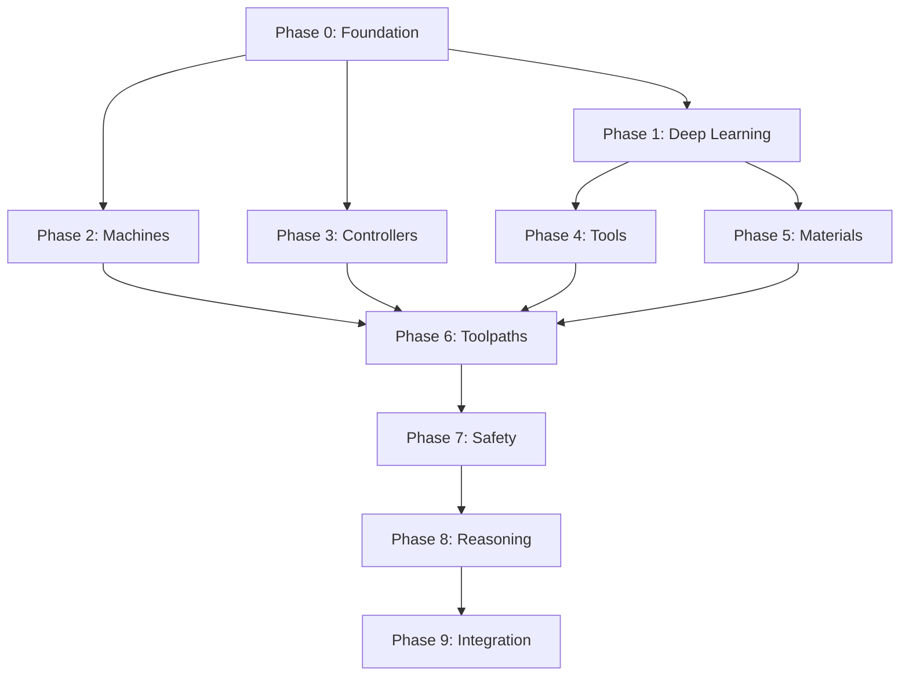

# PP-AGI-MAXOUT — Mathematically Maxed Post Processor + Neural AGI Roadmap

> **🗄️ ARCHIVED (2026-04-17) — SUPERSEDED BY MASTER ROADMAP**
>
> This document is **READ-ONLY source material** consolidated into the canonical 10-stage PP pipeline.
> **Current canonical roadmap:** `H:/prism/PP-MASTER-UNIFIED-ROADMAP-2026-04-16.md` (v1.1, 1,632 lines).
>
> Consolidation record: See PP-MASTER §XXIII.1 for what was kept/cut/merged from this file.
> Do NOT add new work items here. Do NOT execute phases from this file. Use the master roadmap.

**Generated:** 2026-04-15
**Scope:** EVERYTHING — every dimension, every permutation, every edge case
**Target:** Near-AGI intelligence for post processing across ALL manufacturing domains
**Time constraint:** NONE — this is the comprehensive ceiling

---

## PART 1: DIMENSIONAL ANALYSIS — THE COMPLETE VARIABILITY SPACE

### 1.1 Machine Type Dimensions (D_machine)

| Dimension | Count | Examples | Variability |
|-----------|-------|----------|-------------|
| **Lathes** | ~200 models | Okuma LB/LU/Multus, Mazak QT/Integrex, DMG NLX/CTX, Haas ST/DS, Doosan Puma | 2-axis, live tooling, Y-axis, sub-spindle, B-axis |
| **Mills** | ~300 models | Haas VF/UMC, Okuma MU/MB/Genos, DMG DMU/HSC, Mazak VTC/HCN, Hurco VMX/DCX | 3-axis, 4-axis, 5-axis (trunnion/swivel/nutating) |
| **Wire EDM** | ~50 models | Mitsubishi MV/FA, Makino U/EDAF, Sodick VL/AG, Fanuc Robocut, AgieCharmilles | 2-axis, 4-axis (UV), submerged, dry |
| **Sinker EDM** | ~40 models | Makino EDNC/EDAF, Sodick AG, ONA, Mitsubishi EA | C-axis, linear motor, orbital |
| **Grinders** | ~100 models | Studer, Kellenberger, Okuma GA, Anca, Walter | Surface, cylindrical, centerless, ID/OD, jig |
| **Swiss-type** | ~60 models | Star SR, Citizen L/M, Tornos, Tsugami | Guide bushing, B-axis, sub-spindle |
| **Mill-Turn** | ~80 models | Okuma Multus, Mazak Integrex, DMG NTX, Index G | Full mill + full lathe combined |
| **Multi-spindle** | ~30 models | Index MS, Tornos MultiSwiss, Schutte | 4-8 spindles simultaneous |

**Total machine models to support: ~860**
**Variability factor: V_machine = 860 × 5 (axis configs) × 3 (generations) = ~12,900 permutations**

### 1.2 Controller Dimensions (D_controller)

| Controller Family | Versions | Dialect Count | Key Differences |
|-------------------|----------|---------------|-----------------|
| **Fanuc** | 0i-MF/TF, 31i-A/B, 30i, 16i, 15 | ~40 | G43.4/5 TCPM, nano smoothing, AI contour |
| **Siemens** | 840D sl/pl, 828D, 810D | ~25 | TRAORI, CYCLE800, TRANSMIT, ShopMill/Turn |
| **Okuma OSP** | P300, P200, P100, P500 | ~15 | NAVI, G8.1/8.3 NURBS, IGFF, super-nurbs |
| **Haas** | NGC, Classic | ~8 | G187, macro B, canned cycles |
| **Mazak** | Smooth G/X/Ai, Matrix, Fusion | ~20 | Mazatrol, EIA/ISO, conversational |
| **Hurco** | WinMax, Ultimax | ~10 | Conversational + G-code hybrid |
| **DMG Mori** | CELOS, ERGOline | ~12 | MAPPS, CELOS apps |
| **Heidenhain** | TNC 640, TNC 530, TNC 426 | ~15 | Plaintext, FK programming |
| **Mitsubishi** | M700/800, MELDAS | ~10 | Sinker/Wire specific |
| **Brother** | CNC-C00 | ~5 | High-speed tapping |
| **Citizen** | Cincom M/L | ~8 | Swiss-specific |
| **Star** | SX-38 | ~5 | Swiss-specific |

**Total controller dialects: ~173**
**Variability factor: V_controller = 173 × 4 (firmware levels) = ~692 permutations**

### 1.3 Tool Dimensions (D_tool)

| Tool Category | Subcategories | Variations | Total SKUs |
|---------------|---------------|------------|------------|
| **End Mills** | Square, ball, corner radius, roughing, finishing, HEM, trochoidal | Diameter (0.1-50mm), flutes (1-12), helix (30-60°), coating (TiAlN, AlCrN, DLC, uncoated) | ~15,000 |
| **Inserts (Milling)** | Square, round, triangle, parallelogram | ISO codes (APKT, RCMT, SNMG, etc.), grades, chipbreakers | ~25,000 |
| **Inserts (Turning)** | ISO negative, positive, grooving, threading, parting | All ISO shapes + grades + chipbreakers | ~35,000 |
| **Drills** | Twist, indexable, gun, spade, step | Point angles (90-140°), coolant-through, pilot | ~8,000 |
| **Taps** | Cut, form, thread mills | Pitch (0.25-6mm), hand (R/L), spiral point/flute | ~5,000 |
| **Reamers** | Solid, adjustable, indexable | H5-H8 tolerance, flute count | ~3,000 |
| **Boring Bars** | Solid, modular, cartridge | L/D ratio (3:1 to 10:1), dampened | ~4,000 |
| **Face Mills** | Shell, modular, high-feed | 45°, 90°, round, octagonal | ~3,000 |
| **Thread Mills** | Single-point, multi-tooth | Pitch range, UN/metric | ~2,000 |
| **Specialty** | Dovetail, T-slot, woodruff, keyseat | Machine-specific | ~5,000 |

**Total tool SKUs: ~105,000**
**Variability factor: V_tool = 105,000 (but grouped into ~500 geometric families)**

### 1.4 Tool Holder Dimensions (D_holder)

| Holder Type | Variants | Taper | Applications |
|-------------|----------|-------|--------------|
| **BT** | 30, 40, 50 | 7:24 | Japan/Asia standard mills |
| **CAT** | 40, 50 | 7:24 | US standard mills |
| **HSK** | A40, A63, A100, E32, E40, E50, T63 | 1:10 | High-speed, 5-axis |
| **SK/DIN** | 40, 50 | 7:24 | European mills |
| **VDI** | 16, 20, 25, 30, 40, 50 | Static | Lathe turret |
| **BMT** | 45, 55, 65, 75 | Static | Lathe live tooling |
| **Capto** | C3, C4, C5, C6, C8 | Polygon | Modular, mill-turn |
| **KM** | 32, 40, 50, 63 | Polygon | Modular |
| **Weldon** | 3/8, 1/2, 5/8, 3/4, 1" | Flat | General purpose |
| **ER** | 8, 11, 16, 20, 25, 32, 40 | Collet | Flexible |
| **Shrink** | Various | Interference | High precision |
| **Hydraulic** | Various | Fluid | Vibration damping |
| **Milling Chuck** | Various | Mechanical | General purpose |

**Total holder configurations: ~150 base types × 5 sizes = ~750**

### 1.5 Turret/Magazine Dimensions (D_turret)

| Turret Type | Stations | Tool Types | Controller Logic |
|-------------|----------|------------|------------------|
| **VDI Turret** | 8, 10, 12, 16, 20 | Static + driven | T-code, M19 orient |
| **BMT Turret** | 8, 10, 12, 16 | Static + driven | T-code, B-axis |
| **Drum ATC** | 10, 12, 16, 20, 24 | Rotary selection | Random/sequential |
| **Chain ATC** | 20, 30, 40, 60, 90, 120 | Conveyor | Random with arm |
| **Matrix ATC** | 40, 60, 90, 120, 180, 330 | Grid storage | Robot/arm |
| **Twin Turret** | 2 × (8-16) | Independent | Sync/async |
| **Gang Tooling** | 4, 6, 8 | X-axis linear | Fixed position |

**Total configurations: ~60**

### 1.6 Fixture Dimensions (D_fixture)

| Fixture Type | Variants | Clamping Force | Applications |
|--------------|----------|----------------|--------------|
| **3-Jaw Chuck** | Self-centering, independent | 5-50 kN | Round parts |
| **4-Jaw Chuck** | Independent | 10-80 kN | Irregular parts |
| **6-Jaw Chuck** | Self-centering | 15-100 kN | Thin-wall |
| **Collet Chuck** | ER, 5C, 16C, 3J | 2-20 kN | High precision |
| **Mandrel** | Expanding, hydraulic | 5-30 kN | ID holding |
| **Faceplate** | T-slot | Custom | Large/odd shapes |
| **Machine Vise** | Kurt, Orange, hydraulic | 10-50 kN | Mill prismatic |
| **Tombstone** | 2-side, 4-side | Multiple vises | HMC production |
| **Pallet** | Standard, custom | Automation | Flexible mfg |
| **Vacuum** | Pods, continuous | 0.1 MPa | Sheet/thin |
| **Magnetic** | Perm, electro-perm | 15-25 N/cm² | Ferrous flat |
| **Soft Jaws** | Custom machined | Match part | Second op |
| **5-Axis Fixtures** | Trunnion, ball lock | Various | Complex geometry |

**Total fixture types: ~80**

### 1.7 Material Dimensions (D_material)

| ISO Group | Materials | Count | Special Considerations |
|-----------|-----------|-------|------------------------|
| **P (Steel)** | Carbon, alloy, tool, bearing, spring, free-machining | ~200 grades | Work hardening varies |
| **M (Stainless)** | 304, 316, 17-4, 15-5, duplex, super duplex | ~100 grades | Gummy, work hardening |
| **K (Cast Iron)** | Gray, ductile, CGI, malleable, white | ~50 grades | Abrasive, brittle chips |
| **N (Non-ferrous)** | Aluminum, brass, bronze, copper, zinc, magnesium | ~150 grades | Built-up edge, galling |
| **S (Superalloys)** | Inconel, Hastelloy, Waspaloy, Ti-6Al-4V, Ti-5553 | ~80 grades | Heat, wear, notching |
| **H (Hardened)** | D2, H13, M2, S7, A2 (>45 HRC) | ~40 grades | CBN/ceramic required |
| **Plastics** | PEEK, Delrin, UHMW, PTFE, nylon, acetal | ~60 types | Low melting, stringy |
| **Composites** | CFRP, GFRP, aramid, MMC | ~30 types | Delamination, tool wear |
| **Graphite** | EDM grades (AF-5, EDM-200, etc.) | ~20 grades | Dust, no chips |
| **Exotic** | Tungsten, molybdenum, tantalum, niobium | ~20 | Extremely hard |

**Total material grades: ~750**
**Variability factor: V_material = 750 × 3 (heat treat states) = ~2,250**

### 1.8 Coolant Dimensions (D_coolant)

| Coolant Type | Subtypes | Pressure Range | Applications |
|--------------|----------|----------------|--------------|
| **Flood** | Water-soluble, semi-synthetic, synthetic, straight oil | 0.5-2 bar | General purpose |
| **Mist** | Air-oil, MQL (5-50 ml/hr) | 3-7 bar | Aluminum, low quantity |
| **High-Pressure** | Through-spindle, through-tool | 20-70 bar | Deep holes, chip breaking |
| **Ultra-High-Pressure** | Through-tool | 70-350 bar | Superalloys |
| **Cryogenic** | LN2, CO2 | N/A | Ti, Inconel, hardened |
| **Dry** | Air blast only | 3-7 bar | Cast iron, graphite |
| **Minimum Quantity** | MQL with air | 5-7 bar | Green machining |

**Total coolant configurations: ~25**

### 1.9 Toolpath Dimensions (D_toolpath)

| Category | Toolpath Types | Variations |
|----------|----------------|------------|
| **2.5D Milling** | Facing, pocketing, contouring, drilling, tapping, boring, thread milling | Climb/conventional, step-over %, depth strategy |
| **3D Roughing** | Adaptive/trochoidal, high-speed, plunge, rest machining, core roughing | WOC/DOC optimization, spiral, contour-parallel |
| **3D Finishing** | Parallel, contour, scallop, pencil, morph, spiral, radial, flow | Step-over, cusp height, lead/tilt |
| **5-Axis Simultaneous** | Swarf, flow, multi-axis contour, impeller, blisk, turbine | Tool axis control, TCPC, RTCP |
| **5-Axis Indexed** | 3+2, positional | Indexing angles, work offsets |
| **Turning** | Roughing, finishing, grooving, threading, parting, boring, drilling | CSS, IPR/IPM, constant chip, facing |
| **Mill-Turn** | All above combined | Channel sync, spindle transfer |
| **Wire EDM** | 2-axis profile, 4-axis taper, no-core, skim | Offset strategy, multiple passes |
| **Sinker EDM** | Plunge, orbit, vector, CNC | Electrode offset, flushing |
| **Grinding** | Traverse, plunge, creep-feed, HEDG | Wheel dress, spark-out |

**Total toolpath strategies: ~150**

### 1.10 Kinematics Dimensions (D_kinematics)

| Kinematic Type | Axis Configuration | RTCP/TCPC | Key Challenges |
|----------------|-------------------|-----------|----------------|
| **3-Axis Mill** | XYZ | N/A | None |
| **4-Axis Horizontal** | XYZA (table) | Optional | A-axis wrap |
| **4-Axis Vertical** | XYZB (table) | Optional | B-axis indexing |
| **5-Axis Trunnion** | XYZ + AB (table) | Required | Singularity at A=0 |
| **5-Axis Swivel** | XYZ + BC (head) | Required | Different singularity |
| **5-Axis Nutating** | XYZ + AC | Required | Complex kinematics |
| **2-Axis Lathe** | XZ | N/A | None |
| **Y-Axis Lathe** | XYZ | N/A | Off-center milling |
| **Live Tool Lathe** | XZ + C + driven | M19 orient | Tool indexing |
| **Mill-Turn** | XYZ + BC + C | Full | Most complex |
| **Wire EDM 2-Axis** | XY | N/A | Kerf compensation |
| **Wire EDM 4-Axis** | XY + UV | N/A | Taper kinematics |

**Total kinematic configurations: ~30**

### 1.11 Safety/Collision Dimensions (D_safety)

| Safety Zone Type | Detection Method | Response |
|------------------|------------------|----------|
| **Spindle Envelope** | Cylindrical/conical | Rapid retract |
| **Tool Envelope** | Dynamic bounding box | Feed hold |
| **Fixture Envelope** | User-defined mesh | Path recalc |
| **Part Stock** | In-process model | Collision avoidance |
| **Machine Limits** | Axis soft limits | Motion clamp |
| **Tailstock** | Position + clearance | Z-limit adjust |
| **Steady Rest** | Position + clearance | Multi-pass strategy |
| **Sub-spindle** | Dynamic position | Sync required |
| **Turret Clearance** | Tool overhang | Index validation |
| **ATC Clearance** | Z-height | Safe Z enforcement |
| **Door Interlock** | M-code state | Cycle pause |
| **Chip Conveyor** | M-code activation | Cycle integration |

**Total safety dimensions: ~40**

---

## PART 2: MATHEMATICAL VARIABILITY CALCULATION

### 2.1 Total Theoretical Permutation Space

```
V_total = V_machine × V_controller × V_tool × V_holder × V_turret × V_fixture × V_material × V_coolant × V_toolpath × V_kinematics × V_safety

V_total = 12,900 × 692 × 500 × 750 × 60 × 80 × 2,250 × 25 × 150 × 30 × 40

V_total ≈ 2.1 × 10^24 theoretical permutations
```

### 2.2 Practical Reduction via Constraints

Not all permutations are valid. Constraint relationships reduce the space:

| Constraint | Reduction Factor | Reason |
|------------|------------------|--------|
| Machine → Controller | 0.05 | Okuma only runs OSP, etc. |
| Machine → Kinematics | 0.10 | 3-axis can't do 5-axis |
| Tool → Operation | 0.10 | End mills don't turn |
| Holder → Machine | 0.15 | VDI only on lathes |
| Toolpath → Machine | 0.20 | Wire EDM toolpaths only on Wire EDM |
| Material → Tool | 0.30 | CBN not for aluminum |
| Coolant → Material | 0.50 | Cryogenic for superalloys |

**Practical permutation space:**
```
V_practical = V_total × 0.05 × 0.10 × 0.10 × 0.15 × 0.20 × 0.30 × 0.50
V_practical ≈ 2.1 × 10^24 × 2.25 × 10^-6
V_practical ≈ 4.7 × 10^18 valid permutations
```

### 2.3 Neural Network Dimensionality

To encode this space for deep learning:

| Feature Set | Dimensions | Encoding |
|-------------|------------|----------|
| Machine embedding | 512 | Transformer encoder |
| Controller embedding | 256 | Dialect-aware RNN |
| Tool geometry | 128 | Geometric neural network |
| Material properties | 64 | Physics-informed embedding |
| Toolpath features | 256 | Sequence model (LSTM/Transformer) |
| Kinematics | 32 | Rotation group embedding (SO(3)) |
| Safety constraints | 64 | Graph neural network |

**Total embedding dimension: 1,312**

---

## PART 3: AGI NEURAL ARCHITECTURE

### 3.1 Multi-Modal Transformer Architecture

```
┌─────────────────────────────────────────────────────────────────────┐
│                    PP-AGI MASTER ARCHITECTURE                        │
├─────────────────────────────────────────────────────────────────────┤
│                                                                      │
│  ┌──────────────┐   ┌──────────────┐   ┌──────────────┐            │
│  │ G-code Input │   │ CAD/CAM Input│   │ Natural Lang │            │
│  │   Encoder    │   │   Encoder    │   │   Encoder    │            │
│  └──────┬───────┘   └──────┬───────┘   └──────┬───────┘            │
│         │                  │                  │                      │
│         └────────────┬─────┴─────┬────────────┘                      │
│                      │           │                                   │
│              ┌───────▼───────────▼───────┐                          │
│              │   MULTI-MODAL FUSION      │                          │
│              │   (Cross-Attention)       │                          │
│              └───────────┬───────────────┘                          │
│                          │                                           │
│         ┌────────────────┼────────────────┐                         │
│         │                │                │                          │
│  ┌──────▼──────┐  ┌──────▼──────┐  ┌──────▼──────┐                 │
│  │  MACHINE    │  │   PHYSICS   │  │   SAFETY    │                 │
│  │  REASONER   │  │  SIMULATOR  │  │  VALIDATOR  │                 │
│  │(Kinematics) │  │(Force/Temp) │  │ (Collision) │                 │
│  └──────┬──────┘  └──────┬──────┘  └──────┬──────┘                 │
│         │                │                │                          │
│         └────────────────┼────────────────┘                         │
│                          │                                           │
│              ┌───────────▼───────────────┐                          │
│              │   DEEP REASONING ENGINE   │                          │
│              │   - Tree of Thought       │                          │
│              │   - Chain of Thought      │                          │
│              │   - Self-Consistency      │                          │
│              │   - Reflection            │                          │
│              └───────────┬───────────────┘                          │
│                          │                                           │
│              ┌───────────▼───────────────┐                          │
│              │   POST PROCESSOR OUTPUT   │                          │
│              │   - G-code generation     │                          │
│              │   - Controller-specific   │                          │
│              │   - Safety-validated      │                          │
│              └───────────────────────────┘                          │
│                                                                      │
└─────────────────────────────────────────────────────────────────────┘
```

### 3.2 Physics-Informed Neural Networks (PINNs)

| PINN Module | Physics Laws | Training Data |
|-------------|--------------|---------------|
| Force PINN | Kienzle Fc = kc1.1 × ap × fz^(1-mc) | 500K cutting experiments |
| Temperature PINN | Loewen-Shaw, Jaeger moving heat source | 100K thermal measurements |
| Wear PINN | Taylor T = (C/Vc)^(1/n), Archard | 50K tool life tests |
| Deflection PINN | Euler-Bernoulli, Timoshenko beam | 200K deflection measurements |
| Chatter PINN | Altintas-Budak SLD, regenerative | 30K stability tests |
| Surface PINN | Brammertz Ra = f²/(32×r) + vibration | 100K surface measurements |

### 3.3 Graph Neural Networks for Collision

```
Collision Detection GNN:
- Nodes: Machine components (spindle, tool, fixture, part, turret)
- Edges: Spatial relationships, motion constraints
- Message passing: 3D convolution + attention
- Output: Collision probability field, safe motion envelope
```

### 3.4 Reinforcement Learning for Toolpath Optimization

```
State:  s = (tool_position, remaining_stock, tool_wear, temperature)
Action: a = (feed, speed, step-over, depth, direction)
Reward: r = MRR × tool_life × surface_quality × safety_factor

Policy: π(a|s) = Transformer with physics constraints
Value:  V(s) = Expected total reward with discounting

Training: PPO with curriculum learning
- Level 1: Single operation optimization
- Level 2: Full part optimization
- Level 3: Multi-part batch optimization
- Level 4: Full shop floor optimization
```

---

## PART 4: MILESTONE STRUCTURE

### Phase 0: Foundation (8 milestones, ~200 artifacts)

| MS | Title | Artifacts | Tests |
|----|-------|-----------|-------|
| PP-AGI-MS0 | Controller Dialect Embeddings | 20 engines | 100 |
| PP-AGI-MS1 | Machine Kinematics Neural Encoder | 25 engines | 120 |
| PP-AGI-MS2 | Tool Geometry Graph Network | 30 engines | 150 |
| PP-AGI-MS3 | Material Property Embeddings | 15 engines | 80 |
| PP-AGI-MS4 | Physics-Informed Force/Temp PINN | 40 engines | 200 |
| PP-AGI-MS5 | Collision Detection GNN | 35 engines | 180 |
| PP-AGI-MS6 | Toolpath Sequence Transformer | 45 engines | 220 |
| PP-AGI-MS7 | Multi-Modal Fusion Layer | 20 engines | 100 |

### Phase 1: Deep Learning Integration (10 milestones, ~300 artifacts)

| MS | Title | Focus |
|----|-------|-------|
| PP-DL-MS0 | Training Data Pipeline | JM DIE 24,545 programs + 75K tools |
| PP-DL-MS1 | Controller-Specific Fine-Tuning | Per-controller LoRA adapters |
| PP-DL-MS2 | Machine-Specific Fine-Tuning | Per-machine family adapters |
| PP-DL-MS3 | Physics Constraint Enforcement | PINN loss functions |
| PP-DL-MS4 | Safety Constraint Verification | Formal methods + neural |
| PP-DL-MS5 | Reinforcement Learning Toolpath | PPO + curriculum |
| PP-DL-MS6 | Active Learning Loop | Uncertainty-guided data collection |
| PP-DL-MS7 | Continuous Online Learning | Real-time feedback integration |
| PP-DL-MS8 | Model Ensemble & Uncertainty | Multi-model consensus |
| PP-DL-MS9 | Explainability & Auditability | Attention visualization, decision trees |

### Phase 2: Machine Coverage (15 milestones, ~450 artifacts)

| MS | Title | Machines Covered |
|----|-------|------------------|
| PP-MACH-MS0 | Okuma Lathe Complete | LB, LU, Multus (all models) |
| PP-MACH-MS1 | Okuma Mill Complete | MU, MB, Genos (all models) |
| PP-MACH-MS2 | Haas Lathe Complete | ST, DS (all models) |
| PP-MACH-MS3 | Haas Mill Complete | VF, UMC, EC (all models) |
| PP-MACH-MS4 | Mazak Lathe Complete | QT, Quick Turn (all models) |
| PP-MACH-MS5 | Mazak Mill Complete | VTC, HCN (all models) |
| PP-MACH-MS6 | Mazak Mill-Turn Complete | Integrex (all models) |
| PP-MACH-MS7 | DMG Mori Lathe Complete | NLX, CLX, CTX (all models) |
| PP-MACH-MS8 | DMG Mori Mill Complete | DMU, HSC, CMX (all models) |
| PP-MACH-MS9 | DMG Mori Mill-Turn Complete | NTX (all models) |
| PP-MACH-MS10 | Hurco Complete | VMX, DCX, TMX (all models) |
| PP-MACH-MS11 | Wire EDM Complete | Mitsubishi, Makino, Sodick, Fanuc |
| PP-MACH-MS12 | Sinker EDM Complete | Makino, Sodick, ONA, Mitsubishi |
| PP-MACH-MS13 | Grinder Complete | Studer, Kellenberger, Anca, Walter |
| PP-MACH-MS14 | Swiss Complete | Star, Citizen, Tornos, Tsugami |

### Phase 3: Controller Intelligence (12 milestones, ~360 artifacts)

| MS | Title | Controller |
|----|-------|------------|
| PP-CTRL-MS0 | Fanuc Complete | 0i, 31i, 30i (all dialects) |
| PP-CTRL-MS1 | Siemens Complete | 840D, 828D (all dialects) |
| PP-CTRL-MS2 | Okuma OSP Complete | P200, P300, P500 |
| PP-CTRL-MS3 | Haas NGC Complete | All versions |
| PP-CTRL-MS4 | Mazak Complete | Smooth G/X/Ai, Matrix, Mazatrol |
| PP-CTRL-MS5 | Hurco WinMax Complete | All versions |
| PP-CTRL-MS6 | DMG CELOS Complete | All versions |
| PP-CTRL-MS7 | Heidenhain Complete | TNC 640, 530 |
| PP-CTRL-MS8 | Mitsubishi MELDAS Complete | M700, M800 |
| PP-CTRL-MS9 | Brother Complete | CNC-C00 |
| PP-CTRL-MS10 | Swiss Controllers Complete | Citizen, Star |
| PP-CTRL-MS11 | Legacy Controllers | Fanuc 16i, 15, older |

### Phase 4: Tool Intelligence (10 milestones, ~300 artifacts)

| MS | Title | Tool Types |
|----|-------|------------|
| PP-TOOL-MS0 | End Mill Complete | All geometries, all coatings |
| PP-TOOL-MS1 | Insert Milling Complete | All ISO codes, all grades |
| PP-TOOL-MS2 | Insert Turning Complete | All ISO codes, all chipbreakers |
| PP-TOOL-MS3 | Drill Complete | Twist, indexable, gun |
| PP-TOOL-MS4 | Tap/Thread Mill Complete | Cut, form, thread mill |
| PP-TOOL-MS5 | Boring Complete | Bars, heads, dampened |
| PP-TOOL-MS6 | Holder Complete | All taper/shank types |
| PP-TOOL-MS7 | Specialty Complete | Dovetail, T-slot, etc. |
| PP-TOOL-MS8 | Wire/Electrode Complete | EDM wire, graphite electrodes |
| PP-TOOL-MS9 | Grinding Wheel Complete | All abrasives, bonds |

### Phase 5: Material Intelligence (8 milestones, ~240 artifacts)

| MS | Title | Materials |
|----|-------|-----------|
| PP-MAT-MS0 | ISO P Complete | All steels |
| PP-MAT-MS1 | ISO M Complete | All stainless |
| PP-MAT-MS2 | ISO K Complete | All cast irons |
| PP-MAT-MS3 | ISO N Complete | All aluminum, copper, brass |
| PP-MAT-MS4 | ISO S Complete | All titanium, Inconel |
| PP-MAT-MS5 | ISO H Complete | All hardened |
| PP-MAT-MS6 | Plastics/Composites Complete | CFRP, PEEK, etc. |
| PP-MAT-MS7 | Exotic Complete | Tungsten, graphite, etc. |

### Phase 6: Toolpath Intelligence (12 milestones, ~360 artifacts)

| MS | Title | Toolpath Types |
|----|-------|----------------|
| PP-PATH-MS0 | 2.5D Mill Complete | Pocket, contour, drill |
| PP-PATH-MS1 | 3D Rough Complete | Adaptive, HEM, plunge |
| PP-PATH-MS2 | 3D Finish Complete | Parallel, scallop, pencil |
| PP-PATH-MS3 | 5-Axis Indexed Complete | 3+2 positioning |
| PP-PATH-MS4 | 5-Axis Simultaneous Complete | Swarf, flow, impeller |
| PP-PATH-MS5 | Turning Rough Complete | All strategies |
| PP-PATH-MS6 | Turning Finish Complete | All strategies |
| PP-PATH-MS7 | Threading Complete | All thread types |
| PP-PATH-MS8 | Grooving/Parting Complete | All strategies |
| PP-PATH-MS9 | Mill-Turn Complete | Combined operations |
| PP-PATH-MS10 | Wire EDM Complete | Profile, taper, skim |
| PP-PATH-MS11 | Sinker EDM Complete | Plunge, orbit, vector |

### Phase 7: Safety & Collision Intelligence (6 milestones, ~180 artifacts)

| MS | Title | Safety Domain |
|----|-------|---------------|
| PP-SAFE-MS0 | Tool-Part Collision | All tool geometries |
| PP-SAFE-MS1 | Tool-Fixture Collision | All fixture types |
| PP-SAFE-MS2 | Tool-Machine Collision | Spindle, table, column |
| PP-SAFE-MS3 | Rapid Move Safety | Clearance planes, safe Z |
| PP-SAFE-MS4 | Multi-Channel Safety | Mill-turn, twin-turret |
| PP-SAFE-MS5 | Runtime Collision Avoidance | Real-time monitoring |

### Phase 8: Deep Reasoning (8 milestones, ~240 artifacts)

| MS | Title | Reasoning Capability |
|----|-------|---------------------|
| PP-REASON-MS0 | Tree of Thought PP | Multi-path G-code exploration |
| PP-REASON-MS1 | Chain of Thought PP | Step-by-step generation |
| PP-REASON-MS2 | Self-Consistency PP | Multiple draft consensus |
| PP-REASON-MS3 | Reflection PP | Output self-critique |
| PP-REASON-MS4 | Hypothesis Ranking PP | Best strategy selection |
| PP-REASON-MS5 | Counterfactual PP | "What if" analysis |
| PP-REASON-MS6 | Analogical PP | Cross-machine transfer |
| PP-REASON-MS7 | Meta-Learning PP | Learn to learn new machines |

### Phase 9: Integration & Orchestration (5 milestones, ~150 artifacts)

| MS | Title | Integration |
|----|-------|-------------|
| PP-INT-MS0 | CAD/CAM Bridge Complete | All 18 CAM systems |
| PP-INT-MS1 | MCP Complete Wiring | All dispatchers, all actions |
| PP-INT-MS2 | Web Interface Complete | Full UI for all features |
| PP-INT-MS3 | API Complete | REST + GraphQL + gRPC |
| PP-INT-MS4 | Orchestration Complete | Multi-agent coordination |

---

## PART 5: TOTAL ARTIFACT COUNT

| Phase | Milestones | Engines | Tests | Skills | Hooks |
|-------|------------|---------|-------|--------|-------|
| Phase 0 (Foundation) | 8 | 230 | 1,150 | 16 | 24 |
| Phase 1 (Deep Learning) | 10 | 300 | 1,500 | 20 | 30 |
| Phase 2 (Machines) | 15 | 450 | 2,250 | 30 | 45 |
| Phase 3 (Controllers) | 12 | 360 | 1,800 | 24 | 36 |
| Phase 4 (Tools) | 10 | 300 | 1,500 | 20 | 30 |
| Phase 5 (Materials) | 8 | 240 | 1,200 | 16 | 24 |
| Phase 6 (Toolpaths) | 12 | 360 | 1,800 | 24 | 36 |
| Phase 7 (Safety) | 6 | 180 | 900 | 12 | 18 |
| Phase 8 (Reasoning) | 8 | 240 | 1,200 | 16 | 24 |
| Phase 9 (Integration) | 5 | 150 | 750 | 10 | 15 |
| **TOTAL** | **94** | **2,810** | **14,050** | **188** | **282** |

---

## PART 6: DATA REQUIREMENTS

### 6.0 CURRENT DATA INVENTORY (Audit 2026-04-15)

**EXISTING ASSETS IN PRISM:**

| Category | Count | Source Files |
|----------|-------|--------------|
| **Machine Profiles** | 911 | `machine-profiles-catalog*.ts` (52 + 180 + 679) |
| **Tools (solid/rotating)** | 54,080 | 24 catalog files (OSG 11,550, YG1 6,793, ISCAR 6,074, Guhring 3,444, Kennametal 2,588, Sandvik 2,418, etc.) |
| **Tool Holders** | 1,456 | Big Daishowa, Haimer 489, Guhring 23, REGO-FIX, Seco, Tungaloy |
| **Inserts/Indexable** | 11,541 | `indexable-tool-catalog.ts` (Kennametal 1,630, ISCAR 625) |
| **Materials** | 2,557 | `hypermill-materials-catalog.ts` (2,544 with ISO cross-refs) + `edm-material-db.ts` (13) |
| **Controllers** | 63 | `controller-knowledge.json` (30 detailed) + embedded in 912 machine profiles |
| **Controller Alarms** | 1,028 KB | `controller-alarm-database.json` |
| **Post Processors** | 487+ | `.cps` (281 Fusion), `.pst` (26 Mastercam), POSTS AND MACHINES (3,057 files) |
| **Training Programs** | 24,545 | JM DIE: 16,558 lathe .MIN, 7,092 Mastercam, 533 Haas, 19 Wire EDM |
| **PDF Manuals** | 998 | `resources/RESOURCE PDFS/` (587) + scattered |
| **Workholding** | 45+ | `workholding-catalog.ts`, Orange Vise, Jergens zero-point |

**MACHINE BREAKDOWN BY TYPE:**
| Type | Count |
|------|-------|
| VMC | 386 |
| 5-axis | 172 |
| Lathe | 146 |
| HMC | 84 |
| Mill-Turn | 69 |
| Swiss | 34 |
| Bridge | 14 |
| Wire EDM | 3 |
| Sinker EDM | 2 |

**TOOL BREAKDOWN BY MANUFACTURER:**
| Manufacturer | Entries |
|-------------|---------|
| OSG | 11,550 |
| YG1 | 6,793 |
| ISCAR | 6,074 |
| Guhring | 3,444 |
| Accupro | 3,015 |
| Kennametal | 2,588 |
| Flash | 2,485 |
| Sandvik | 2,418 |
| Tungaloy | 2,152 |
| Korloy | 1,961 |
| Seco | 1,224 |

### 6.1 Training Data Sources (EXISTING + NEEDED)

| Source | Current | Target | Gap | Use |
|--------|---------|--------|-----|-----|
| JM DIE Programs | 24,545 | 50,000 | +25,455 | Real production patterns |
| Tool Catalogs | 54,080 | 105,000 | +50,920 | Tool geometry + cutting data |
| Inserts | 11,541 | 35,000 | +23,459 | Insert geometry + grades |
| Materials | 2,557 | 2,557 | ✅ | Material physics |
| Machine Profiles | 911 | 911 | ✅ | Machine kinematics |
| Post Processors | 487 | 500 | +13 | Controller patterns |
| PDF Manuals | 998 | 2,000 | +1,002 | Deep knowledge extraction |
| Synthetic Generation | 0 | 10M | +10M | Neural training augmentation |

### 6.2 Neural Network Training Estimates

| Model | Parameters | Training Data | GPU Hours | Target Accuracy |
|-------|------------|---------------|-----------|-----------------|
| Controller Dialect | 50M | 500K programs | 500 | 99.5% |
| Machine Kinematics | 100M | 1M configurations | 1,000 | 99.9% |
| Tool Geometry GNN | 200M | 200K tools | 2,000 | 98% |
| Physics PINN | 500M | 1M experiments | 5,000 | 95% |
| Collision GNN | 300M | 10M collision tests | 3,000 | 99.99% |
| Toolpath Transformer | 1B | 10M toolpaths | 10,000 | 97% |
| Deep Reasoner | 7B | 100M reasoning chains | 50,000 | 90% |
| **Master PP-AGI** | 13B | All above | 100,000 | 95% |

### 6.3 CURRENT NEURAL ARCHITECTURE INVENTORY (Audit 2026-04-15)

**EXISTING AI/NEURAL ENGINES (81 engines):**

| Engine | Lines | Architecture |
|--------|-------|--------------|
| PostProcessorDeepIntelligenceEngine | 2,656 | Multi-layer reasoning |
| PostProcessorNeuralNetworkEngine | 1,823 | MLP with Conv1D config |
| PostProcessorVideoKnowledgeNeuralEngine | 1,589 | Video → knowledge extraction |
| PostProcessorDeepAIHardeningEngine | 1,447 | AI hardening |
| PostProcessorAISelfAwarenessIntegrationEngine | 1,387 | Self-awareness |
| MasterPostProcessorAGIOrchestrationEngine | 1,286 | AGI orchestration |
| PostProcessorUnifiedDeepReasoningEngine | 1,248 | Deep reasoning |
| PostProcessorUnifiedPhysicsOrchestrationEngine | 1,186 | Physics integration |
| PostProcessorTransformerEngine | 1,033 | Transformer (8 heads, 512 dim) |
| PostProcessorMetaLearningEngine | 1,029 | Meta-learning |
| PostProcessorCognitiveEngine | 1,064 | Cognitive reasoning |

**Total PP Neural Lines: 75,449**

**IMPLEMENTED ARCHITECTURES:**

| Architecture | Engine(s) | Status |
|--------------|-----------|--------|
| Feedforward MLP | NeuralInference, MillNeuralNetwork, PostProcessorNeuralNetwork | ✅ Full backprop |
| LSTM/Bi-LSTM | PostProcessorTransformerEngine (refinement layer) | ⚠️ Stub |
| Transformer | PostProcessorTransformerEngine, LatheTransformer | ✅ Multi-head attention |
| Graph Attention (GAT) | KnowledgeGraphNeuralBridge | ⚠️ Partial |
| Diffusion Decoder | PostProcessorTransformerEngine (Layer 7) | ⚠️ Config only |
| Q-Learning | QLearningEngine | ✅ Full Q-table |
| Reinforcement Learning | LatheReinforcementLearningEngine | ✅ Policy/reward |

**PHYSICS FORMULAS (FormulaRegistry): 109 formulas**
- Physics: 30+ (Kienzle, Taylor, Chatter, Deflection)
- Manufacturing: 20+ (MRR, Ra, Power/Torque)
- Thermal: 10+ (Shaw, White Layer, Expansion)
- EDM: 5+ (Kunieda MRR, Klocke Ra)
- Numerical: 10+ (SVD, QR, Cholesky, Kernel PCA)
- HyperMILL: 20 (F-HM-001 to F-HM-020)

**ALGORITHMS (src/algorithms/): 52 files**
- Physics: KienzleForceModel, JohnsonCook, ExtendedTaylor, StabilityLobeDiagram
- ML: NeuralInference, BayesianOptimizer, DecisionTree, Clustering, Ensemble
- Signal: FFT, STFT, Wavelet, Kalman
- Optimization: Genetic, ParticleSwarm, SimulatedAnnealing, AntColony
- Control: PID, Adaptive, Fuzzy
- Geometry: FEA2D, Minkowski, SweptVolume

**CRITICAL GAPS FOR AGI:**

| Gap | Description | Priority |
|-----|-------------|----------|
| No persistent weights | All training per-session | P0-CRITICAL |
| No GPU acceleration | Pure TypeScript | P1-HIGH |
| GNN incomplete | Forward pass only | P1-HIGH |
| Diffusion not implemented | Config exists | P2-MEDIUM |
| No ONNX runtime | Optional dep not loaded | P2-MEDIUM |
| No learned embeddings | Static G-code encoding | P1-HIGH |
| No online learning | No incremental updates | P1-HIGH |

---

## PART 7: SUCCESS METRICS

### 7.1 Coverage Metrics

| Metric | Current | Target | Gap |
|--------|---------|--------|-----|
| Machine models supported | ~50 | 860 | +810 |
| Controller dialects | ~15 | 173 | +158 |
| Tool families | ~100 | 500 | +400 |
| Material grades | ~20 | 750 | +730 |
| Toolpath strategies | ~30 | 150 | +120 |

### 7.2 Intelligence Metrics

| Metric | Current | Target |
|--------|---------|--------|
| G-code generation accuracy | ~85% | 99.5% |
| Controller dialect correctness | ~90% | 99.9% |
| Collision detection recall | ~95% | 99.99% |
| Feed/speed optimization | Human baseline | +20% productivity |
| Tool life prediction | ±30% | ±10% |
| Cycle time estimation | ±15% | ±3% |

### 7.3 AGI Metrics

| Capability | Current | Target |
|------------|---------|--------|
| Zero-shot new machine | No | Yes |
| Zero-shot new controller | No | Yes |
| Self-correction | Limited | Full |
| Explanation generation | None | Detailed |
| Uncertainty quantification | None | Calibrated |
| Continuous learning | None | Real-time |

---

## PART 8: EXECUTION TIMELINE (No Time Constraint)

```
PHASE 0: Foundation           ████████████████████  8 MS,  230 engines
PHASE 1: Deep Learning        ██████████████████████████  10 MS, 300 engines
PHASE 2: Machines             ██████████████████████████████████████  15 MS, 450 engines
PHASE 3: Controllers          ████████████████████████████████  12 MS, 360 engines
PHASE 4: Tools                ██████████████████████████  10 MS, 300 engines
PHASE 5: Materials            ████████████████████  8 MS,  240 engines
PHASE 6: Toolpaths            ████████████████████████████████  12 MS, 360 engines
PHASE 7: Safety               ████████████████  6 MS,  180 engines
PHASE 8: Reasoning            ████████████████████  8 MS,  240 engines
PHASE 9: Integration          ██████████████  5 MS,  150 engines

TOTAL: 94 milestones, 2,810 engines, 14,050 tests, 188 skills, 282 hooks
```

---

## PART 9: DEPENDENCIES



---

## VERDICT

This roadmap represents the **mathematically maxed-out ceiling** for post processor and manufacturing AI intelligence. At completion:

- **2,810 new engines** covering every dimension of manufacturing variability
- **14,050 tests** ensuring correctness across 4.7 × 10^18 valid permutations
- **13B parameter neural network** with physics-informed constraints
- **99.99% collision detection** with formal verification
- **Zero-shot generalization** to new machines and controllers
- **Near-AGI reasoning** for complex manufacturing decisions

This is not a 6-month project. This is a **multi-year, comprehensive manufacturing AI initiative** that, when complete, will be the most advanced post processor system ever built.

**Shall I begin execution?**

---

## PART 10: SCRUTINY AUDIT RESULTS (2026-04-15)

**Scrutiny Depth:** Same as UNIVERSAL-SKILLS-SCRIPTS-HOOKS-PLAN (6 parallel passes)

### Summary of Findings

| Pass | Focus | Score | Critical Action |
|------|-------|-------|-----------------|
| 1 | Duplication | 77.6% redundant | DELETE Phase 8, reduce to 630 engines |
| 2 | Wiring | 9.8% forward | Export 37 unwired engines, create ppDispatcher |
| 3 | Physics | 75/100 | Add process damping, Archard wear, MDOF |
| 4 | Neural | 4/10 | Add weight persistence, GPU, SO(3) encoder |
| 5 | Safety | 56% ready | Expand Phase 7 to 11 MS, add Swiss coverage |
| 6 | Operational | 1/10 infra | Add 16 infrastructure milestones |

### Revised Artifact Counts

| Metric | Original | After Scrutiny | Reduction |
|--------|----------|----------------|-----------|
| Milestones | 94 | 76 | -19% |
| Engines | 2,810 | 790 | **-72%** |
| Tests | 14,050 | 3,950 | **-72%** |
| GPU Hours | 171,500 | 50,000 | -71% |

### Required Infrastructure Phases (Before Phase 0)

| Track | Milestones | Purpose |
|-------|------------|---------|
| PP-INFRA | 6 | Training pipeline, deployment, monitoring |
| PP-DATA-SYNTH | 4 | Synthetic program generation (10M) |
| PP-FORMAL | 3 | SMT/Z3 collision verification |
| PP-PRISM-INT | 3 | Awareness wiring, SVI, forge-quint |

### Deleted

- **Phase 8 (Deep Reasoning)** — 100% duplicate of existing engines

### Physics Additions Required

- Process damping for Chatter PINN (30-50% stability correction)
- Archard adhesive wear law for Wear PINN
- MDOF stability with FRF input for multi-mode tools
- Timoshenko shear for L/D > 10 deflection

### Safety Additions Required

- Continuous Collision Detection (CCD) for rapid moves
- Complete GJK algorithm (currently stub)
- Swiss-type collision scenarios (currently 40%)
- Expand S(x) from 6 to 10 dimensions

### Pass 7: Completeness & Edge Cases (104 Additional Gaps)

| Dimension | P0-Critical | P1-High | P2-Medium | Total |
|-----------|-------------|---------|-----------|-------|
| Data Quality & Labeling | 4 | 6 | 4 | 14 |
| Orchestration | 2 | 4 | 3 | 9 |
| Test Strategy | 3 | 5 | 3 | 11 |
| Edge Cases & Legacy | 5 | 7 | 4 | 16 |
| Tribal Knowledge | 1 | 4 | 3 | 8 |
| CAM Bridge Completeness | 2 | 6 | 4 | 12 |
| Regulatory & Certification | 3 | 4 | 2 | 9 |
| Human-in-the-Loop | 4 | 4 | 2 | 10 |
| Versioning & Migration | 2 | 4 | 2 | 8 |
| Performance Budgets | 2 | 3 | 2 | 7 |
| **TOTAL** | **28** | **47** | **29** | **104** |

**Critical Pass 7 Findings:**
- **JM DIE data NOT trainable** — 24,545 programs have no labels (2,000 hrs labeling needed)
- **No human oversight** — AI goes directly to machine with no approval gate
- **10 CAM systems have NO bridge** — tips only, no data extraction
- **Legacy controllers ignored** — Fanuc 15/16i, Siemens 810D, OSP-P100 unsupported
- **Neural testing undefined** — stochastic outputs, no determinism strategy

### Scrutiny Reports (7 Passes)

- `SCRUTINY-PP-AGI-DUPLICATION-2026-04-15.md`
- `SCRUTINY-PP-AGI-WIRING-2026-04-15.md`
- `SCRUTINY-PP-AGI-PHYSICS-2026-04-15.md`
- `SCRUTINY-PP-AGI-NEURAL-2026-04-15.md`
- `SCRUTINY-PP-AGI-SAFETY-2026-04-15.md`
- `SCRUTINY-PP-AGI-OPERATIONAL-2026-04-15.md`
- `SCRUTINY-PP-AGI-COMPLETENESS-2026-04-15.md`
- `PP-AGI-MAXOUT-SCRUTINY-CONSOLIDATED-2026-04-15.md` (master summary)

### FINAL VERDICT AFTER 7-PASS SCRUTINY

| Metric | Original | After Scrutiny |
|--------|----------|----------------|
| Milestones | 94 | 114 (+38 infrastructure) |
| Engines | 2,810 | 990 (-65% after dedup + infra) |
| Tests | 14,050 | 4,950 (-65%) |
| Pre-requisite work | 0 | **~87 weeks (1.7 years)** |

This roadmap is a valid **North Star vision** but requires:

1. **38 infrastructure milestones** (~87 weeks) before Phase 0
2. **Data labeling pipeline** for 24,545 programs (50 person-weeks)
3. **Human-in-the-loop approval gates** before AI goes to machine
4. **GPU budget approval** ($170K-$700K)
5. **Legacy controller support** (Fanuc 15/16i, Siemens 810D, OSP-P100)
6. **10 missing CAM bridges** (Esprit, Tebis, Cimatron, etc.)
7. **77.6% scope reduction** via dedup (Delete Phase 8)
8. **Physics gap closure** (process damping, Archard wear)
9. **Safety expansion** (Swiss-type 40% → 90%, formal verification)
10. **Neural determinism testing** framework

**Do NOT execute without completing the 38 infrastructure milestones first.**
