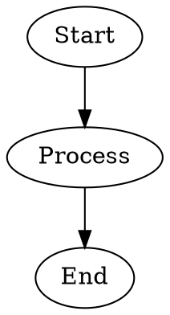
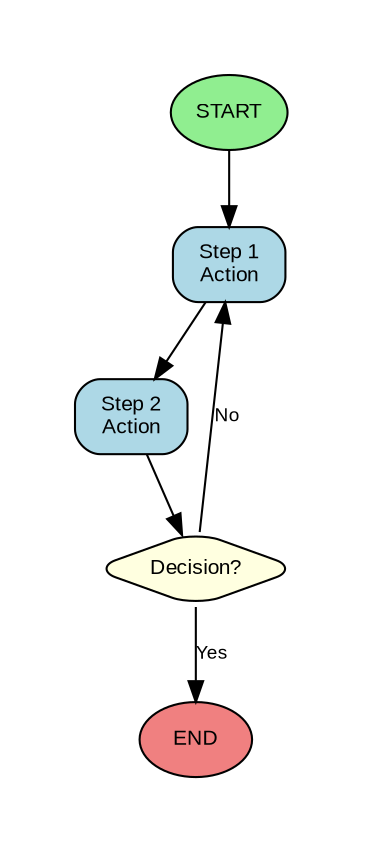
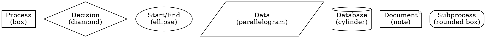
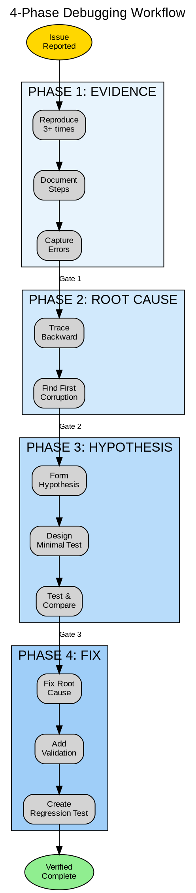

# PRISM DOT DIAGRAM STANDARDS
## Graphviz DOT Standards for Skill Visualizations
### Version 1.0 | SP.0.3 Deliverable | January 24, 2026

---

# PART 1: OVERVIEW

## 1.1 Purpose

This document establishes standards for creating consistent, readable diagrams within PRISM skills using Graphviz DOT notation and ASCII art. Diagrams help visualize workflows, decision trees, data flows, and system architectures.

## 1.2 When to Use Diagrams

| Diagram Type | Use For | Example |
|--------------|---------|---------|
| **Workflow** | Step-by-step processes | Debugging phases, extraction steps |
| **Decision Tree** | Branching logic | Material selection, algorithm choice |
| **Data Flow** | Information movement | Database → Consumer wiring |
| **Architecture** | System structure | Module dependencies, tier layers |
| **State Machine** | Status transitions | Task states, session states |

## 1.3 Diagram Formats

PRISM uses two diagram formats:

1. **ASCII Box Diagrams** - For inline documentation (renders in any text viewer)
2. **DOT Notation** - For generating SVG/PNG with Graphviz (when tools available)

---

# PART 2: ASCII BOX DIAGRAM STANDARDS

## 2.1 Basic Box Elements

```
┌─────────────────┐     Single box with content
│  Box Content    │
└─────────────────┘

╔═════════════════╗     Double-line box (emphasis/headers)
║  Emphasized     ║
╚═════════════════╝

┌─────────────────┐     Box with title
│ ▶ TITLE         │
├─────────────────┤
│  Content here   │
└─────────────────┘
```

## 2.2 Connection Lines

```
Vertical:
    │
    │
    ▼

Horizontal:
────────────▶

Bidirectional:
◀───────────▶

Branching:
        ┌───────────┐
        │           │
    ────┼───────────┼────
        │           │
        ▼           ▼
```

## 2.3 Standard Workflow Pattern

```
┌─────────────────────────────────────────────────────────────────┐
│                        WORKFLOW TITLE                            │
├─────────────────────────────────────────────────────────────────┤
│                                                                 │
│  ┌─────────┐     ┌─────────┐     ┌─────────┐     ┌─────────┐   │
│  │ Step 1  │────▶│ Step 2  │────▶│ Step 3  │────▶│ Step 4  │   │
│  └─────────┘     └─────────┘     └─────────┘     └─────────┘   │
│                                                                 │
└─────────────────────────────────────────────────────────────────┘
```

## 2.4 Standard Decision Pattern

```
                    ┌─────────────┐
                    │  Decision   │
                    │  Point?     │
                    └──────┬──────┘
                           │
           ┌───────────────┼───────────────┐
           │               │               │
           ▼               ▼               ▼
     ┌──────────┐    ┌──────────┐    ┌──────────┐
     │ Option A │    │ Option B │    │ Option C │
     └──────────┘    └──────────┘    └──────────┘
```

## 2.5 Standard Layer Pattern

```
┌─────────────────────────────────────────────────────────────────┐
│  LAYER 1 (Top)                                                  │
│  ┌─────────┐  ┌─────────┐  ┌─────────┐                         │
│  │ Item A  │  │ Item B  │  │ Item C  │                         │
│  └────┬────┘  └────┬────┘  └────┬────┘                         │
├───────┼────────────┼────────────┼───────────────────────────────┤
│       │            │            │                               │
│       ▼            ▼            ▼              LAYER 2          │
│  ┌─────────────────────────────────────┐                       │
│  │         Shared Component            │                       │
│  └─────────────────────────────────────┘                       │
├─────────────────────────────────────────────────────────────────┤
│  LAYER 3 (Bottom)                                               │
│  ┌─────────────────────────────────────────────────────────┐   │
│  │                    Foundation                            │   │
│  └─────────────────────────────────────────────────────────┘   │
└─────────────────────────────────────────────────────────────────┘
```

## 2.6 Character Reference

```
BOX DRAWING:
┌ ┐ └ ┘    Light corners
├ ┤ ┬ ┴    Light T-junctions
│ ─        Light lines
╔ ╗ ╚ ╝    Double corners
╠ ╣ ╦ ╩    Double T-junctions
║ ═        Double lines

ARROWS:
▶ ◀ ▲ ▼    Filled arrows
→ ← ↑ ↓    Simple arrows
⟶ ⟵        Long arrows

SYMBOLS:
✓ ✗        Check/X
☐ ☑        Checkbox
● ○        Filled/empty circle
★ ☆        Filled/empty star
▸ ▹        Small triangles
```

---

# PART 3: WORKFLOW DIAGRAMS

## 3.1 Linear Workflow

```
PURPOSE: Show sequential steps with clear progression

┌─────────┐     ┌─────────┐     ┌─────────┐     ┌─────────┐
│  START  │────▶│ Step 1  │────▶│ Step 2  │────▶│  END    │
└─────────┘     └─────────┘     └─────────┘     └─────────┘
```

## 3.2 Workflow with Verification Points

```
PURPOSE: Show steps with checkpoints

┌─────────┐     ┌─────────┐     ┌─────────┐     ┌─────────┐
│ Step 1  │────▶│ Verify  │────▶│ Step 2  │────▶│ Verify  │
└─────────┘     └────┬────┘     └─────────┘     └────┬────┘
                     │                               │
                     ▼                               ▼
                ┌─────────┐                     ┌─────────┐
                │  Pass?  │                     │  Pass?  │
                └────┬────┘                     └────┬────┘
                     │                               │
              ┌──────┴──────┐                 ┌──────┴──────┐
              │             │                 │             │
              ▼             ▼                 ▼             ▼
           [Yes]         [No]              [Yes]         [No]
         Continue       Fix First        Continue       Fix First
```

## 3.3 Workflow with Parallel Paths

```
PURPOSE: Show concurrent activities

                    ┌─────────┐
                    │  START  │
                    └────┬────┘
                         │
         ┌───────────────┼───────────────┐
         │               │               │
         ▼               ▼               ▼
    ┌─────────┐    ┌─────────┐    ┌─────────┐
    │ Path A  │    │ Path B  │    │ Path C  │
    │ Task 1  │    │ Task 1  │    │ Task 1  │
    └────┬────┘    └────┬────┘    └────┬────┘
         │               │               │
         ▼               ▼               ▼
    ┌─────────┐    ┌─────────┐    ┌─────────┐
    │ Path A  │    │ Path B  │    │ Path C  │
    │ Task 2  │    │ Task 2  │    │ Task 2  │
    └────┬────┘    └────┬────┘    └────┬────┘
         │               │               │
         └───────────────┼───────────────┘
                         │
                         ▼
                    ┌─────────┐
                    │  MERGE  │
                    └────┬────┘
                         │
                         ▼
                    ┌─────────┐
                    │   END   │
                    └─────────┘
```

## 3.4 4-Phase Debugging Workflow (Real Example)

```
┌─────────────────────────────────────────────────────────────────────────────┐
│                        4-PHASE DEBUGGING WORKFLOW                            │
├─────────────────────────────────────────────────────────────────────────────┤
│                                                                             │
│  ┌──────────────┐                                                           │
│  │   ISSUE      │                                                           │
│  │   REPORTED   │                                                           │
│  └──────┬───────┘                                                           │
│         │                                                                   │
│         ▼                                                                   │
│  ╔══════════════╗     ┌─────────────────────────────────────┐              │
│  ║   PHASE 1    ║     │ • Reproduce 3+ times                │              │
│  ║   EVIDENCE   ║────▶│ • Document exact steps              │              │
│  ╚══════╤═══════╝     │ • Capture errors verbatim           │              │
│         │             └─────────────────────────────────────┘              │
│         │                                                                   │
│    ═════╧═════ GATE: Evidence complete? ═════                              │
│         │                                                                   │
│         ▼                                                                   │
│  ╔══════════════╗     ┌─────────────────────────────────────┐              │
│  ║   PHASE 2    ║     │ • Trace backward from error         │              │
│  ║  ROOT CAUSE  ║────▶│ • Find FIRST corruption point       │              │
│  ╚══════╤═══════╝     │ • Distinguish symptom from cause    │              │
│         │             └─────────────────────────────────────┘              │
│         │                                                                   │
│    ═════╧═════ GATE: Root cause identified? ═════                          │
│         │                                                                   │
│         ▼                                                                   │
│  ╔══════════════╗     ┌─────────────────────────────────────┐              │
│  ║   PHASE 3    ║     │ • Form specific hypothesis          │              │
│  ║  HYPOTHESIS  ║────▶│ • Design minimal test               │              │
│  ╚══════╤═══════╝     │ • Predict → test → compare          │              │
│         │             └─────────────────────────────────────┘              │
│         │                                                                   │
│    ═════╧═════ GATE: Hypothesis validated? ═════                           │
│         │                                                                   │
│         ▼                                                                   │
│  ╔══════════════╗     ┌─────────────────────────────────────┐              │
│  ║   PHASE 4    ║     │ • Fix at ROOT CAUSE                 │              │
│  ║  FIX+PREVENT ║────▶│ • Add validation                    │              │
│  ╚══════╤═══════╝     │ • Create regression test            │              │
│         │             └─────────────────────────────────────┘              │
│         │                                                                   │
│         ▼                                                                   │
│  ┌──────────────┐                                                           │
│  │   VERIFIED   │                                                           │
│  │   COMPLETE   │                                                           │
│  └──────────────┘                                                           │
│                                                                             │
└─────────────────────────────────────────────────────────────────────────────┘
```

---

# PART 4: DECISION TREE DIAGRAMS

## 4.1 Binary Decision Tree

```
                         ┌─────────────────┐
                         │   Condition?    │
                         └────────┬────────┘
                                  │
                    ┌─────────────┴─────────────┐
                    │                           │
                    ▼                           ▼
              ┌───────────┐               ┌───────────┐
              │    YES    │               │    NO     │
              └─────┬─────┘               └─────┬─────┘
                    │                           │
                    ▼                           ▼
              [Action A]                  [Action B]
```

## 4.2 Multi-Branch Decision

```
                         ┌─────────────────┐
                         │  What type?     │
                         └────────┬────────┘
                                  │
           ┌──────────────────────┼──────────────────────┐
           │                      │                      │
           ▼                      ▼                      ▼
     ┌───────────┐          ┌───────────┐          ┌───────────┐
     │  Type A   │          │  Type B   │          │  Type C   │
     └─────┬─────┘          └─────┬─────┘          └─────┬─────┘
           │                      │                      │
           ▼                      ▼                      ▼
     [Process A]            [Process B]            [Process C]
```

## 4.3 Nested Decision Tree

```
                    ┌───────────────────┐
                    │ Primary Question? │
                    └─────────┬─────────┘
                              │
              ┌───────────────┴───────────────┐
              │                               │
              ▼                               ▼
        ┌───────────┐                   ┌───────────┐
        │    YES    │                   │    NO     │
        └─────┬─────┘                   └─────┬─────┘
              │                               │
              ▼                               ▼
     ┌─────────────────┐             ┌─────────────────┐
     │ Sub-question A? │             │ Sub-question B? │
     └────────┬────────┘             └────────┬────────┘
              │                               │
       ┌──────┴──────┐                 ┌──────┴──────┐
       │             │                 │             │
       ▼             ▼                 ▼             ▼
    [A.Yes]       [A.No]            [B.Yes]       [B.No]
```

## 4.4 Skill Selection Decision Tree (Real Example)

```
┌─────────────────────────────────────────────────────────────────────────────┐
│                        SKILL SELECTION DECISION TREE                         │
├─────────────────────────────────────────────────────────────────────────────┤
│                                                                             │
│                         ┌─────────────────────┐                             │
│                         │   What's the task?  │                             │
│                         └──────────┬──────────┘                             │
│                                    │                                        │
│     ┌──────────────┬───────────────┼───────────────┬──────────────┐        │
│     │              │               │               │              │        │
│     ▼              ▼               ▼               ▼              ▼        │
│ ┌────────┐    ┌────────┐     ┌────────┐     ┌────────┐     ┌────────┐     │
│ │Develop │    │Extract │     │Material│     │ Debug  │     │  App   │     │
│ └───┬────┘    └───┬────┘     └───┬────┘     └───┬────┘     └───┬────┘     │
│     │             │              │              │              │          │
│     ▼             ▼              ▼              ▼              ▼          │
│ ┌────────┐   ┌─────────┐   ┌─────────┐   ┌─────────┐   ┌─────────────┐   │
│ │New     │   │sp-      │   │sp-      │   │sp-      │   │What type?   │   │
│ │feature?│   │extract  │   │materials│   │debugging│   └──────┬──────┘   │
│ └───┬────┘   │+monolith│   │+material│   │+error-  │          │          │
│     │        │-index   │   │-template│   │catalog  │   ┌──────┴──────┐   │
│  ┌──┴──┐     └─────────┘   └─────────┘   └─────────┘   │             │   │
│  │     │                                               ▼             ▼   │
│ YES    NO                                        ┌─────────┐   ┌────────┐│
│  │     │                                         │Speed/   │   │Trouble-││
│  ▼     ▼                                         │Feed     │   │shoot   ││
│ sp-   sp-                                        └────┬────┘   └───┬────┘│
│ brain exec                                            │            │     │
│ storm ution                                           ▼            ▼     │
│                                                  app-speed-   app-trouble│
│                                                  feed+product shoot+     │
│                                                  -calculators master-    │
│                                                               machinist  │
│                                                                          │
└─────────────────────────────────────────────────────────────────────────────┘
```


---

# PART 5: DATA FLOW DIAGRAMS

## 5.1 Simple Data Flow

```
┌──────────┐     data      ┌──────────┐     result     ┌──────────┐
│  Source  │──────────────▶│ Process  │───────────────▶│  Output  │
└──────────┘               └──────────┘                └──────────┘
```

## 5.2 Multi-Source Data Flow

```
┌──────────┐
│ Source A │────┐
└──────────┘    │
                │    ┌──────────┐     ┌──────────┐
┌──────────┐    ├───▶│  Merge   │────▶│  Output  │
│ Source B │────┤    └──────────┘     └──────────┘
└──────────┘    │
                │
┌──────────┐    │
│ Source C │────┘
└──────────┘
```

## 5.3 Data Flow with Transformation

```
┌──────────┐     raw      ┌──────────┐    cleaned    ┌──────────┐
│   Raw    │─────────────▶│  Clean   │──────────────▶│ Validate │
│   Data   │              │  Filter  │               │  Check   │
└──────────┘              └──────────┘               └────┬─────┘
                                                          │
                                         ┌────────────────┴────────────────┐
                                         │                                 │
                                         ▼                                 ▼
                                   ┌──────────┐                      ┌──────────┐
                                   │  Valid   │                      │ Invalid  │
                                   │  Store   │                      │  Log     │
                                   └──────────┘                      └──────────┘
```

## 5.4 Database Consumer Wiring (Real Example)

```
┌─────────────────────────────────────────────────────────────────────────────┐
│                      DATABASE → CONSUMER WIRING                              │
├─────────────────────────────────────────────────────────────────────────────┤
│                                                                             │
│  ┌─────────────────────────────────────────────────────────────────────┐   │
│  │                    PRISM_MATERIALS_MASTER                            │   │
│  │                    (127 parameters per material)                     │   │
│  └───────────────────────────────┬─────────────────────────────────────┘   │
│                                  │                                         │
│     ┌────────────────────────────┼────────────────────────────┐           │
│     │         │         │        │        │         │         │           │
│     ▼         ▼         ▼        ▼        ▼         ▼         ▼           │
│  ┌──────┐ ┌──────┐ ┌──────┐ ┌──────┐ ┌──────┐ ┌──────┐ ┌──────┐         │
│  │Force │ │Thermal│ │Tool  │ │Chip  │ │Surface│ │Cost  │ │Speed │         │
│  │Calc  │ │Engine │ │Life  │ │Form  │ │Integ │ │Est   │ │Feed  │         │
│  └──────┘ └──────┘ └──────┘ └──────┘ └──────┘ └──────┘ └──────┘         │
│                                                                             │
│  Parameters Used by Each Consumer:                                         │
│  ─────────────────────────────────                                         │
│  Force:   Kienzle Kc1.1, mc, composition, hardness                        │
│  Thermal: Specific heat, conductivity, melting point                       │
│  Tool:    Taylor coefficients, chip formation, machinability              │
│  Chip:    Shear angle, chip ratio, built-up edge tendency                 │
│  Surface: Ra/Rz correlation, residual stress factors                      │
│  Cost:    Material cost/kg, availability, lead time                       │
│  Speed:   Recommended Vc, feed factors, depth limits                      │
│                                                                             │
└─────────────────────────────────────────────────────────────────────────────┘
```

---

# PART 6: ARCHITECTURE DIAGRAMS

## 6.1 Layer Architecture

```
╔═════════════════════════════════════════════════════════════════════════════╗
║                              PRESENTATION LAYER                              ║
║  ┌─────────────┐  ┌─────────────┐  ┌─────────────┐  ┌─────────────┐        ║
║  │     UI      │  │    API      │  │   Reports   │  │   Export    │        ║
║  └──────┬──────┘  └──────┬──────┘  └──────┬──────┘  └──────┬──────┘        ║
╠═════════╪════════════════╪════════════════╪════════════════╪════════════════╣
║         └────────────────┴────────────────┴────────────────┘                ║
║                                   │                                         ║
║                                   ▼                                         ║
║                           APPLICATION LAYER                                  ║
║  ┌─────────────────────────────────────────────────────────────────────┐   ║
║  │                        Business Logic                                │   ║
║  │  ┌─────────┐  ┌─────────┐  ┌─────────┐  ┌─────────┐  ┌─────────┐   │   ║
║  │  │ Engines │  │ Calcs   │  │Workflow │  │ Rules   │  │Validation│  │   ║
║  │  └─────────┘  └─────────┘  └─────────┘  └─────────┘  └─────────┘   │   ║
║  └─────────────────────────────────┬───────────────────────────────────┘   ║
╠═════════════════════════════════════╪═══════════════════════════════════════╣
║                                     │                                       ║
║                                     ▼                                       ║
║                              DATA LAYER                                      ║
║  ┌─────────────────────────────────────────────────────────────────────┐   ║
║  │  ┌─────────┐  ┌─────────┐  ┌─────────┐  ┌─────────┐  ┌─────────┐   │   ║
║  │  │Materials│  │Machines │  │  Tools  │  │ Posts   │  │ Learned │   │   ║
║  │  └─────────┘  └─────────┘  └─────────┘  └─────────┘  └─────────┘   │   ║
║  └─────────────────────────────────────────────────────────────────────┘   ║
╚═════════════════════════════════════════════════════════════════════════════╝
```

## 6.2 Component Architecture

```
┌─────────────────────────────────────────────────────────────────────────────┐
│                           PRISM v9.0 ARCHITECTURE                            │
├─────────────────────────────────────────────────────────────────────────────┤
│                                                                             │
│  ┌─────────────┐          ┌─────────────┐          ┌─────────────┐         │
│  │   PRISM     │◀────────▶│   PRISM     │◀────────▶│   PRISM     │         │
│  │   CORE      │          │  DATA_BUS   │          │  GATEWAY    │         │
│  └──────┬──────┘          └──────┬──────┘          └──────┬──────┘         │
│         │                        │                        │                │
│         │         ┌──────────────┴──────────────┐        │                │
│         │         │                             │        │                │
│         ▼         ▼                             ▼        ▼                │
│  ┌─────────────────────┐                ┌─────────────────────┐           │
│  │     DATABASES       │                │      ENGINES        │           │
│  │  ┌─────┐ ┌─────┐   │                │  ┌─────┐ ┌─────┐   │           │
│  │  │Mat. │ │Mach.│   │                │  │Phys.│ │ AI  │   │           │
│  │  ├─────┤ ├─────┤   │                │  ├─────┤ ├─────┤   │           │
│  │  │Tool │ │Work │   │                │  │ CAM │ │Optim│   │           │
│  │  ├─────┤ ├─────┤   │                │  ├─────┤ ├─────┤   │           │
│  │  │Post │ │Cost │   │                │  │Post │ │Sig. │   │           │
│  │  └─────┘ └─────┘   │                │  └─────┘ └─────┘   │           │
│  └─────────────────────┘                └─────────────────────┘           │
│                                                                             │
└─────────────────────────────────────────────────────────────────────────────┘
```

## 6.3 Database Hierarchy (Real Example)

```
┌─────────────────────────────────────────────────────────────────────────────┐
│                        DATABASE HIERARCHY LAYERS                             │
├─────────────────────────────────────────────────────────────────────────────┤
│                                                                             │
│  PRIORITY: LEARNED > USER > ENHANCED > CORE                                 │
│                                                                             │
│  ┌─────────────────────────────────────────────────────────────────────┐   │
│  │ LEARNED (AI/ML Derived) ─────────────────────── Highest Priority    │   │
│  │ • Auto-tuned parameters from shop floor feedback                     │   │
│  │ • ML-predicted optimal values                                        │   │
│  │ • Confidence-weighted adjustments                                    │   │
│  └───────────────────────────────────┬─────────────────────────────────┘   │
│                                      │ overrides ↓                         │
│  ┌───────────────────────────────────▼─────────────────────────────────┐   │
│  │ USER (Shop-Specific) ────────────────────────── High Priority       │   │
│  │ • Custom material grades                                             │   │
│  │ • Shop machine configurations                                        │   │
│  │ • Local supplier tools                                               │   │
│  └───────────────────────────────────┬─────────────────────────────────┘   │
│                                      │ overrides ↓                         │
│  ┌───────────────────────────────────▼─────────────────────────────────┐   │
│  │ ENHANCED (Manufacturer-Specific) ───────────── Medium Priority      │   │
│  │ • 33 machine manufacturers with full specs                          │   │
│  │ • Kinematic models, axis limits, options                            │   │
│  │ • Tool manufacturer catalogs                                        │   │
│  └───────────────────────────────────┬─────────────────────────────────┘   │
│                                      │ overrides ↓                         │
│  ┌───────────────────────────────────▼─────────────────────────────────┐   │
│  │ CORE (Infrastructure Defaults) ─────────────── Lowest Priority      │   │
│  │ • Generic machine types                                              │   │
│  │ • Standard material properties                                       │   │
│  │ • Default cutting parameters                                         │   │
│  └─────────────────────────────────────────────────────────────────────┘   │
│                                                                             │
└─────────────────────────────────────────────────────────────────────────────┘
```

---

# PART 7: STATE MACHINE DIAGRAMS

## 7.1 Simple State Machine

```
        ┌─────────────────────────────────────────────────────┐
        │                                                     │
        ▼                                                     │
   ┌─────────┐    start     ┌─────────┐    complete    ┌─────────┐
   │  IDLE   │─────────────▶│ ACTIVE  │───────────────▶│  DONE   │
   └─────────┘              └────┬────┘                └─────────┘
                                 │
                                 │ error
                                 ▼
                            ┌─────────┐    retry
                            │  ERROR  │────────────────────┘
                            └─────────┘
```

## 7.2 Task State Machine (Real Example)

```
┌─────────────────────────────────────────────────────────────────────────────┐
│                           TASK STATE MACHINE                                 │
├─────────────────────────────────────────────────────────────────────────────┤
│                                                                             │
│                              ┌─────────────┐                                │
│                              │   PLANNED   │                                │
│                              └──────┬──────┘                                │
│                                     │ start                                 │
│                                     ▼                                       │
│  ┌──────────────────────────────────────────────────────────────────────┐  │
│  │                                                                      │  │
│  │    ┌─────────────┐    progress    ┌─────────────┐                   │  │
│  │    │ IN_PROGRESS │───────────────▶│   PARTIAL   │                   │  │
│  │    └──────┬──────┘                └──────┬──────┘                   │  │
│  │           │                              │                           │  │
│  │           │ complete                     │ resume                    │  │
│  │           │                              │                           │  │
│  │           │         ┌────────────────────┘                           │  │
│  │           │         │                                                │  │
│  │           ▼         ▼                                                │  │
│  │    ┌─────────────────────┐                                          │  │
│  │    │      VERIFYING      │◀──────────────────────────┐              │  │
│  │    └──────────┬──────────┘                           │              │  │
│  │               │                                       │ rework       │  │
│  │        ┌──────┴──────┐                               │              │  │
│  │        │             │                               │              │  │
│  │        ▼             ▼                               │              │  │
│  │  ┌──────────┐  ┌──────────┐                         │              │  │
│  │  │  PASSED  │  │  FAILED  │─────────────────────────┘              │  │
│  │  └─────┬────┘  └──────────┘                                        │  │
│  │        │                                                            │  │
│  └────────┼────────────────────────────────────────────────────────────┘  │
│           │                                                               │
│           ▼                                                               │
│    ┌─────────────┐                                                        │
│    │  COMPLETE   │                                                        │
│    └─────────────┘                                                        │
│                                                                             │
└─────────────────────────────────────────────────────────────────────────────┘
```

---

# PART 8: GRAPHVIZ DOT NOTATION

## 8.1 Basic DOT Syntax



## 8.2 Styled DOT Graph



## 8.3 DOT Shape Reference



## 8.4 DOT Color Palette for PRISM

```dot
// PRISM standard colors
digraph colors {
    // Status colors
    success [fillcolor="#90EE90" label="Success\n#90EE90"];
    warning [fillcolor="#FFD700" label="Warning\n#FFD700"];
    error [fillcolor="#FF6B6B" label="Error\n#FF6B6B"];
    info [fillcolor="#87CEEB" label="Info\n#87CEEB"];
    
    // Phase colors
    phase1 [fillcolor="#E8F4FD" label="Phase 1\n#E8F4FD"];
    phase2 [fillcolor="#D1E9FC" label="Phase 2\n#D1E9FC"];
    phase3 [fillcolor="#B8DCFA" label="Phase 3\n#B8DCFA"];
    phase4 [fillcolor="#9FCEF8" label="Phase 4\n#9FCEF8"];
    
    // Layer colors
    learned [fillcolor="#FFB6C1" label="LEARNED\n#FFB6C1"];
    user [fillcolor="#DDA0DD" label="USER\n#DDA0DD"];
    enhanced [fillcolor="#ADD8E6" label="ENHANCED\n#ADD8E6"];
    core [fillcolor="#D3D3D3" label="CORE\n#D3D3D3"];
}
```



## 8.5 Complete DOT Example (4-Phase Debugging)




---

# PART 9: BEST PRACTICES

## 9.1 Diagram Selection Guide

| Need to Show | Use This Diagram | ASCII or DOT |
|--------------|------------------|--------------|
| Step-by-step process | Workflow | ASCII preferred |
| Yes/No branching | Binary Decision | ASCII |
| Multiple options | Multi-Branch Decision | ASCII |
| Data movement | Data Flow | ASCII or DOT |
| System structure | Architecture | ASCII or DOT |
| Layer relationships | Layer Diagram | ASCII |
| Status changes | State Machine | DOT preferred |
| Complex dependencies | Component Graph | DOT |

## 9.2 ASCII Diagram Guidelines

**DO:**
- Use consistent box sizes where possible
- Align elements vertically and horizontally
- Include clear labels inside boxes
- Add legend if symbols might be unclear
- Keep diagrams under 80 characters wide for compatibility

**DON'T:**
- Mix single and double lines without meaning
- Create overly complex diagrams (split into multiple)
- Use ambiguous arrow directions
- Omit important connections
- Make boxes too small for content

## 9.3 DOT Diagram Guidelines

**DO:**
- Use subgraphs (clusters) for logical grouping
- Apply consistent color scheme (Part 8.4)
- Include meaningful edge labels
- Set appropriate rankdir (TB or LR)
- Add graph title with label attribute

**DON'T:**
- Use too many colors (max 5-6)
- Create crossing edges when avoidable
- Make nodes too small to read
- Forget to style edges consistently
- Mix conflicting shape meanings

## 9.4 Common Mistakes

| Mistake | Impact | Fix |
|---------|--------|-----|
| Inconsistent box sizes | Looks unprofessional | Use fixed widths |
| Missing arrows | Flow unclear | Add directional arrows |
| Too much detail | Overwhelming | Split into sub-diagrams |
| No legend | Confusion | Add symbol explanation |
| Misaligned elements | Hard to follow | Use grid alignment |

---

# PART 10: DIAGRAM TEMPLATES GALLERY

## 10.1 Session Workflow Template

```
┌─────────────────────────────────────────────────────────────────────────────┐
│                           SESSION: [ID] - [NAME]                             │
├─────────────────────────────────────────────────────────────────────────────┤
│                                                                             │
│  ┌─────────┐     ┌─────────┐     ┌─────────┐     ┌─────────┐              │
│  │  Read   │────▶│  Check  │────▶│  Load   │────▶│Execute  │              │
│  │  State  │     │IN_PROG? │     │ Skills  │     │  Task   │              │
│  └─────────┘     └────┬────┘     └─────────┘     └────┬────┘              │
│                       │                               │                    │
│                  [If YES]                             │                    │
│                       │                               ▼                    │
│                       ▼                          ┌─────────┐              │
│                 ┌──────────┐                     │ Verify  │              │
│                 │  Resume  │                     │  Save   │              │
│                 │  From    │                     └────┬────┘              │
│                 │Checkpoint│                          │                    │
│                 └──────────┘                          ▼                    │
│                                                 ┌─────────┐              │
│                                                 │ Update  │              │
│                                                 │  State  │              │
│                                                 └─────────┘              │
│                                                                             │
└─────────────────────────────────────────────────────────────────────────────┘
```

## 10.2 Brainstorm-to-Execute Template

```
┌─────────────────────────────────────────────────────────────────────────────┐
│                      BRAINSTORM → EXECUTE WORKFLOW                           │
├─────────────────────────────────────────────────────────────────────────────┤
│                                                                             │
│  ┌──────────────────────────────────────────────────────────────────────┐  │
│  │ BRAINSTORM PHASE                                                     │  │
│  │ ┌─────────┐     ┌─────────┐     ┌─────────┐     ┌─────────┐        │  │
│  │ │  Scope  │────▶│Approach │────▶│ Details │────▶│ Approval│        │  │
│  │ │ Chunk   │     │ Chunk   │     │ Chunk   │     │   ✓     │        │  │
│  │ └─────────┘     └─────────┘     └─────────┘     └────┬────┘        │  │
│  └──────────────────────────────────────────────────────┼───────────────┘  │
│                                                         │                  │
│                                                         ▼                  │
│  ┌──────────────────────────────────────────────────────────────────────┐  │
│  │ EXECUTE PHASE                                                        │  │
│  │ ┌─────────┐     ┌─────────┐     ┌─────────┐     ┌─────────┐        │  │
│  │ │  Task   │────▶│Checkpoint────▶│  Task   │────▶│ Verify  │        │  │
│  │ │   1     │     │   💾    │     │   2     │     │   ✓     │        │  │
│  │ └─────────┘     └─────────┘     └─────────┘     └─────────┘        │  │
│  └──────────────────────────────────────────────────────────────────────┘  │
│                                                                             │
└─────────────────────────────────────────────────────────────────────────────┘
```

## 10.3 Error Handling Template

```
┌─────────────────────────────────────────────────────────────────────────────┐
│                           ERROR HANDLING FLOW                                │
├─────────────────────────────────────────────────────────────────────────────┤
│                                                                             │
│  ┌─────────┐                                                                │
│  │Operation│                                                                │
│  └────┬────┘                                                                │
│       │                                                                     │
│       ▼                                                                     │
│  ┌─────────┐     ┌─────────────────────────────────────────────────────┐   │
│  │Success? │     │ ERROR PATH                                          │   │
│  └────┬────┘     │ ┌─────────┐     ┌─────────┐     ┌─────────┐        │   │
│       │          │ │  Log    │────▶│ Analyze │────▶│ Decide  │        │   │
│    ┌──┴──┐       │ │  Error  │     │  Type   │     │ Action  │        │   │
│    │     │       │ └─────────┘     └─────────┘     └────┬────┘        │   │
│   YES    NO──────│─────────────────────────────────────▶│             │   │
│    │             │                              ┌───────┼───────┐     │   │
│    ▼             │                              │       │       │     │   │
│  ┌─────────┐     │                              ▼       ▼       ▼     │   │
│  │Continue │     │                         ┌──────┐┌──────┐┌──────┐  │   │
│  └─────────┘     │                         │Retry ││Fallbk││ Fail │  │   │
│                  │                         └──────┘└──────┘└──────┘  │   │
│                  └─────────────────────────────────────────────────────┘   │
│                                                                             │
└─────────────────────────────────────────────────────────────────────────────┘
```

## 10.4 Skill Composition Template

```
┌─────────────────────────────────────────────────────────────────────────────┐
│                          SKILL COMPOSITION: [TASK]                           │
├─────────────────────────────────────────────────────────────────────────────┤
│                                                                             │
│  ┌─────────────────────┐                                                    │
│  │    LEAD SKILL       │                                                    │
│  │    [skill-name]     │ ◀─── Controls workflow                            │
│  └──────────┬──────────┘                                                    │
│             │                                                               │
│      ┌──────┴──────┐                                                        │
│      │             │                                                        │
│      ▼             ▼                                                        │
│  ┌─────────┐  ┌─────────┐                                                  │
│  │ SUPPORT │  │REFERENCE│                                                  │
│  │[skill]  │  │[skill]  │                                                  │
│  │         │  │         │                                                  │
│  │Provides:│  │Provides:│                                                  │
│  │• [data] │  │• [data] │                                                  │
│  │• [guide]│  │• [vals] │                                                  │
│  └─────────┘  └─────────┘                                                  │
│                                                                             │
│  ANTI-PATTERN: [prism-sp-anti-xxx] (implicitly available)                  │
│                                                                             │
└─────────────────────────────────────────────────────────────────────────────┘
```

---

# PART 11: QUICK REFERENCE

## 11.1 ASCII Character Quick Copy

```
BOXES:     ┌ ─ ┐ │ └ ┘ ├ ┤ ┬ ┴ ┼
DOUBLE:    ╔ ═ ╗ ║ ╚ ╝ ╠ ╣ ╦ ╩ ╬
ARROWS:    ▶ ◀ ▲ ▼ → ← ↑ ↓
SYMBOLS:   ✓ ✗ ☐ ☑ ● ○ ★ ◆ ▸
```

## 11.2 DOT Quick Syntax

```dot
// Minimal workflow
digraph G {
    rankdir=LR;
    A -> B -> C;
}

// Styled nodes
node [shape=box style="rounded,filled" fillcolor="lightblue"];

// Decision diamond
decision [shape=diamond];

// Cluster/subgraph
subgraph cluster_name { label="Group"; A; B; }

// Edge label
A -> B [label="condition"];
```

## 11.3 Diagram Type Selector

```
NEED                          USE
────                          ───
Linear process?          ──▶  Workflow (horizontal)
Multi-step with gates?   ──▶  Workflow (vertical with gates)
Yes/No decision?         ──▶  Binary decision tree
Multiple options?        ──▶  Multi-branch decision
Data transformation?     ──▶  Data flow diagram
System structure?        ──▶  Architecture diagram
Status changes?          ──▶  State machine
Database relationships?  ──▶  Data flow + layers
Skill combination?       ──▶  Composition diagram
```

## 11.4 Color Quick Reference

```
SUCCESS:  #90EE90 (light green)
WARNING:  #FFD700 (gold)
ERROR:    #FF6B6B (light red)
INFO:     #87CEEB (sky blue)
NEUTRAL:  #D3D3D3 (light gray)

PHASES:   #E8F4FD → #D1E9FC → #B8DCFA → #9FCEF8 (blue gradient)
LAYERS:   #FFB6C1 (learned) → #DDA0DD (user) → #ADD8E6 (enhanced) → #D3D3D3 (core)
```

---

# DOCUMENT METADATA

```
Document:     DOT_STANDARDS.md
Version:      1.0.0
Created:      2026-01-24
Session:      SP.0.3
Author:       Claude (PRISM Development)
Size:         ~35KB
Sections:     11 Parts

Purpose:      Establish standards for creating consistent
              diagrams in PRISM skills and documentation

Related:      PRISM_SKILL_FRAMEWORK.md
              SKILL_TEMPLATE.md

Next:         SP.0.4 - Evidence & Activation Rules
```

---

**END OF DOCUMENT**

