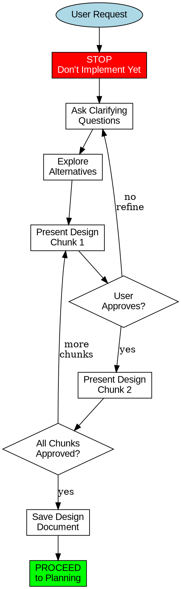
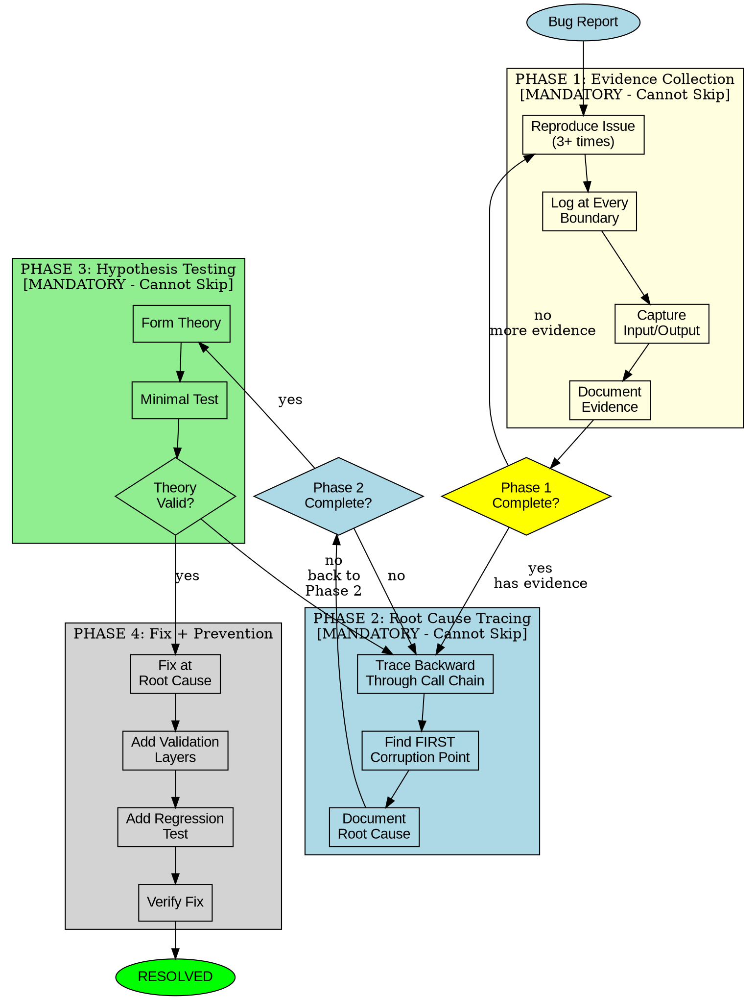

# PRISM SUPERPOWERS COMPLETE ROADMAP
## Comprehensive Skills Framework Transformation
### Version 2.0 | January 24, 2026

---

# EXECUTIVE SUMMARY

```
╔═══════════════════════════════════════════════════════════════════════════════════════════╗
║                      PRISM SUPERPOWERS ADAPTATION PROJECT                                  ║
╠═══════════════════════════════════════════════════════════════════════════════════════════╣
║                                                                                           ║
║   OBJECTIVE: Transform PRISM's skills system into a Superpowers-class methodology         ║
║   framework with mandatory workflows, evidence-based verification, and systematic         ║
║   processes - adapted for BOTH PRISM development AND in-app user assistance.              ║
║                                                                                           ║
║   SOURCE INSPIRATION: obra/superpowers (34.7k stars, MIT license)                         ║
║   https://github.com/obra/superpowers                                                     ║
║                                                                                           ║
║   ═══════════════════════════════════════════════════════════════════════════════════     ║
║                                                                                           ║
║   DUAL-PURPOSE ARCHITECTURE:                                                              ║
║                                                                                           ║
║   TRACK A: Development Skills           │ For Claude rebuilding PRISM                     ║
║   └── 28 sessions                       │ Methodology & process skills                    ║
║                                                                                           ║
║   TRACK B: Application Skills           │ For PRISM end-users (in-app)                    ║
║   └── 22 sessions                       │ Manufacturing workflow guidance                 ║
║                                                                                           ║
║   TRACK C: Shared Infrastructure        │ Common framework components                     ║
║   └── 10 sessions                       │ Activation, evidence, diagrams                  ║
║                                                                                           ║
║   TRACK D: Testing & Validation         │ Quality assurance                               ║
║   └── 8 sessions                        │ Skill testing framework                         ║
║                                                                                           ║
║   ═══════════════════════════════════════════════════════════════════════════════════     ║
║                                                                                           ║
║   TOTAL: 68 micro-sessions                                                                ║
║   ESTIMATED DURATION: 3-4 weeks (or 1.5-2 weeks with parallel execution)                  ║
║                                                                                           ║
║   DELIVERABLES:                                                                           ║
║   • 42 NEW skills (Superpowers-adapted)                                                   ║
║   • 18 ENHANCED existing skills                                                           ║
║   • 1 Complete skill framework with auto-activation                                       ║
║   • 1 DOT/Graphviz decision diagram library                                               ║
║   • 1 Evidence capture & verification system                                              ║
║   • 1 Comprehensive testing suite                                                         ║
║                                                                                           ║
╚═══════════════════════════════════════════════════════════════════════════════════════════╝
```

---

# PART 1: SUPERPOWERS PATTERNS WE'RE ADOPTING

## 1.1 Core Methodology Patterns

| # | Pattern | Source Skill | PRISM Adaptation | Priority |
|---|---------|--------------|------------------|----------|
| 1 | **Brainstorming-First** | `brainstorming/SKILL.md` | Socratic design validation before ANY implementation | CRITICAL |
| 2 | **Two-Stage Review** | `subagent-driven-development/SKILL.md` | Spec compliance review → Quality review (sequential gates) | CRITICAL |
| 3 | **4-Phase Debugging** | `systematic-debugging/SKILL.md` | Evidence→Root Cause→Hypothesis→Fix (mandatory order) | CRITICAL |
| 4 | **Evidence Verification** | `verification-before-completion/SKILL.md` | Proof-based completion (actual output, not claims) | CRITICAL |
| 5 | **TDD for Skills** | `writing-skills/SKILL.md` | Test scenarios for skill compliance | HIGH |
| 6 | **Plan Format Rigor** | `writing-plans/SKILL.md` | Exact paths, complete code, verification commands | HIGH |
| 7 | **DOT Decision Diagrams** | Multiple skills | Visual workflow encoding in Graphviz | HIGH |
| 8 | **Anti-Pattern Documentation** | `testing-anti-patterns.md` | Explicit "NEVER DO" sections | HIGH |
| 9 | **Auto-Activation Triggers** | `using-superpowers/SKILL.md` | Context-based skill activation | HIGH |
| 10 | **Checkpoint Execution** | `executing-plans/SKILL.md` | Batch execution with save points | MEDIUM |

## 1.2 What Makes Superpowers Effective

```
┌─────────────────────────────────────────────────────────────────────────────────────┐
│                     SUPERPOWERS KEY SUCCESS FACTORS                                  │
├─────────────────────────────────────────────────────────────────────────────────────┤
│                                                                                     │
│   1. MANDATORY PAUSES                                                               │
│      • STOP before implementing                                                     │
│      • Design approval required                                                     │
│      • No "just start coding"                                                       │
│                                                                                     │
│   2. EVIDENCE-BASED EVERYTHING                                                      │
│      • Actual command output, not claims                                            │
│      • Verification before "done"                                                   │
│      • Proof collection at each step                                                │
│                                                                                     │
│   3. SEQUENTIAL GATES                                                               │
│      • Can't skip phases                                                            │
│      • Each gate requires evidence                                                  │
│      • Failure → back to previous phase                                             │
│                                                                                     │
│   4. VISUAL WORKFLOWS                                                               │
│      • DOT diagrams for complex flows                                               │
│      • Decision trees are explicit                                                  │
│      • Claude can "execute" the diagram                                             │
│                                                                                     │
│   5. EXPLICIT ANTI-PATTERNS                                                         │
│      • "NEVER DO THIS" sections                                                     │
│      • Wrong vs Right examples                                                      │
│      • Prevents common mistakes                                                     │
│                                                                                     │
└─────────────────────────────────────────────────────────────────────────────────────┘
```

---

# PART 2: DUAL-TRACK ARCHITECTURE

## 2.1 Architecture Overview

```
┌─────────────────────────────────────────────────────────────────────────────────────┐
│                         PRISM SUPERPOWERS ARCHITECTURE                               │
├─────────────────────────────────────────────────────────────────────────────────────┤
│                                                                                     │
│   ┌───────────────────────────────────────────────────────────────────────────┐     │
│   │                    TRACK A: DEVELOPMENT SKILLS                            │     │
│   │                    (For Claude rebuilding PRISM)                          │     │
│   ├───────────────────────────────────────────────────────────────────────────┤     │
│   │                                                                           │     │
│   │   CORE WORKFLOW (8 skills)                                                │     │
│   │   ├── prism-sp-brainstorm        Socratic design refinement               │     │
│   │   ├── prism-sp-planning          Rigorous plan creation                   │     │
│   │   ├── prism-sp-execution         Checkpoint-based execution               │     │
│   │   ├── prism-sp-review-spec       Specification compliance gate            │     │
│   │   ├── prism-sp-review-quality    Code quality gate                        │     │
│   │   ├── prism-sp-debugging         4-phase systematic debugging             │     │
│   │   ├── prism-sp-verification      Evidence-based completion                │     │
│   │   └── prism-sp-handoff           Session transition protocol              │     │
│   │                                                                           │     │
│   │   SPECIALIZED (12 skills)                                                 │     │
│   │   ├── prism-sp-extraction        Module extraction workflow               │     │
│   │   ├── prism-sp-materials         Material database workflow               │     │
│   │   ├── prism-sp-machines          Machine database workflow                │     │
│   │   ├── prism-sp-engines           Physics engine extraction                │     │
│   │   ├── prism-sp-wiring            Consumer mapping workflow                │     │
│   │   ├── prism-sp-testing           TDD patterns for PRISM                   │     │
│   │   ├── prism-sp-migration         Module migration workflow                │     │
│   │   ├── prism-sp-documentation     Documentation standards                  │     │
│   │   ├── prism-sp-performance       Performance optimization                 │     │
│   │   ├── prism-sp-refactoring       Safe refactoring patterns                │     │
│   │   ├── prism-sp-integration       Integration testing                      │     │
│   │   └── prism-sp-deployment        Deployment checklist                     │     │
│   │                                                                           │     │
│   │   ANTI-PATTERNS (4 skills)                                                │     │
│   │   ├── prism-sp-anti-extraction   What NOT to do in extraction             │     │
│   │   ├── prism-sp-anti-wiring       What NOT to do in wiring                 │     │
│   │   ├── prism-sp-anti-state        What NOT to do with state                │     │
│   │   └── prism-sp-anti-testing      What NOT to do in testing                │     │
│   │                                                                           │     │
│   │   DIAGRAMS (4 skills)                                                     │     │
│   │   ├── prism-sp-diagrams-workflow Development workflow diagrams            │     │
│   │   ├── prism-sp-diagrams-decision Decision tree diagrams                   │     │
│   │   ├── prism-sp-diagrams-arch     Architecture diagrams                    │     │
│   │   └── prism-sp-diagrams-data     Data flow diagrams                       │     │
│   │                                                                           │     │
│   └───────────────────────────────────────────────────────────────────────────┘     │
│                                                                                     │
│   ┌───────────────────────────────────────────────────────────────────────────┐     │
│   │                    TRACK B: APPLICATION SKILLS                            │     │
│   │                    (For PRISM end-users in-app)                           │     │
│   ├───────────────────────────────────────────────────────────────────────────┤     │
│   │                                                                           │     │
│   │   USER WORKFLOWS (12 skills)                                              │     │
│   │   ├── prism-app-material-guide   Guided material selection                │     │
│   │   ├── prism-app-speed-feed       Parameter optimization wizard            │     │
│   │   ├── prism-app-tool-select      Cutting tool recommendation              │     │
│   │   ├── prism-app-machine-setup    Setup optimization guide                 │     │
│   │   ├── prism-app-toolpath         Strategy selection guide                 │     │
│   │   ├── prism-app-troubleshoot     Systematic problem diagnosis             │     │
│   │   ├── prism-app-quality          Quality issue root cause                 │     │
│   │   ├── prism-app-cost             Cost optimization guide                  │     │
│   │   ├── prism-app-post-debug       Post processor troubleshooting           │     │
│   │   ├── prism-app-fixture          Workholding selection guide              │     │
│   │   ├── prism-app-cycle-time       Cycle time optimization                  │     │
│   │   └── prism-app-quotes           Quoting assistance                       │     │
│   │                                                                           │     │
│   │   USER ASSISTANCE (10 skills)                                             │     │
│   │   ├── prism-app-explain-physics  Physics explanations (XAI)               │     │
│   │   ├── prism-app-explain-recs     Recommendation explanations              │     │
│   │   ├── prism-app-confidence       Uncertainty communication                │     │
│   │   ├── prism-app-alternatives     Alternative solution explorer            │     │
│   │   ├── prism-app-learning         User feedback integration                │     │
│   │   ├── prism-app-safety           Safety verification guide                │     │
│   │   ├── prism-app-documentation    Setup sheet generation                   │     │
│   │   ├── prism-app-diagrams         User-facing decision flows               │     │
│   │   ├── prism-app-anti-machining   Common machining mistakes                │     │
│   │   └── prism-app-onboarding       New user guidance                        │     │
│   │                                                                           │     │
│   └───────────────────────────────────────────────────────────────────────────┘     │
│                                                                                     │
│   ┌───────────────────────────────────────────────────────────────────────────┐     │
│   │                    TRACK C: SHARED INFRASTRUCTURE                         │     │
│   ├───────────────────────────────────────────────────────────────────────────┤     │
│   │                                                                           │     │
│   │   FRAMEWORK (6 components)                                                │     │
│   │   ├── Skill Activation Engine    Context → skill mapping                  │     │
│   │   ├── Evidence Capture System    Proof collection & storage               │     │
│   │   ├── DOT Diagram Renderer       Graphviz interpretation                  │     │
│   │   ├── Anti-Pattern Registry      Centralized violation detection          │     │
│   │   ├── Skill Composition Engine   Multi-skill coordination                 │     │
│   │   └── Progress Tracker           Execution tracking & checkpoints         │     │
│   │                                                                           │     │
│   │   STANDARDS (4 documents)                                                 │     │
│   │   ├── SKILL_TEMPLATE.md          Standard skill file template             │     │
│   │   ├── DOT_STANDARDS.md           Graphviz diagram conventions             │     │
│   │   ├── EVIDENCE_STANDARDS.md      Proof format requirements                │     │
│   │   └── ACTIVATION_RULES.md        Trigger pattern definitions              │     │
│   │                                                                           │     │
│   └───────────────────────────────────────────────────────────────────────────┘     │
│                                                                                     │
│   ┌───────────────────────────────────────────────────────────────────────────┐     │
│   │                    TRACK D: TESTING & VALIDATION                          │     │
│   ├───────────────────────────────────────────────────────────────────────────┤     │
│   │                                                                           │     │
│   │   TEST FRAMEWORK                                                          │     │
│   │   ├── Skill Test Harness         Scenario-based skill testing             │     │
│   │   ├── Compliance Checker         Verify skill structure                   │     │
│   │   ├── Pressure Tester            Edge case & adversarial tests            │     │
│   │   └── Integration Tester         Cross-skill workflow tests               │     │
│   │                                                                           │     │
│   │   TEST SUITES                                                             │     │
│   │   ├── Development Skill Tests    All Track A skills                       │     │
│   │   ├── Application Skill Tests    All Track B skills                       │     │
│   │   ├── Infrastructure Tests       All Track C components                   │     │
│   │   └── End-to-End Tests           Complete workflow scenarios              │     │
│   │                                                                           │     │
│   └───────────────────────────────────────────────────────────────────────────┘     │
│                                                                                     │
└─────────────────────────────────────────────────────────────────────────────────────┘
```

---

# PART 3: COMPLETE SESSION ROADMAP

## PHASE SP-0: FOUNDATION (4 Sessions)

### Session Details

| Session | ID | Name | Duration | Deliverables |
|---------|-----|------|----------|--------------|
| 1 | SP.0.1 | **Framework Architecture** | 60 min | PRISM_SKILL_FRAMEWORK.md - Complete architecture spec |
| 2 | SP.0.2 | **Skill Template Standards** | 45 min | SKILL_TEMPLATE.md - Required sections, structure |
| 3 | SP.0.3 | **DOT Diagram Standards** | 45 min | DOT_STANDARDS.md - Graphviz conventions, examples |
| 4 | SP.0.4 | **Evidence & Activation Rules** | 45 min | EVIDENCE_STANDARDS.md, ACTIVATION_RULES.md |

### SP.0.1 Framework Architecture - Specification

```yaml
Session: SP.0.1
Name: Framework Architecture
Priority: CRITICAL
Prerequisites: None

Objectives:
  - Define skill file structure
  - Define activation mechanism
  - Define evidence capture flow
  - Define skill composition rules

Deliverables:
  - PRISM_SKILL_FRAMEWORK.md (~40KB)
    Contents:
      - Skill file anatomy (required sections)
      - Activation trigger syntax
      - Evidence capture protocol
      - Skill dependency resolution
      - Version compatibility rules
      - Integration with existing 59 skills

Output Path: C:\\PRISM\_SKILLS_SUPERPOWERS\FRAMEWORK\

Verification:
  - [ ] Framework document complete
  - [ ] All required sections defined
  - [ ] Integration path with existing skills clear
```

---

## PHASE SP-1: DEVELOPMENT TRACK - CORE WORKFLOW (8 Sessions)

### Session Details

| Session | ID | Name | Size | Key Components |
|---------|-----|------|------|----------------|
| 5 | SP.1.1 | **prism-sp-brainstorm** | ~35KB | Socratic refinement, chunked presentation, approval gates |
| 6 | SP.1.2 | **prism-sp-planning** | ~40KB | Exact paths, complete code, verification commands, 2-5 min tasks |
| 7 | SP.1.3 | **prism-sp-execution** | ~30KB | Checkpoint execution, batch processing, progress tracking |
| 8 | SP.1.4 | **prism-sp-review-spec** | ~25KB | Specification compliance gate, required evidence, pass/fail |
| 9 | SP.1.5 | **prism-sp-review-quality** | ~25KB | Code quality gate (only after spec passes), style checks |
| 10 | SP.1.6 | **prism-sp-debugging** | ~50KB | 4-phase mandatory process, root cause tracing, defense-in-depth |
| 11 | SP.1.7 | **prism-sp-verification** | ~30KB | Evidence-based completion, proof capture, verification commands |
| 12 | SP.1.8 | **prism-sp-handoff** | ~25KB | Session transitions, state updates, next-skill recommendation |

### SP.1.1 prism-sp-brainstorm - Full Specification

```yaml
---
name: prism-sp-brainstorm
version: 1.0.0
category: development-core
priority: CRITICAL
file_size: ~35KB

triggers:
  keywords:
    - "extract", "create", "build", "implement", "design"
    - "new session", "start working on"
    - "let's do", "begin", "develop"
  contexts:
    - New session starting significant work
    - User requests implementation
    - Module creation or extraction

activation_rule: |
  IF (message contains implementation intent) 
  AND (no approved design exists)
  THEN activate prism-sp-brainstorm

requires:
  - None (entry point skill)

outputs:
  - Approved design document
  - Scope confirmation
  - Alternative analysis

next_skills:
  on_approval: prism-sp-planning
  on_rejection: prism-sp-brainstorm (iterate)
---

## PURPOSE

Before ANY implementation, refine the design through Socratic questioning.
Present design in digestible chunks. Get EXPLICIT approval before proceeding.

## MANDATORY WORKFLOW



## CHUNKED PRESENTATION PROTOCOL

### Chunk 1: Scope Definition
Present ONLY:
- What we're building (1-2 sentences)
- Why (problem being solved)
- NOT how (no implementation details yet)

Wait for: "Scope approved" or questions

### Chunk 2: Approach Overview
Present ONLY:
- High-level approach (bullets)
- Key decisions required
- NOT detailed steps

Wait for: "Approach approved" or alternatives requested

### Chunk 3: Detailed Design (if needed)
Present:
- Specific file structure
- Key data structures
- Integration points

Wait for: "Design approved" or modifications

## EVIDENCE REQUIREMENTS

Before proceeding to prism-sp-planning, must have:
- [ ] Explicit "approved" from user for each chunk
- [ ] Design document saved to disk
- [ ] Alternatives documented (even if rejected)

## ANTI-PATTERNS

### ❌ NEVER DO THIS

1. **Jump into coding without approval**
   ```
   WRONG: "I'll start extracting the materials database..."
   RIGHT: "Before I extract, let me clarify the scope. Are we extracting all 6 material databases or starting with one?"
   ```

2. **Present entire design at once**
   ```
   WRONG: [500-line design document in one message]
   RIGHT: "Here's the first part (scope). Does this match your expectations?"
   ```

3. **Skip alternatives exploration**
   ```
   WRONG: "I'll do it this way."
   RIGHT: "We could: (A) extract all at once, (B) category by category, (C) priority-first. Trade-offs are..."
   ```

4. **Proceed without explicit approval**
   ```
   WRONG: "I think this is good, so I'll start."
   RIGHT: "Does this design look correct? Reply 'approved' to proceed."
   ```

5. **Assume understanding**
   ```
   WRONG: "You want me to build the database."
   RIGHT: "Let me confirm: you want the 127-parameter material database with Kienzle coefficients, correct?"
   ```

## EXAMPLES

### Example 1: Material Extraction Request

**User:** "Let's extract the materials databases"

**Claude (prism-sp-brainstorm activated):**
```
Before I start extracting, let me clarify the scope:

CHUNK 1: SCOPE
- We have 6 material databases in the monolith
- Total ~618 materials with various parameter coverage
- Current goal: Extract with 127-parameter structure

Questions:
1. Do you want all 6 databases, or start with priority ones?
2. Should I enhance to 127 parameters during extraction, or extract as-is first?

Please confirm scope or adjust.
```

**User:** "Extract all 6, enhance during extraction"

**Claude:**
```
CHUNK 2: APPROACH

Approach for all 6 databases with 127-parameter enhancement:
1. Extract each database to separate file
2. For each material:
   - Preserve existing parameters
   - Add missing parameters from scientific sources
   - Validate with physics formulas
3. Create index file linking all databases

Alternatives considered:
- A) Extract as-is, enhance later (faster but two passes)
- B) Enhance during extraction (chosen - single pass, consistency)
- C) Extract only priority materials (incomplete)

Does this approach match your expectations?
```

**User:** "Approved"

**Claude:**
```
✓ Design approved. Saving design document...

[Creates design doc at specified path]

Design saved. Proceeding to prism-sp-planning for detailed task breakdown.
```

## SKILL METADATA

```json
{
  "triggers_logged": true,
  "approval_required": true,
  "evidence_required": ["user_approval", "design_document"],
  "max_iterations": 5,
  "timeout_action": "ask_user_to_continue"
}
```
```

### SP.1.6 prism-sp-debugging - Full Specification

```yaml
---
name: prism-sp-debugging
version: 1.0.0
category: development-core
priority: CRITICAL
file_size: ~50KB

triggers:
  keywords:
    - "error", "bug", "not working", "broken", "fails"
    - "unexpected", "wrong output", "crash"
    - "doesn't work", "issue", "problem"
  contexts:
    - Error encountered during execution
    - Test failure
    - Unexpected behavior reported

activation_rule: |
  IF (error or unexpected behavior detected)
  THEN activate prism-sp-debugging
  
  CRITICAL: Cannot skip phases. Must complete Phase N before Phase N+1.

requires:
  - Error or unexpected behavior to diagnose

outputs:
  - Root cause identification
  - Fix implementation
  - Regression test
  - Prevention layers

next_skills:
  on_fix: prism-sp-verification
  on_unresolved: escalate to user
---

## PURPOSE

Systematic 4-phase debugging that MUST be followed in order.
No skipping phases. No symptom fixes. Find and fix the ROOT CAUSE.

## THE 4 PHASES (MANDATORY ORDER)



## PHASE 1: EVIDENCE COLLECTION

### Requirements (ALL mandatory)

```markdown
□ Reproduce issue consistently (minimum 3 times)
  Evidence: Screenshot or log of each reproduction

□ Log data at EACH module boundary:
  - Input to module (exact values)
  - Output from module (exact values)
  - State at entry and exit

□ Capture FULL error stack trace
  Evidence: Complete stack trace text

□ Document environment:
  - File paths involved
  - CURRENT_STATE.json contents
  - Recent operations

EVIDENCE TEMPLATE:
═══════════════════════════════════════
PHASE 1 EVIDENCE
───────────────────────────────────────
Issue: [One sentence description]

Reproduction:
  Attempt 1: [result]
  Attempt 2: [result]
  Attempt 3: [result]
  Consistent: yes/no

Boundary Logs:
  Module A input:  [value]
  Module A output: [value]
  Module B input:  [value]
  Module B output: [value]
  
Stack Trace:
  [full trace]

Environment:
  Path: [path]
  State: [relevant state]
═══════════════════════════════════════

⛔ CANNOT PROCEED TO PHASE 2 WITHOUT ALL EVIDENCE
```

## PHASE 2: ROOT CAUSE TRACING

### Requirements (ALL mandatory)

```markdown
□ Start at symptom location (where error appears)

□ Trace BACKWARD through call chain:
  Question at each step:
  - Which function called this?
  - What data did it pass?
  - Where did THAT data come from?

□ Identify: Which module FIRST corrupts/creates bad data?
  This is the ROOT CAUSE location

□ Document the root cause

ROOT CAUSE TEMPLATE:
═══════════════════════════════════════
PHASE 2 ROOT CAUSE
───────────────────────────────────────
Symptom Location: [where error appears]

Trace Path:
  1. [downstream module] ← receives bad data
  2. [middle module] ← passes data through
  3. [upstream module] ← FIRST CORRUPTION HERE

Root Cause:
  Module: [name]
  Location: [file:line or function]
  Reason: [why corruption occurs]

Statement:
  "The bug originates in [MODULE] at [LOCATION] 
   because [REASON]. It manifests as [SYMPTOM] 
   in [DOWNSTREAM_MODULE]."
═══════════════════════════════════════

⛔ CANNOT PROPOSE FIXES YET - ONLY IDENTIFY SOURCE
```

## PHASE 3: HYPOTHESIS TESTING

### Requirements (ALL mandatory)

```markdown
□ Form theory based on root cause
  Format: "If I change X, symptom Y will stop because Z"

□ Create MINIMAL test to validate theory
  - Smallest possible change
  - Isolated from other factors

□ Run test and record result

□ If theory wrong → Return to Phase 2

HYPOTHESIS TEMPLATE:
═══════════════════════════════════════
PHASE 3 HYPOTHESIS
───────────────────────────────────────
THEORY: 
  If I [change], then [symptom] will stop
  because [mechanism].

MINIMAL TEST:
  Change: [exact change]
  Expected: [expected result]
  
TEST RESULT:
  Actual: [actual result]
  
VERDICT:
  Theory valid: yes/no
  
  If no → Return to Phase 2 for deeper analysis
═══════════════════════════════════════
```

## PHASE 4: FIX + PREVENTION

### Requirements (ALL mandatory)

```markdown
□ Fix at ROOT CAUSE location (not symptom)
  - The fix goes where corruption ORIGINATES
  - NOT where it's detected

□ Add validation at 2+ upstream layers (defense-in-depth)
  Layer 1: [validation location and type]
  Layer 2: [validation location and type]

□ Add regression test that would have caught this
  Test name: [descriptive name]
  Test verifies: [what it checks]

□ Verify fix with original reproduction steps
  Reproduction now: [should fail to reproduce bug]

FIX TEMPLATE:
═══════════════════════════════════════
PHASE 4 FIX
───────────────────────────────────────
ROOT CAUSE FIX:
  Location: [file:line]
  Change: [description of fix]
  
DEFENSE LAYER 1:
  Location: [upstream location]
  Validation: [what is validated]
  
DEFENSE LAYER 2:
  Location: [another upstream location]
  Validation: [what is validated]

REGRESSION TEST:
  Name: test_[descriptive_name]
  Verifies: [what the test checks]
  
VERIFICATION:
  Original reproduction: [now fails to reproduce]
  All existing tests: [still pass]
═══════════════════════════════════════
```

## ANTI-PATTERNS

### ❌ NEVER DO THIS

1. **Symptom fixes**
   ```
   WRONG: "The error is in module B, so I'll add a try-catch there"
   RIGHT: "Module B shows the error, but the corruption comes from module A"
   ```

2. **Skip to fixing**
   ```
   WRONG: "I see the problem, let me just fix it"
   RIGHT: "Before fixing, I need to complete Phase 1-3 evidence"
   ```

3. **Assume root cause**
   ```
   WRONG: "It's probably a null pointer"
   RIGHT: "Tracing shows the null originates at line 42 where..."
   ```

4. **Fix without prevention**
   ```
   WRONG: "Fixed the bug, done"
   RIGHT: "Fixed + added validation layers + regression test"
   ```

## SKILL METADATA

```json
{
  "phases_required": 4,
  "phase_skipping_allowed": false,
  "evidence_required_per_phase": true,
  "max_phase2_iterations": 3,
  "escalation_after_iterations": "ask_user"
}
```
```

---

## PHASE SP-2: DEVELOPMENT TRACK - SPECIALIZED (12 Sessions)

| Session | ID | Name | Size | Key Components |
|---------|-----|------|------|----------------|
| 13 | SP.2.1 | **prism-sp-extraction** | ~40KB | Module extraction workflow, dependency mapping, completeness audit |
| 14 | SP.2.2 | **prism-sp-materials** | ~35KB | 127-parameter workflow, scientific validation, source verification |
| 15 | SP.2.3 | **prism-sp-machines** | ~35KB | Kinematic extraction, CAD mapping, hierarchy management |
| 16 | SP.2.4 | **prism-sp-engines** | ~40KB | Physics engine extraction, algorithm validation, formula verification |
| 17 | SP.2.5 | **prism-sp-wiring** | ~30KB | Consumer mapping, utilization enforcement, gateway routing |
| 18 | SP.2.6 | **prism-sp-testing** | ~35KB | TDD patterns, test coverage, regression prevention |
| 19 | SP.2.7 | **prism-sp-migration** | ~35KB | Module migration workflow, backward compatibility, rollback |
| 20 | SP.2.8 | **prism-sp-documentation** | ~25KB | Documentation standards, API contracts, user guides |
| 21 | SP.2.9 | **prism-sp-performance** | ~30KB | Performance patterns, <2s load, <500ms calculations |
| 22 | SP.2.10 | **prism-sp-refactoring** | ~25KB | Safe refactoring, incremental changes, verification |
| 23 | SP.2.11 | **prism-sp-integration** | ~30KB | Integration testing, cross-module validation |
| 24 | SP.2.12 | **prism-sp-deployment** | ~25KB | Deployment checklist, release verification |

---

## PHASE SP-3: DEVELOPMENT TRACK - ANTI-PATTERNS & DIAGRAMS (8 Sessions)

| Session | ID | Name | Size | Key Components |
|---------|-----|------|------|----------------|
| 25 | SP.3.1 | **prism-sp-anti-extraction** | ~25KB | Extraction mistakes, data loss patterns |
| 26 | SP.3.2 | **prism-sp-anti-wiring** | ~25KB | Orphaned modules, circular dependencies |
| 27 | SP.3.3 | **prism-sp-anti-state** | ~20KB | State corruption, session loss |
| 28 | SP.3.4 | **prism-sp-anti-testing** | ~20KB | Testing mistakes, false positives |
| 29 | SP.3.5 | **prism-sp-diagrams-workflow** | ~30KB | DOT diagrams for all dev workflows |
| 30 | SP.3.6 | **prism-sp-diagrams-decision** | ~30KB | Decision trees for common choices |
| 31 | SP.3.7 | **prism-sp-diagrams-arch** | ~25KB | Architecture visualization |
| 32 | SP.3.8 | **prism-sp-diagrams-data** | ~25KB | Data flow visualization |

---

## PHASE SP-4: APPLICATION TRACK - USER WORKFLOWS (12 Sessions)

| Session | ID | Name | Size | Key Components |
|---------|-----|------|------|----------------|
| 33 | SP.4.1 | **prism-app-material-guide** | ~45KB | Guided material selection with Socratic questioning |
| 34 | SP.4.2 | **prism-app-speed-feed** | ~50KB | Parameter optimization with uncertainty ranges |
| 35 | SP.4.3 | **prism-app-tool-select** | ~40KB | Tool matching, geometry, coating recommendation |
| 36 | SP.4.4 | **prism-app-machine-setup** | ~35KB | Workholding, fixture optimization |
| 37 | SP.4.5 | **prism-app-toolpath** | ~40KB | Strategy selection, engagement optimization |
| 38 | SP.4.6 | **prism-app-troubleshoot** | ~55KB | Systematic machining problem diagnosis |
| 39 | SP.4.7 | **prism-app-quality** | ~45KB | Quality issue root cause (SPC-integrated) |
| 40 | SP.4.8 | **prism-app-cost** | ~35KB | Cost optimization, efficiency improvement |
| 41 | SP.4.9 | **prism-app-post-debug** | ~40KB | Post processor troubleshooting |
| 42 | SP.4.10 | **prism-app-fixture** | ~35KB | Workholding selection guide |
| 43 | SP.4.11 | **prism-app-cycle-time** | ~35KB | Cycle time optimization |
| 44 | SP.4.12 | **prism-app-quotes** | ~30KB | Quoting assistance |

---

## PHASE SP-5: APPLICATION TRACK - USER ASSISTANCE (10 Sessions)

| Session | ID | Name | Size | Key Components |
|---------|-----|------|------|----------------|
| 45 | SP.5.1 | **prism-app-explain-physics** | ~35KB | XAI for force, thermal, vibration |
| 46 | SP.5.2 | **prism-app-explain-recs** | ~30KB | Recommendation explanations |
| 47 | SP.5.3 | **prism-app-confidence** | ~25KB | Uncertainty communication |
| 48 | SP.5.4 | **prism-app-alternatives** | ~30KB | Alternative solution explorer |
| 49 | SP.5.5 | **prism-app-learning** | ~25KB | User feedback integration |
| 50 | SP.5.6 | **prism-app-safety** | ~35KB | Safety verification guide |
| 51 | SP.5.7 | **prism-app-documentation** | ~30KB | Setup sheet generation |
| 52 | SP.5.8 | **prism-app-diagrams** | ~35KB | User-facing decision flows |
| 53 | SP.5.9 | **prism-app-anti-machining** | ~40KB | Common machining mistakes |
| 54 | SP.5.10 | **prism-app-onboarding** | ~25KB | New user guidance |

---

## PHASE SP-6: INFRASTRUCTURE (10 Sessions)

| Session | ID | Name | Size | Key Components |
|---------|-----|------|------|----------------|
| 55 | SP.6.1 | **Skill Activation Engine** | ~45KB | Context analysis, trigger rules, skill selection |
| 56 | SP.6.2 | **Evidence Capture System** | ~30KB | Proof collection, storage, audit trail |
| 57 | SP.6.3 | **DOT Diagram Renderer** | ~35KB | Graphviz interpretation, visual execution |
| 58 | SP.6.4 | **Anti-Pattern Registry** | ~40KB | Centralized anti-pattern database |
| 59 | SP.6.5 | **Skill Composition Engine** | ~30KB | Multi-skill coordination |
| 60 | SP.6.6 | **Progress Tracker** | ~25KB | Execution tracking, checkpoints |
| 61 | SP.6.7 | **User Context Analyzer** | ~35KB | App context detection (for Track B) |
| 62 | SP.6.8 | **Skill Dependency Resolver** | ~25KB | Skill ordering, prerequisites |
| 63 | SP.6.9 | **Skill Update Framework** | ~20KB | Versioning, compatibility |
| 64 | SP.6.10 | **Integration Bridge** | ~30KB | Bridge to existing 59 skills |

---

## PHASE SP-7: TESTING & VALIDATION (8 Sessions)

| Session | ID | Name | Size | Key Components |
|---------|-----|------|------|----------------|
| 65 | SP.7.1 | **Skill Test Framework** | ~35KB | Test harness, scenario runner |
| 66 | SP.7.2 | **Development Skill Tests** | ~45KB | All Track A skills tested |
| 67 | SP.7.3 | **Application Skill Tests** | ~45KB | All Track B skills tested |
| 68 | SP.7.4 | **Infrastructure Tests** | ~30KB | All Track C components tested |
| 69 | SP.7.5 | **Integration Tests** | ~35KB | Cross-skill workflow tests |
| 70 | SP.7.6 | **Pressure Tests** | ~25KB | Edge cases, adversarial scenarios |
| 71 | SP.7.7 | **Documentation Review** | ~20KB | All docs complete and accurate |
| 72 | SP.7.8 | **Final Deployment** | ~20KB | Deployment, activation, verification |

---

# PART 4: SKILL FILE TEMPLATE

## Standard Structure (Required for ALL skills)

```markdown
---
name: prism-sp-[name]
version: 1.0.0
category: [development-core|development-specialized|application-workflow|application-assistance]
priority: [CRITICAL|HIGH|MEDIUM]

triggers:
  keywords: [list of trigger words]
  contexts: [list of context situations]

activation_rule: |
  [Pseudocode for when to activate]

requires:
  - [prerequisite skills or conditions]

databases_used: [for app skills]
  - [database names]

engines_used: [for app skills]
  - [engine names]

outputs:
  - [what this skill produces]

next_skills:
  on_success: [skill to activate next]
  on_failure: [skill to activate on failure]
---

# [SKILL NAME]

## PURPOSE
[What this skill does and when to use it]

## TRIGGERS
[Detailed trigger conditions]

## WORKFLOW
[DOT diagram of the workflow]

```dot
digraph workflow {
  // Graphviz diagram here
}
```

## STEPS
[Detailed step-by-step instructions]

## EVIDENCE REQUIREMENTS
[What proof is needed at each step]

## ANTI-PATTERNS
### ❌ NEVER DO THIS
[Explicit wrong approaches with examples]

## EXAMPLES
[Concrete example scenarios]

## SKILL METADATA
```json
{
  // Machine-readable metadata
}
```
```

---

# PART 5: IMPLEMENTATION SCHEDULE

## Recommended Execution Order

```
WEEK 1: Foundation + Core Development Skills
═══════════════════════════════════════════════════════════════════════════
Day 1: SP.0.1-SP.0.4  (Foundation: Framework, Templates, Standards)
Day 2: SP.1.1-SP.1.2  (Brainstorm + Planning)
Day 3: SP.1.3-SP.1.4  (Execution + Spec Review)
Day 4: SP.1.5-SP.1.6  (Quality Review + Debugging)
Day 5: SP.1.7-SP.1.8  (Verification + Handoff)

WEEK 2: Specialized Development Skills
═══════════════════════════════════════════════════════════════════════════
Day 1: SP.2.1-SP.2.2  (Extraction + Materials)
Day 2: SP.2.3-SP.2.4  (Machines + Engines)
Day 3: SP.2.5-SP.2.6  (Wiring + Testing)
Day 4: SP.2.7-SP.2.8  (Migration + Documentation)
Day 5: SP.2.9-SP.2.12 (Performance, Refactoring, Integration, Deployment)

WEEK 3: Anti-Patterns, Diagrams + App Skills Part 1
═══════════════════════════════════════════════════════════════════════════
Day 1: SP.3.1-SP.3.4  (All Anti-Pattern Skills)
Day 2: SP.3.5-SP.3.8  (All Diagram Skills)
Day 3: SP.4.1-SP.4.3  (Material, Speed/Feed, Tool)
Day 4: SP.4.4-SP.4.6  (Machine Setup, Toolpath, Troubleshoot)
Day 5: SP.4.7-SP.4.9  (Quality, Cost, Post Debug)

WEEK 4: App Skills Part 2 + Infrastructure
═══════════════════════════════════════════════════════════════════════════
Day 1: SP.4.10-SP.4.12 (Fixture, Cycle Time, Quotes)
Day 2: SP.5.1-SP.5.4   (Physics, Recs, Confidence, Alternatives)
Day 3: SP.5.5-SP.5.8   (Learning, Safety, Documentation, Diagrams)
Day 4: SP.5.9-SP.5.10  (Anti-Machining, Onboarding)
Day 5: SP.6.1-SP.6.5   (Infrastructure Part 1)

WEEK 5: Infrastructure + Testing
═══════════════════════════════════════════════════════════════════════════
Day 1: SP.6.6-SP.6.10  (Infrastructure Part 2)
Day 2: SP.7.1-SP.7.2   (Test Framework + Dev Tests)
Day 3: SP.7.3-SP.7.4   (App Tests + Infrastructure Tests)
Day 4: SP.7.5-SP.7.6   (Integration + Pressure Tests)
Day 5: SP.7.7-SP.7.8   (Documentation Review + Deployment)
```

## Parallel Execution Option (with Claude-Flow)

```
WEEK 1-2: 
  Agent 1-2: Track A (Development Skills)     [32 sessions]
  Agent 3-4: Track B (Application Skills)     [22 sessions]
  
WEEK 2-3:
  Agent 5:   Track C (Infrastructure)         [10 sessions]
  Agent 6:   Track D (Testing)                [8 sessions]
  
Potential reduction: 5 weeks → 2-2.5 weeks
```

---

# PART 6: SUCCESS METRICS

## Development Skills (Track A)

| Metric | Target |
|--------|--------|
| Skills with DOT diagrams | 100% |
| Skills with anti-patterns section | 100% |
| Skills with concrete examples | 100% (≥2 each) |
| Skills with evidence requirements | 100% |
| Skills tested | 100% |

## Application Skills (Track B)

| Metric | Target |
|--------|--------|
| User scenarios covered | 90%+ of common tasks |
| XAI integration | 100% of recommendations |
| Confidence ranges | 100% of outputs |
| Database integration | 100% documented |
| User-facing diagrams | 100% |

## Infrastructure (Track C)

| Metric | Target |
|--------|--------|
| Auto-activation working | 100% of triggers |
| Evidence capture | All phases captured |
| Skill composition | Multi-skill workflows functional |
| Existing skill integration | 100% compatible |

## Overall

| Metric | Target |
|--------|--------|
| Total new skills | 42 |
| Enhanced existing skills | 18 |
| Framework documentation | Complete |
| Test coverage | 100% |
| Deployment ready | All components |

---

# PART 7: DIRECTORY STRUCTURE

```
C:\\PRISM\
├── _SKILLS_SUPERPOWERS\
│   │
│   ├── FRAMEWORK\
│   │   ├── PRISM_SKILL_FRAMEWORK.md       Framework architecture
│   │   ├── SKILL_TEMPLATE.md              Standard skill template
│   │   ├── DOT_STANDARDS.md               Graphviz conventions
│   │   ├── EVIDENCE_STANDARDS.md          Proof format requirements
│   │   └── ACTIVATION_RULES.md            Trigger definitions
│   │
│   ├── DEVELOPMENT\
│   │   ├── core\
│   │   │   ├── prism-sp-brainstorm\SKILL.md
│   │   │   ├── prism-sp-planning\SKILL.md
│   │   │   ├── prism-sp-execution\SKILL.md
│   │   │   ├── prism-sp-review-spec\SKILL.md
│   │   │   ├── prism-sp-review-quality\SKILL.md
│   │   │   ├── prism-sp-debugging\SKILL.md
│   │   │   ├── prism-sp-verification\SKILL.md
│   │   │   └── prism-sp-handoff\SKILL.md
│   │   │
│   │   ├── specialized\
│   │   │   ├── prism-sp-extraction\SKILL.md
│   │   │   ├── prism-sp-materials\SKILL.md
│   │   │   ├── prism-sp-machines\SKILL.md
│   │   │   ├── prism-sp-engines\SKILL.md
│   │   │   ├── prism-sp-wiring\SKILL.md
│   │   │   ├── prism-sp-testing\SKILL.md
│   │   │   ├── prism-sp-migration\SKILL.md
│   │   │   ├── prism-sp-documentation\SKILL.md
│   │   │   ├── prism-sp-performance\SKILL.md
│   │   │   ├── prism-sp-refactoring\SKILL.md
│   │   │   ├── prism-sp-integration\SKILL.md
│   │   │   └── prism-sp-deployment\SKILL.md
│   │   │
│   │   ├── anti-patterns\
│   │   │   ├── prism-sp-anti-extraction\SKILL.md
│   │   │   ├── prism-sp-anti-wiring\SKILL.md
│   │   │   ├── prism-sp-anti-state\SKILL.md
│   │   │   └── prism-sp-anti-testing\SKILL.md
│   │   │
│   │   └── diagrams\
│   │       ├── prism-sp-diagrams-workflow\SKILL.md
│   │       ├── prism-sp-diagrams-decision\SKILL.md
│   │       ├── prism-sp-diagrams-arch\SKILL.md
│   │       └── prism-sp-diagrams-data\SKILL.md
│   │
│   ├── APPLICATION\
│   │   ├── workflows\
│   │   │   ├── prism-app-material-guide\SKILL.md
│   │   │   ├── prism-app-speed-feed\SKILL.md
│   │   │   ├── prism-app-tool-select\SKILL.md
│   │   │   ├── prism-app-machine-setup\SKILL.md
│   │   │   ├── prism-app-toolpath\SKILL.md
│   │   │   ├── prism-app-troubleshoot\SKILL.md
│   │   │   ├── prism-app-quality\SKILL.md
│   │   │   ├── prism-app-cost\SKILL.md
│   │   │   ├── prism-app-post-debug\SKILL.md
│   │   │   ├── prism-app-fixture\SKILL.md
│   │   │   ├── prism-app-cycle-time\SKILL.md
│   │   │   └── prism-app-quotes\SKILL.md
│   │   │
│   │   └── assistance\
│   │       ├── prism-app-explain-physics\SKILL.md
│   │       ├── prism-app-explain-recs\SKILL.md
│   │       ├── prism-app-confidence\SKILL.md
│   │       ├── prism-app-alternatives\SKILL.md
│   │       ├── prism-app-learning\SKILL.md
│   │       ├── prism-app-safety\SKILL.md
│   │       ├── prism-app-documentation\SKILL.md
│   │       ├── prism-app-diagrams\SKILL.md
│   │       ├── prism-app-anti-machining\SKILL.md
│   │       └── prism-app-onboarding\SKILL.md
│   │
│   ├── INFRASTRUCTURE\
│   │   ├── skill-activation-engine.js
│   │   ├── evidence-capture-system.js
│   │   ├── dot-diagram-renderer.js
│   │   ├── anti-pattern-registry.js
│   │   ├── skill-composition-engine.js
│   │   ├── progress-tracker.js
│   │   ├── user-context-analyzer.js
│   │   ├── skill-dependency-resolver.js
│   │   ├── skill-update-framework.js
│   │   └── integration-bridge.js
│   │
│   └── TESTS\
│       ├── test-framework\
│       ├── development-tests\
│       ├── application-tests\
│       ├── infrastructure-tests\
│       └── integration-tests\
│
└── CURRENT_STATE.json (updated with Superpowers phase)
```

---

# PART 8: INTEGRATION WITH EXISTING WORK

## Skills to Enhance (from existing 59)

| Existing Skill | Enhancement | Session |
|----------------|-------------|---------|
| prism-debugging | Upgrade to 4-phase systematic | SP.1.6 |
| prism-review | Split into spec + quality | SP.1.4, SP.1.5 |
| prism-verification | Add evidence capture | SP.1.7 |
| prism-planning | Add rigorous format | SP.1.2 |
| prism-quick-start | Add brainstorm trigger | SP.1.1 |
| prism-session-handoff | Add next-skill logic | SP.1.8 |
| prism-extractor | Add workflow diagram | SP.2.1 |
| prism-auditor | Integrate with verification | SP.1.7 |
| prism-material-template | Add guided selection | SP.4.1 |
| prism-manufacturing-tables | Link to app skills | SP.4.2 |
| prism-error-catalog | Link to debugging | SP.1.6 |
| prism-physics-formulas | Link to explain-physics | SP.5.1 |

## Relationship to Master Roadmap

```
Current Master Roadmap: 166 sessions
├── Phase 1: Skills & Foundation (22 sessions) - 82% complete
├── Phase 2-8: Development work (144 sessions)

Superpowers Roadmap: 68 sessions
├── Inserted BEFORE Phase 2
├── Enhances development efficiency
├── Provides methodology for remaining 144 sessions

REVISED TOTAL: 166 + 68 = 234 sessions
BUT: Methodology improvements should REDUCE Phase 2-8 time by ~20%
NET IMPACT: ~200-210 total sessions (similar duration, higher quality)
```

---

# APPENDIX A: QUICK REFERENCE

```
╔═══════════════════════════════════════════════════════════════════════════════════════════╗
║                           PRISM SUPERPOWERS QUICK REFERENCE                                ║
╠═══════════════════════════════════════════════════════════════════════════════════════════╣
║                                                                                           ║
║   MANDATORY WORKFLOW:                                                                     ║
║   ┌─────────────────────────────────────────────────────────────────────────────────────┐ ║
║   │ REQUEST → BRAINSTORM → PLAN → EXECUTE → REVIEW(spec) → REVIEW(quality) → VERIFY    │ ║
║   └─────────────────────────────────────────────────────────────────────────────────────┘ ║
║                                                                                           ║
║   KEY RULES:                                                                              ║
║   • NEVER implement without design approval (brainstorm first)                            ║
║   • NEVER skip debugging phases (all 4 mandatory)                                         ║
║   • NEVER declare done without evidence (proof required)                                  ║
║   • ALWAYS present design in chunks (get approval per chunk)                              ║
║   • ALWAYS use exact paths and complete code in plans                                     ║
║   • ALWAYS include DOT diagrams in workflow skills                                        ║
║                                                                                           ║
║   DEBUGGING PHASES (MANDATORY ORDER):                                                     ║
║   ┌─────────────────────────────────────────────────────────────────────────────────────┐ ║
║   │ 1. Evidence Collection → 2. Root Cause → 3. Hypothesis → 4. Fix + Prevention        │ ║
║   └─────────────────────────────────────────────────────────────────────────────────────┘ ║
║                                                                                           ║
║   REVIEW STAGES:                                                                          ║
║   ┌─────────────────────────────────────────────────────────────────────────────────────┐ ║
║   │ 1. Spec Compliance (does it match requirements?) [must pass first]                  │ ║
║   │ 2. Code Quality (is it well-written?) [only if #1 passes]                           │ ║
║   └─────────────────────────────────────────────────────────────────────────────────────┘ ║
║                                                                                           ║
║   EVIDENCE TYPES:                                                                         ║
║   • File listing output (extraction verification)                                         ║
║   • Line count comparison (completeness check)                                            ║
║   • Console/error output (debugging evidence)                                             ║
║   • Test results (validation proof)                                                       ║
║   • User approval (design approval)                                                       ║
║                                                                                           ║
║   ANTI-PATTERN CATEGORIES:                                                                ║
║   • Extraction: Data loss, incomplete audit, wrong paths                                  ║
║   • Wiring: Orphaned modules, circular deps, <100% utilization                            ║
║   • State: Corruption, session loss, context overflow                                     ║
║   • Testing: False positives, missing coverage, flaky tests                               ║
║   • Machining: Common user mistakes in manufacturing                                      ║
║                                                                                           ║
╚═══════════════════════════════════════════════════════════════════════════════════════════╝
```

---

**Document Version:** 2.0.0  
**Created:** January 24, 2026  
**Total Sessions:** 68  
**Estimated Duration:** 3-4 weeks (or 1.5-2 weeks parallel)  
**Status:** READY FOR EXECUTION

---

## NEXT STEPS

1. **Approve this roadmap**
2. **Begin SP.0.1:** Create Framework Architecture
3. **Decision:** Sequential (5 weeks) or parallel with Claude-Flow (2-2.5 weeks)?
