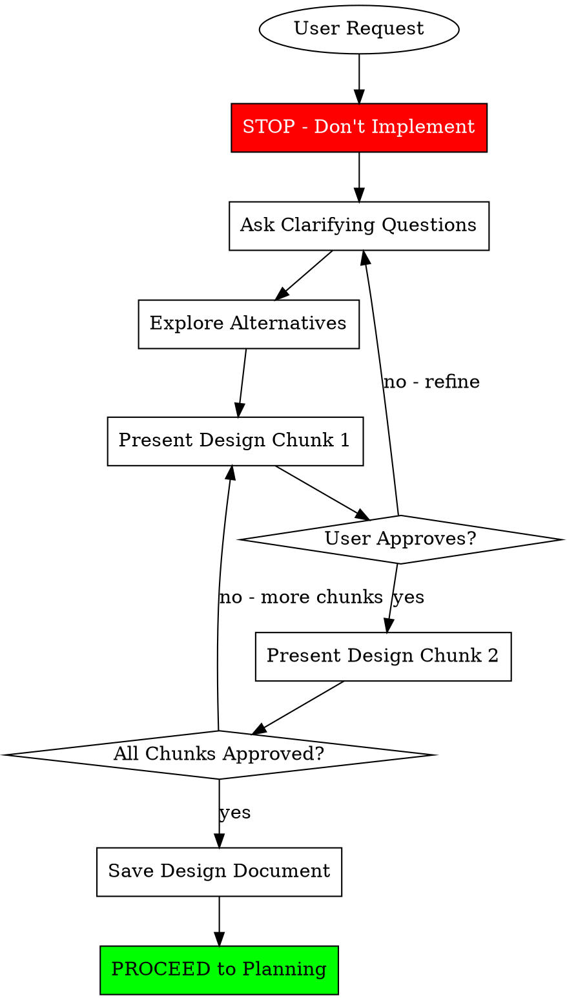
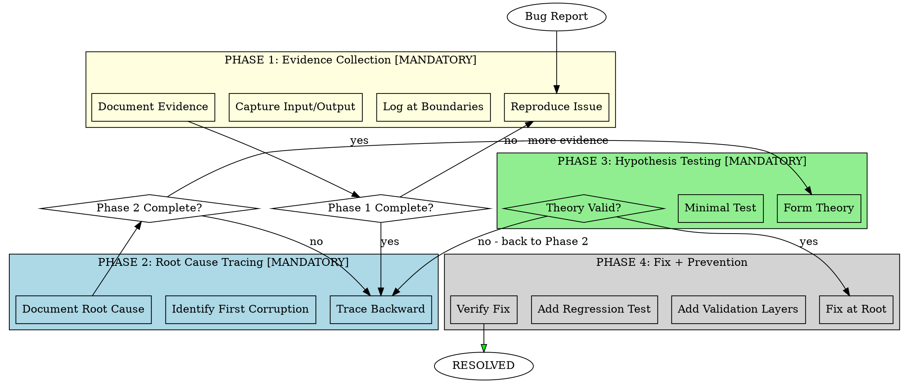
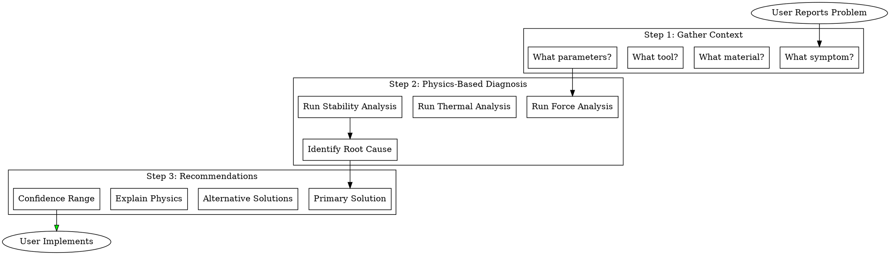

# PRISM SUPERPOWERS UPGRADE ROADMAP
## Complete Skills Framework Transformation
### Version 1.0 | January 23, 2026

---

# EXECUTIVE SUMMARY

```
╔═══════════════════════════════════════════════════════════════════════════════════════════╗
║                      PRISM SUPERPOWERS ADAPTATION PROJECT                                  ║
╠═══════════════════════════════════════════════════════════════════════════════════════════╣
║                                                                                           ║
║   OBJECTIVE: Transform PRISM's 59-skill system into a Superpowers-class methodology       ║
║   framework with mandatory workflows, evidence-based verification, and systematic         ║
║   processes - adapted for both PRISM DEVELOPMENT and IN-APP USER ASSISTANCE.              ║
║                                                                                           ║
║   SOURCE INSPIRATION: obra/superpowers (34.7k stars, MIT license)                         ║
║   https://github.com/obra/superpowers                                                     ║
║                                                                                           ║
║   ═══════════════════════════════════════════════════════════════════════════════════     ║
║                                                                                           ║
║   SCOPE:                                                                                  ║
║   ├── TRACK A: Development Skills (for Claude rebuilding PRISM)         │ 24 sessions    ║
║   ├── TRACK B: App Skills (for PRISM end-users)                         │ 18 sessions    ║
║   ├── TRACK C: Infrastructure (shared framework)                        │ 8 sessions     ║
║   └── TRACK D: Testing & Validation                                     │ 6 sessions     ║
║                                                                                           ║
║   TOTAL: 56 micro-sessions                                                                ║
║   ESTIMATED TIME: 2-3 weeks of focused work                                               ║
║                                                                                           ║
║   DELIVERABLES:                                                                           ║
║   • 32 NEW skills (Superpowers-adapted)                                                   ║
║   • 15 ENHANCED existing skills                                                           ║
║   • 1 Skill framework with auto-activation triggers                                       ║
║   • 1 Visual decision diagram library (DOT/Graphviz)                                      ║
║   • 1 Complete testing suite for skills                                                   ║
║                                                                                           ║
╚═══════════════════════════════════════════════════════════════════════════════════════════╝
```

---

# PART 1: SUPERPOWERS PATTERN CATALOG

## 1.1 Core Patterns We're Adopting

| # | Pattern | Superpowers Source | PRISM Adaptation |
|---|---------|-------------------|------------------|
| 1 | Brainstorming-First | `brainstorming/SKILL.md` | Design validation before implementation |
| 2 | Two-Stage Review | `subagent-driven-development/SKILL.md` | Spec compliance → Quality review |
| 3 | 4-Phase Debugging | `systematic-debugging/SKILL.md` | Mandatory root cause process |
| 4 | Evidence Verification | `verification-before-completion/SKILL.md` | Proof-based completion |
| 5 | Plan Format Rigor | `writing-plans/SKILL.md` | Exact paths, complete code, verification |
| 6 | DOT Decision Diagrams | Multiple skills | Visual workflow encoding |
| 7 | TDD for Skills | `writing-skills/SKILL.md` | Test skills before deployment |
| 8 | Skill Auto-Activation | `using-superpowers/SKILL.md` | Context-triggered skill loading |
| 9 | Anti-Pattern Documentation | `testing-anti-patterns.md` | What NOT to do sections |
| 10 | Subagent Coordination | `dispatching-parallel-agents/SKILL.md` | Batch processing patterns |

## 1.2 Dual-Track Architecture

```
┌─────────────────────────────────────────────────────────────────────────────────────┐
│                         PRISM SUPERPOWERS ARCHITECTURE                               │
├─────────────────────────────────────────────────────────────────────────────────────┤
│                                                                                     │
│   TRACK A: DEVELOPMENT SKILLS (Claude rebuilding PRISM)                             │
│   ════════════════════════════════════════════════════                              │
│   Purpose: Guide Claude through the 166-session rebuild                             │
│   Location: /mnt/skills/user/prism-dev-*/                                           │
│   Activation: Reading CURRENT_STATE.json triggers relevant skills                   │
│                                                                                     │
│   Skills:                                                                           │
│   ├── prism-dev-brainstorm         (design refinement)                              │
│   ├── prism-dev-planning           (session planning)                               │
│   ├── prism-dev-extraction         (monolith extraction)                            │
│   ├── prism-dev-review             (two-stage review)                               │
│   ├── prism-dev-debugging          (4-phase systematic)                             │
│   ├── prism-dev-verification       (evidence-based)                                 │
│   └── prism-dev-handoff            (session transitions)                            │
│                                                                                     │
│   ─────────────────────────────────────────────────────────────────────────────     │
│                                                                                     │
│   TRACK B: APP SKILLS (End users of PRISM application)                              │
│   ════════════════════════════════════════════════════                              │
│   Purpose: Guide users through manufacturing decisions                              │
│   Location: Embedded in PRISM_KNOWLEDGE_BASE module                                 │
│   Activation: User query context triggers relevant skills                           │
│                                                                                     │
│   Skills:                                                                           │
│   ├── prism-app-material-selection (guided material choice)                         │
│   ├── prism-app-speed-feed         (parameter optimization)                         │
│   ├── prism-app-troubleshoot       (machining problem solving)                      │
│   ├── prism-app-tool-selection     (cutting tool guidance)                          │
│   ├── prism-app-machine-setup      (setup optimization)                             │
│   ├── prism-app-quality-analysis   (defect root cause)                              │
│   └── prism-app-cost-optimization  (quote/efficiency guidance)                      │
│                                                                                     │
│   ─────────────────────────────────────────────────────────────────────────────     │
│                                                                                     │
│   TRACK C: SHARED INFRASTRUCTURE                                                    │
│   ══════════════════════════════════                                                │
│   Purpose: Common framework for both tracks                                         │
│                                                                                     │
│   Components:                                                                       │
│   ├── Skill Activation Engine      (context → skill mapping)                        │
│   ├── DOT Diagram Library          (visual decision flows)                          │
│   ├── Evidence Capture System      (proof collection)                               │
│   └── Anti-Pattern Registry        (what NOT to do)                                 │
│                                                                                     │
└─────────────────────────────────────────────────────────────────────────────────────┘
```

---

# PART 2: MICRO-SESSION ROADMAP

## PHASE SP-0: PREPARATION (2 Sessions)

| Session | ID | Name | Duration | Deliverables |
|---------|-----|------|----------|--------------|
| 1 | SP.0.1 | Framework Architecture | 45 min | PRISM_SKILL_FRAMEWORK.md, activation rules |
| 2 | SP.0.2 | DOT Diagram Standards | 30 min | DOT_STANDARDS.md, template library |

---

## PHASE SP-1: DEVELOPMENT TRACK SKILLS (24 Sessions)

### SP-1.A: Core Workflow Skills (8 Sessions)

| Session | ID | Skill Name | Size | Key Components |
|---------|-----|------------|------|----------------|
| 1 | SP.1.A.1 | prism-dev-brainstorm | ~25KB | Socratic design refinement, alternatives exploration, chunk-based presentation |
| 2 | SP.1.A.2 | prism-dev-planning | ~30KB | Exact paths, complete code, verification commands, 2-5 min tasks |
| 3 | SP.1.A.3 | prism-dev-extraction | ~35KB | Module extraction workflow, dependency mapping, audit checklist |
| 4 | SP.1.A.4 | prism-dev-review-spec | ~20KB | Spec compliance review, required evidence, pass/fail gates |
| 5 | SP.1.A.5 | prism-dev-review-quality | ~20KB | Code quality review, style compliance, performance checks |
| 6 | SP.1.A.6 | prism-dev-debugging | ~40KB | 4-phase systematic debugging, root cause tracing, defense-in-depth |
| 7 | SP.1.A.7 | prism-dev-verification | ~25KB | Evidence-based completion, proof capture, verification commands |
| 8 | SP.1.A.8 | prism-dev-handoff | ~20KB | Session transitions, state updates, next-session prep |

### SP-1.B: Specialized Development Skills (8 Sessions)

| Session | ID | Skill Name | Size | Key Components |
|---------|-----|------------|------|----------------|
| 9 | SP.1.B.1 | prism-dev-materials | ~30KB | 127-parameter extraction, scientific validation, source verification |
| 10 | SP.1.B.2 | prism-dev-machines | ~30KB | Kinematic extraction, CAD mapping, hierarchy management |
| 11 | SP.1.B.3 | prism-dev-engines | ~35KB | Physics engine extraction, algorithm validation, formula verification |
| 12 | SP.1.B.4 | prism-dev-wiring | ~25KB | Consumer mapping, utilization enforcement, gateway routing |
| 13 | SP.1.B.5 | prism-dev-testing | ~25KB | TDD patterns, test coverage, regression prevention |
| 14 | SP.1.B.6 | prism-dev-migration | ~30KB | Module migration workflow, backward compatibility, rollback |
| 15 | SP.1.B.7 | prism-dev-documentation | ~20KB | Code documentation, API contracts, user guides |
| 16 | SP.1.B.8 | prism-dev-performance | ~25KB | Optimization patterns, <2s load, <500ms calculations |

### SP-1.C: Anti-Pattern & Decision Diagram Skills (8 Sessions)

| Session | ID | Skill Name | Size | Key Components |
|---------|-----|------------|------|----------------|
| 17 | SP.1.C.1 | prism-dev-antipatterns-extraction | ~20KB | Extraction mistakes, data loss patterns, incomplete audits |
| 18 | SP.1.C.2 | prism-dev-antipatterns-wiring | ~20KB | Orphaned modules, circular dependencies, utilization failures |
| 19 | SP.1.C.3 | prism-dev-antipatterns-state | ~15KB | State corruption, session loss, context overflow |
| 20 | SP.1.C.4 | prism-dev-diagrams-workflow | ~25KB | DOT diagrams for extraction, review, debugging workflows |
| 21 | SP.1.C.5 | prism-dev-diagrams-decision | ~25KB | Material selection, tool selection, parameter calculation flows |
| 22 | SP.1.C.6 | prism-dev-diagrams-architecture | ~20KB | Module hierarchy, data flow, consumer mapping visuals |
| 23 | SP.1.C.7 | prism-dev-skill-creation | ~25KB | How to write new PRISM skills, TDD for skills |
| 24 | SP.1.C.8 | prism-dev-skill-testing | ~20KB | Skill validation scenarios, compliance testing |

---

## PHASE SP-2: APP TRACK SKILLS (18 Sessions)

### SP-2.A: Manufacturing Workflow Skills (9 Sessions)

| Session | ID | Skill Name | Size | Key Components |
|---------|-----|------------|------|----------------|
| 1 | SP.2.A.1 | prism-app-material-selection | ~40KB | Guided material choice, property comparison, application matching |
| 2 | SP.2.A.2 | prism-app-speed-feed-optimization | ~45KB | Parameter calculation, constraint handling, uncertainty ranges |
| 3 | SP.2.A.3 | prism-app-tool-selection | ~35KB | Tool matching, geometry selection, coating recommendation |
| 4 | SP.2.A.4 | prism-app-machine-setup | ~30KB | Workholding selection, fixture optimization, setup sheets |
| 5 | SP.2.A.5 | prism-app-toolpath-strategy | ~35KB | Strategy selection, engagement optimization, cycle time |
| 6 | SP.2.A.6 | prism-app-quality-analysis | ~40KB | Defect root cause, SPC interpretation, corrective actions |
| 7 | SP.2.A.7 | prism-app-cost-optimization | ~30KB | Quote optimization, cycle time reduction, tool life extension |
| 8 | SP.2.A.8 | prism-app-troubleshooting | ~50KB | Systematic machining problem diagnosis (chatter, wear, finish) |
| 9 | SP.2.A.9 | prism-app-post-processor | ~35KB | G-code generation guidance, controller-specific advice |

### SP-2.B: User Guidance & Explanation Skills (9 Sessions)

| Session | ID | Skill Name | Size | Key Components |
|---------|-----|------------|------|----------------|
| 10 | SP.2.B.1 | prism-app-explain-physics | ~30KB | Force, thermal, vibration explanations for users |
| 11 | SP.2.B.2 | prism-app-explain-recommendations | ~25KB | XAI for speed/feed/tool recommendations |
| 12 | SP.2.B.3 | prism-app-learning-feedback | ~20KB | User feedback integration, preference learning |
| 13 | SP.2.B.4 | prism-app-confidence-ranges | ~25KB | Uncertainty communication, confidence intervals |
| 14 | SP.2.B.5 | prism-app-alternative-strategies | ~25KB | Multiple solution presentation, trade-off analysis |
| 15 | SP.2.B.6 | prism-app-safety-checks | ~30KB | Collision warnings, parameter limits, safety verification |
| 16 | SP.2.B.7 | prism-app-documentation-gen | ~25KB | Setup sheet generation, operation documentation |
| 17 | SP.2.B.8 | prism-app-diagrams-visual | ~30KB | User-facing decision diagrams, parameter selection flows |
| 18 | SP.2.B.9 | prism-app-antipatterns-machining | ~35KB | Common machining mistakes, prevention strategies |

---

## PHASE SP-3: INFRASTRUCTURE (8 Sessions)

| Session | ID | Component | Size | Key Components |
|---------|-----|-----------|------|----------------|
| 1 | SP.3.1 | Skill Activation Engine | ~40KB | Context analysis, trigger rules, skill selection logic |
| 2 | SP.3.2 | Evidence Capture System | ~25KB | Proof collection, verification storage, audit trail |
| 3 | SP.3.3 | DOT Diagram Renderer | ~30KB | Graphviz interpretation, visual flow execution |
| 4 | SP.3.4 | Anti-Pattern Registry | ~35KB | Centralized anti-pattern database, violation detection |
| 5 | SP.3.5 | Skill Composition Engine | ~25KB | Multi-skill coordination, dependency resolution |
| 6 | SP.3.6 | Progress Tracking System | ~20KB | Skill execution tracking, completion verification |
| 7 | SP.3.7 | User Context Analyzer | ~30KB | App context detection, skill recommendation |
| 8 | SP.3.8 | Skill Update Framework | ~20KB | Version control, backward compatibility, migration |

---

## PHASE SP-4: TESTING & VALIDATION (6 Sessions)

| Session | ID | Component | Size | Key Components |
|---------|-----|-----------|------|----------------|
| 1 | SP.4.1 | Skill Test Framework | ~30KB | Test harness, scenario runner, compliance checker |
| 2 | SP.4.2 | Development Skill Tests | ~40KB | All Track A skills tested |
| 3 | SP.4.3 | App Skill Tests | ~40KB | All Track B skills tested |
| 4 | SP.4.4 | Integration Tests | ~25KB | Cross-skill workflows, end-to-end scenarios |
| 5 | SP.4.5 | Pressure Testing | ~20KB | Edge cases, adversarial scenarios, compliance under pressure |
| 6 | SP.4.6 | Documentation & Deployment | ~15KB | Final docs, deployment checklist, user guide |

---

# PART 3: SESSION TEMPLATES

## 3.1 Development Skill Session Template

```markdown
# SESSION [SP.X.X.X]: [Skill Name]
## Status: [NOT STARTED | IN PROGRESS | COMPLETE]

### Pre-Session Checklist
☐ Read CURRENT_STATE.json
☐ Read Superpowers source skill (if applicable)
☐ Review PRISM existing related skills
☐ Identify anti-patterns to document

### Skill Structure (Superpowers-Adapted)

```yaml
---
name: prism-dev-[name]
version: 1.0.0
category: development
triggers:
  - "pattern that activates this skill"
  - "another trigger pattern"
requires:
  - prism-dev-prerequisite-skill
---
```

### Required Sections
☐ PURPOSE (what and when)
☐ TRIGGERS (activation conditions)
☐ WORKFLOW (step-by-step with DOT diagram)
☐ VERIFICATION (evidence requirements)
☐ ANTI-PATTERNS (what NOT to do)
☐ EXAMPLES (concrete scenarios)
☐ HANDOFF (next skill/step)

### DOT Diagram Requirement
Every workflow skill MUST include a Graphviz DOT decision diagram.

### Post-Session Verification
☐ Skill file created at correct path
☐ All required sections present
☐ DOT diagram renders correctly
☐ Anti-patterns documented
☐ Examples are concrete and testable
☐ CURRENT_STATE.json updated
```

## 3.2 App Skill Session Template

```markdown
# SESSION [SP.X.X.X]: [Skill Name]
## Status: [NOT STARTED | IN PROGRESS | COMPLETE]

### Pre-Session Checklist
☐ Read CURRENT_STATE.json
☐ Review manufacturing domain requirements
☐ Identify user scenarios
☐ Map to PRISM databases/engines being used

### Skill Structure (App-Focused)

```yaml
---
name: prism-app-[name]
version: 1.0.0
category: application
user_facing: true
triggers:
  - user_query_patterns: ["pattern1", "pattern2"]
  - context: ["material_selection", "speed_feed"]
databases_used:
  - PRISM_MATERIALS_MASTER
  - PRISM_TOOLS_DATABASE
engines_used:
  - PRISM_SPEED_FEED_CALCULATOR
  - PRISM_FORCE_ENGINE
---
```

### Required Sections
☐ USER INTENT (what user is trying to achieve)
☐ GUIDED WORKFLOW (Socratic questions)
☐ DATA SOURCES (databases/engines used)
☐ EXPLANATION (XAI for recommendations)
☐ CONFIDENCE (uncertainty communication)
☐ ALTERNATIVES (other options)
☐ ANTI-PATTERNS (common user mistakes)
☐ VISUAL FLOW (user-facing DOT diagram)

### Post-Session Verification
☐ Skill integrates with PRISM gateway routes
☐ All database dependencies documented
☐ XAI explanations are clear
☐ Confidence ranges included
☐ User-facing diagram is clear
```

---

# PART 4: KEY SKILL SPECIFICATIONS

## 4.1 prism-dev-brainstorm (Flagship Development Skill)

```yaml
---
name: prism-dev-brainstorm
version: 1.0.0
category: development
priority: CRITICAL
triggers:
  - "extract", "create", "build", "implement", "design"
  - Any new session starting significant work
---
```

### Purpose
Before ANY implementation, refine the design through Socratic questioning. Present design in digestible chunks. Get explicit approval before proceeding.

### Workflow (DOT Diagram)


### Anti-Patterns
```markdown
## ❌ NEVER DO THIS

1. Jump into coding without design approval
   WRONG: "I'll start extracting the materials database..."
   RIGHT: "Before I extract, let me clarify the scope..."

2. Present entire design at once
   WRONG: [500-line design document]
   RIGHT: "Here's the first section (scope). Does this match your expectations?"

3. Skip alternatives exploration
   WRONG: "I'll do it this way."
   RIGHT: "We could: (A) extract all at once, (B) category by category, (C) priority-first. Trade-offs are..."

4. Proceed without explicit approval
   WRONG: "I think this is good, so I'll start."
   RIGHT: "Does this design look correct? Reply 'approved' to proceed."
```

---

## 4.2 prism-dev-debugging (4-Phase Systematic)

```yaml
---
name: prism-dev-debugging
version: 1.0.0
category: development
priority: CRITICAL
triggers:
  - "error", "bug", "not working", "broken", "fails"
  - Any unexpected behavior
requires:
  - MUST complete Phase 1 before Phase 2
  - MUST complete Phase 2 before Phase 3
  - CANNOT skip phases
---
```

### Workflow (DOT Diagram)


### Phase Requirements

#### Phase 1: Evidence Collection
```markdown
□ Reproduce issue consistently (3+ times)
□ Log data at EACH module boundary:
  - Input to module
  - Output from module
  - State at entry/exit
□ Capture FULL error stack trace
□ Document environment: paths, versions, state

EVIDENCE REQUIRED:
- Console/log output showing failure
- Input data that causes failure
- Expected vs actual output

⛔ CANNOT PROCEED TO PHASE 2 WITHOUT THIS EVIDENCE
```

#### Phase 2: Root Cause Tracing
```markdown
□ Start at symptom location
□ Trace BACKWARD through call chain:
  - Which function called this?
  - What data did it pass?
  - Where did THAT data come from?
□ Identify: Which module FIRST corrupts the data?
□ Document the root cause location

ROOT CAUSE FORMAT:
"The bug originates in [MODULE] at [LOCATION] because [REASON].
 It manifests as [SYMPTOM] in [DOWNSTREAM_MODULE]."

⛔ CANNOT PROPOSE FIXES YET - ONLY IDENTIFY SOURCE
```

#### Phase 3: Hypothesis Testing
```markdown
□ Form theory: "If I change X, symptom Y will stop because Z"
□ Create MINIMAL test to validate theory
□ Run test
□ If theory wrong → Return to Phase 2

HYPOTHESIS FORMAT:
"THEORY: [description]
 TEST: [minimal change]
 EXPECTED: [result]
 ACTUAL: [result]
 VALID: yes/no"
```

#### Phase 4: Implementation + Prevention
```markdown
□ Fix at ROOT CAUSE location (not symptom)
□ Add validation at 2+ upstream layers (defense-in-depth)
□ Add regression test that would have caught this
□ Verify fix with original reproduction steps

PREVENTION CHECKLIST:
- [ ] Validation added at layer 1: [location]
- [ ] Validation added at layer 2: [location]
- [ ] Regression test added: [test name]
- [ ] Original bug no longer reproduces
```

---

## 4.3 prism-app-troubleshooting (Flagship App Skill)

```yaml
---
name: prism-app-troubleshooting
version: 1.0.0
category: application
user_facing: true
triggers:
  - "chatter", "vibration", "noise", "poor finish", "tool wear"
  - "breaking", "burning", "not cutting", "deflection"
databases_used:
  - PRISM_MATERIALS_MASTER
  - PRISM_MACHINES_DATABASE
  - PRISM_TOOLS_DATABASE
engines_used:
  - PRISM_CHATTER_PREDICTION_ENGINE
  - PRISM_FORCE_CALCULATOR
  - PRISM_THERMAL_ENGINE
  - PRISM_SURFACE_FINISH_ENGINE
---
```

### User-Facing Workflow (DOT Diagram)


### Symptom → Root Cause Mapping
```markdown
## CHATTER / VIBRATION
Physics Check: Stability lobes, natural frequency, damping
Common Causes:
1. Speed in unstable zone (45%)
2. Too much radial engagement (25%)
3. Tool overhang too long (15%)
4. Workholding insufficient (10%)
5. Machine spindle issue (5%)

## POOR SURFACE FINISH
Physics Check: Chip load, BUE tendency, thermal effects
Common Causes:
1. Wrong speed/feed combination (35%)
2. Built-up edge (25%)
3. Tool wear (20%)
4. Chatter (15%)
5. Coolant issues (5%)

## EXCESSIVE TOOL WEAR
Physics Check: Temperature, abrasion, chemical wear
Common Causes:
1. Speed too high (30%)
2. Wrong coating for material (25%)
3. Insufficient coolant (20%)
4. Interrupted cuts (15%)
5. Material harder than expected (10%)
```

---

# PART 5: INTEGRATION WITH EXISTING SKILLS

## 5.1 Skills to Enhance (Not Replace)

| Existing Skill | Enhancement | Priority |
|----------------|-------------|----------|
| prism-debugging | Upgrade to 4-phase systematic | HIGH |
| prism-review | Split into spec + quality reviews | HIGH |
| prism-verification | Add evidence capture requirements | HIGH |
| prism-planning | Add exact path/code requirements | HIGH |
| prism-quick-start | Add brainstorming trigger | MEDIUM |
| prism-session-handoff | Add next-skill recommendation | MEDIUM |
| prism-extractor | Add DOT workflow diagram | MEDIUM |
| prism-material-template | Add guided selection flow | MEDIUM |

## 5.2 Skills to Deprecate (Merged into New Skills)

| Old Skill | Merged Into | Reason |
|-----------|-------------|--------|
| prism-task-continuity | prism-dev-handoff | Consolidation |
| prism-context-pressure | prism-dev-verification | Evidence-based approach handles this |

## 5.3 New Skill → Existing Skill Mapping

```
prism-dev-brainstorm
├── Uses: prism-knowledge-base (for alternatives)
├── Uses: prism-expert-* (for domain expertise)
└── Triggers: prism-dev-planning (after approval)

prism-dev-planning
├── Uses: prism-monolith-index (for line numbers)
├── Uses: prism-coding-patterns (for style)
└── Triggers: prism-dev-extraction (when executing)

prism-dev-debugging
├── Uses: prism-error-catalog (for known issues)
├── Uses: prism-expert-master-machinist (for domain debugging)
└── Triggers: prism-dev-verification (after fix)

prism-app-troubleshooting
├── Uses: prism-physics-formulas (for analysis)
├── Uses: prism-manufacturing-tables (for parameters)
├── Uses: prism-expert-* (for domain expertise)
└── Triggers: prism-app-explain-physics (for XAI)
```

---

# PART 6: IMPLEMENTATION SCHEDULE

## 6.1 Recommended Execution Order

```
WEEK 1: Foundation + Core Development Skills
═══════════════════════════════════════════
Day 1: SP.0.1, SP.0.2 (Framework + DOT Standards)
Day 2: SP.1.A.1, SP.1.A.2 (Brainstorm + Planning)
Day 3: SP.1.A.3, SP.1.A.4 (Extraction + Spec Review)
Day 4: SP.1.A.5, SP.1.A.6 (Quality Review + Debugging)
Day 5: SP.1.A.7, SP.1.A.8 (Verification + Handoff)

WEEK 2: Specialized Development + Infrastructure
═══════════════════════════════════════════════
Day 1: SP.1.B.1, SP.1.B.2 (Materials + Machines)
Day 2: SP.1.B.3, SP.1.B.4 (Engines + Wiring)
Day 3: SP.1.B.5, SP.1.B.6 (Testing + Migration)
Day 4: SP.1.B.7, SP.1.B.8 (Documentation + Performance)
Day 5: SP.3.1, SP.3.2 (Activation Engine + Evidence System)

WEEK 3: Anti-Patterns + App Skills Part 1
═══════════════════════════════════════════
Day 1: SP.1.C.1, SP.1.C.2, SP.1.C.3 (Anti-patterns)
Day 2: SP.1.C.4, SP.1.C.5, SP.1.C.6 (Diagrams)
Day 3: SP.1.C.7, SP.1.C.8 (Skill Creation + Testing)
Day 4: SP.2.A.1, SP.2.A.2 (Material Selection + Speed/Feed)
Day 5: SP.2.A.3, SP.2.A.4 (Tool Selection + Machine Setup)

WEEK 4: App Skills Part 2 + Testing
═══════════════════════════════════════════
Day 1: SP.2.A.5, SP.2.A.6, SP.2.A.7 (Toolpath, Quality, Cost)
Day 2: SP.2.A.8, SP.2.A.9 (Troubleshooting + Post)
Day 3: SP.2.B.1-SP.2.B.5 (Explanation Skills)
Day 4: SP.2.B.6-SP.2.B.9 (User Guidance Skills)
Day 5: SP.3.3-SP.3.8 (Remaining Infrastructure)

WEEK 5: Testing & Deployment
═══════════════════════════════════════════
Day 1: SP.4.1 (Test Framework)
Day 2: SP.4.2 (Development Skill Tests)
Day 3: SP.4.3 (App Skill Tests)
Day 4: SP.4.4, SP.4.5 (Integration + Pressure Tests)
Day 5: SP.4.6 (Documentation + Deployment)
```

## 6.2 Parallel Execution Option

If using Claude-Flow multi-agent:
- Track A (Development Skills): Agent 1-2
- Track B (App Skills): Agent 3-4
- Track C (Infrastructure): Agent 5
- Track D (Testing): Agent 6

Potential reduction: 5 weeks → 2 weeks

---

# PART 7: SUCCESS CRITERIA

## 7.1 Development Skills Success

| Criterion | Metric | Target |
|-----------|--------|--------|
| Skill Coverage | % of dev activities with dedicated skill | 100% |
| DOT Diagrams | % of workflow skills with visual flow | 100% |
| Anti-Patterns | Documented per skill | ≥3 per skill |
| Examples | Concrete examples per skill | ≥2 per skill |
| Test Coverage | Skills with validation tests | 100% |

## 7.2 App Skills Success

| Criterion | Metric | Target |
|-----------|--------|--------|
| User Scenario Coverage | Common machining tasks with skill | 90%+ |
| XAI Integration | Recommendations with explanations | 100% |
| Confidence Ranges | Outputs with uncertainty | 100% |
| Database Integration | Skills using PRISM data | 100% |
| Visual Flows | User-facing decision diagrams | 100% |

## 7.3 Framework Success

| Criterion | Metric | Target |
|-----------|--------|--------|
| Auto-Activation | Skills triggered by context | Working |
| Evidence Capture | Proof collection system | Working |
| Skill Composition | Multi-skill workflows | Working |
| Backward Compatibility | Existing skills still work | 100% |

---

# APPENDIX A: FILE STRUCTURE

```
C:\\PRISM\
├── _SKILLS_SUPERPOWERS\
│   ├── FRAMEWORK\
│   │   ├── PRISM_SKILL_FRAMEWORK.md
│   │   ├── DOT_STANDARDS.md
│   │   ├── SKILL_TEMPLATE_DEV.md
│   │   └── SKILL_TEMPLATE_APP.md
│   │
│   ├── DEVELOPMENT\
│   │   ├── prism-dev-brainstorm\
│   │   │   └── SKILL.md
│   │   ├── prism-dev-planning\
│   │   │   └── SKILL.md
│   │   ├── prism-dev-extraction\
│   │   │   └── SKILL.md
│   │   ├── prism-dev-review-spec\
│   │   │   └── SKILL.md
│   │   ├── prism-dev-review-quality\
│   │   │   └── SKILL.md
│   │   ├── prism-dev-debugging\
│   │   │   ├── SKILL.md
│   │   │   ├── root-cause-tracing.md
│   │   │   └── defense-in-depth.md
│   │   ├── prism-dev-verification\
│   │   │   └── SKILL.md
│   │   ├── prism-dev-handoff\
│   │   │   └── SKILL.md
│   │   └── [specialized skills]\
│   │
│   ├── APPLICATION\
│   │   ├── prism-app-material-selection\
│   │   │   └── SKILL.md
│   │   ├── prism-app-speed-feed-optimization\
│   │   │   └── SKILL.md
│   │   ├── prism-app-troubleshooting\
│   │   │   └── SKILL.md
│   │   └── [other app skills]\
│   │
│   ├── ANTIPATTERNS\
│   │   ├── extraction-antipatterns.md
│   │   ├── wiring-antipatterns.md
│   │   ├── state-antipatterns.md
│   │   └── machining-antipatterns.md
│   │
│   ├── DIAGRAMS\
│   │   ├── workflow-diagrams.dot
│   │   ├── decision-diagrams.dot
│   │   └── architecture-diagrams.dot
│   │
│   └── TESTS\
│       ├── test-framework.md
│       ├── dev-skill-tests\
│       └── app-skill-tests\
│
└── CURRENT_STATE.json (updated with Superpowers phase)
```

---

# APPENDIX B: QUICK REFERENCE CARD

```
╔═══════════════════════════════════════════════════════════════════════════════╗
║                     PRISM SUPERPOWERS QUICK REFERENCE                          ║
╠═══════════════════════════════════════════════════════════════════════════════╣
║                                                                               ║
║  MANDATORY WORKFLOW:                                                          ║
║  ┌─────────────────────────────────────────────────────────────────────────┐  ║
║  │ REQUEST → BRAINSTORM → PLAN → EXECUTE → REVIEW → VERIFY → HANDOFF      │  ║
║  └─────────────────────────────────────────────────────────────────────────┘  ║
║                                                                               ║
║  KEY RULES:                                                                   ║
║  • NEVER implement without design approval                                    ║
║  • NEVER skip debugging phases                                                ║
║  • NEVER declare done without evidence                                        ║
║  • ALWAYS present design in chunks                                            ║
║  • ALWAYS use exact paths and complete code in plans                          ║
║  • ALWAYS add DOT diagrams to workflow skills                                 ║
║                                                                               ║
║  DEBUGGING PHASES (MANDATORY ORDER):                                          ║
║  1. Evidence Collection → 2. Root Cause → 3. Hypothesis → 4. Fix+Prevent     ║
║                                                                               ║
║  REVIEW STAGES:                                                               ║
║  1. Spec Compliance (does it match requirements?)                             ║
║  2. Code Quality (is it well-written?) [only if #1 passes]                    ║
║                                                                               ║
║  EVIDENCE TYPES:                                                              ║
║  • File listing output (extraction verification)                              ║
║  • Line count comparison (completeness)                                       ║
║  • Console output (debugging)                                                 ║
║  • Test results (validation)                                                  ║
║                                                                               ║
╚═══════════════════════════════════════════════════════════════════════════════╝
```

---

**Document Version:** 1.0.0  
**Created:** January 23, 2026  
**Total Sessions:** 56  
**Estimated Duration:** 2-3 weeks  
**Status:** READY FOR EXECUTION

---

## NEXT STEPS

1. **Mark's Approval:** Review and approve this roadmap
2. **Session SP.0.1:** Create Framework Architecture
3. **Parallel Option:** Consider Claude-Flow for 2-week completion
