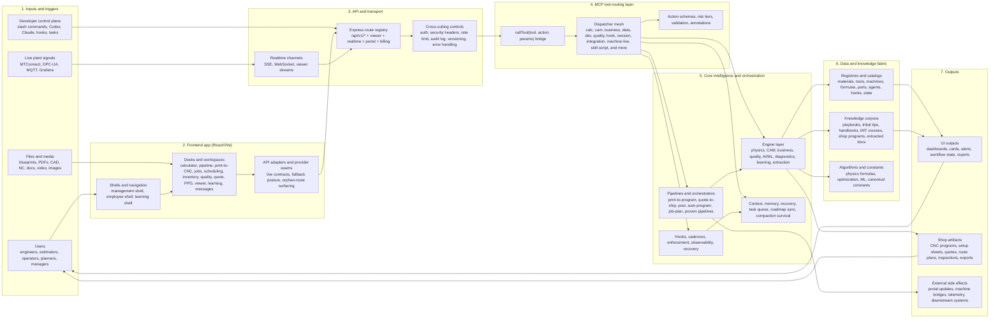
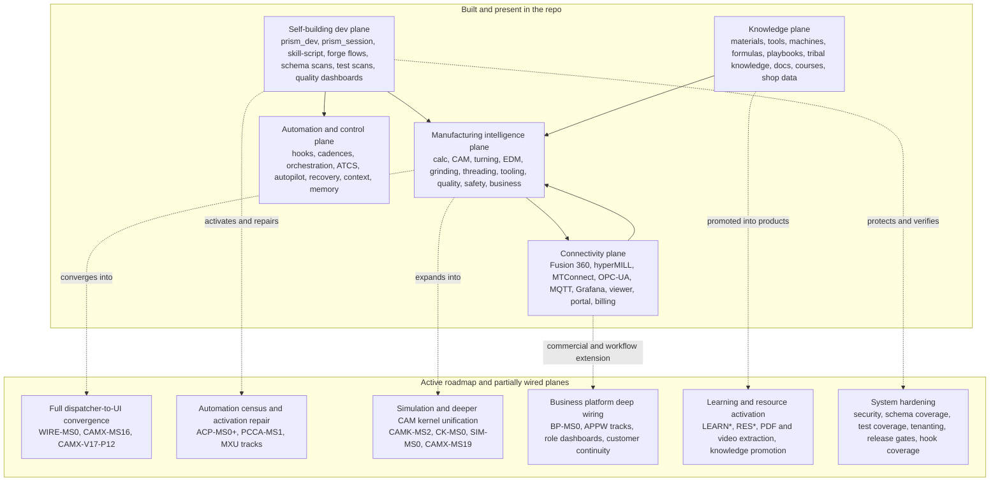
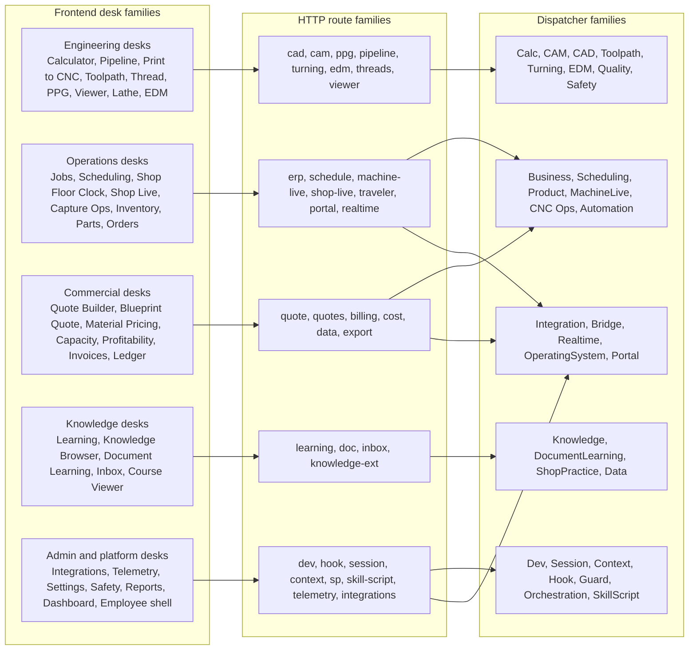

# PRISM Executive System Map

Updated: 2026-04-14

Purpose: give leadership one visual that explains what PRISM already is, what is partially wired, what is still planned, and how the backend capability stack feeds the frontend application.

Truthfulness note: PRISM's generated inventories do not all agree on exact counts because different digests were generated on different dates. The safe takeaway is the scale, not one magic number: roughly 82 dispatchers, 4.7k-4.9k actions, 1.5k+ engines, 100+ routed web surfaces, 23+ registries, 100+ hooks, and a large active roadmap behind them.

## Executive Snapshot

- Built today: manufacturing calculation, CAD/CAM, post processing, quote/business, quality, learning, knowledge, machine connectivity, orchestration, dev automation, hooks, session/context, and broad web UI desks already exist in code.
- In motion now: frontend/backend convergence, provider-seam hardening, analytics/reporting honesty, app-wide route activation, automation census/repair, wiring sweeps, simulation, deeper CAM kernel integration, and learning/resource activation.
- Structural reality: PRISM is not just "an app." It is an MCP server, API platform, dispatcher mesh, engine library, knowledge system, automation framework, and frontend shell all at once.
- Exhaustive inventories live here: [Capability Manifest](../state/shared/PRISM_CAPABILITY_MANIFEST.md), [System Capabilities](../state/shared/SYSTEM-CAPABILITIES.md), [Dispatcher Digest](../mcp-server/data/docs/DISPATCHER_DIGEST.md), [Engine Digest](../mcp-server/data/docs/ENGINE_DIGEST.md), [Directory Digest](../mcp-server/data/docs/DIRECTORY_DIGEST.md), [Task Queue](../state/shared/TASK_QUEUE.md).

## 1. End-to-End System Flow

## 2. Backend Capability Mesh

## 3. How the Backend Feeds the Frontend

## 4. Built Surface Inventory

These are the major feature families already present in code, route registration, dispatcher registration, shared manifests, and frontend routing.

- Manufacturing intelligence: speed/feed, cutting force, tool life, chatter, thermal, deflection, surface finish, safety checks, threading, toolpath strategy, machine capability, CAM strategy, post processing, print-to-program.
- Process domains: milling, turning, five-axis, mill-turn, EDM, grinding, laser, waterjet, additive, sheet metal, injection molding, secondary ops, welding, forming, material processing, mechanical design, fluid/thermal.
- Business and operations: quote estimation, quote analytics, customer portal, orders, jobs, scheduling, inventory, purchasing, machine rates, capacity, profitability, payroll, ledger, invoices, exports, compliance, HR.
- Quality and diagnostics: SPC, FAI, metrology uncertainty, alarm decode, safety monitor, prove-out, diagnosis, root cause, reports, telemetry, OEE.
- Knowledge and learning: document learning, inbox, knowledge browser, course viewer, learning dashboards, fleet learning, playbooks, tribal knowledge, onboarding, apprentice-style learning.
- Platform and orchestration: MCP server, route registry, dispatcher mesh, hooks, cadences, orchestration, context/session, memory, recovery, task queue, roadmap sync, automation, ATCS, autopilot, dev scans, schema/test/quality dashboards.
- Frontend shells: management shell, employee shell, learning shell, operating-system provider seams, live/fallback surface status, orphan-route surfacing, route-level lazy loading.
- Integrations: Fusion 360, hyperMILL, MTConnect, OPC-UA, MQTT, Grafana, portal/billing/viewer/realtime bridges, file and traveler surfaces.

## 5. Frontend Desk Coverage

These are the visible app desks already routed in `web/src/App.tsx`.

- Core engineering and release: Dashboard, Calculator, Print to CNC, Pipeline, Job Planner, Toolpath Advisor, Thread Calculator, Post Processor Generator, Post Processor, Optimization Report, Setup Sheet, Cycle Time, Tool Optimization, Prove Out, Viewer, Feature Toggle.
- Shop floor and execution: Jobs, Scheduling, Shop Floor Clock, Shop Floor Live, Capture Ops, Program Release, Batch Planning, Parts Library, Inventory, Order Tracking, Purchasing, Machine Rates, Capacity Planning.
- Commercial and finance: Quote Builder, Quote Analytics, Blueprint Quote, Sheet Metal Quote, Additive Quote, Injection Mold Quote, Stock Optimizer, Material Pricing, Customers, Customer Portal, Financial Analysis, General Ledger, Invoices, Payroll, Timecards, Profitability.
- Quality, safety, and troubleshooting: Quality Management, SPC Dashboard, Safety Dashboard, Safety Monitor, Alarm, Root Cause, A3 Report, Reports, Compliance, HR Compliance.
- Learning and knowledge: Learning Dashboard, Knowledge Browser, Knowledge Ingestion, Course Viewer, Document Learning, Document Inbox, Fleet Learning, Department Dashboard.
- Specialty and process desks: Lathe Upload, Lathe Results, Wire EDM Studio, EDM, Grinding, Welding, Thermal, Vibration, Mechanical Design, CAM Strategy, SFC Calculator, PPG, Viewer.
- Platform and shell continuity: Messages, Integrations, Settings, Employee Portal, Employee Directory, Employee Profile, Shell Gateway, Kaizen Board, Kanban Board, Value Stream, OEE Dashboard.

## 6. Planned and Partially Wired Roadmap Themes

These are the major future tracks surfaced by the current task queue and roadmap state.

- Full UI exposure of backend capability: wire more dispatcher actions and deeper live contracts into the frontend, especially on currently staged provider seams and partial route families.
- Simulation and unified pipeline depth: CAM kernel unification, multi-process print-to-program, verification, volumetric simulation, deeper controller and machine strategy reasoning.
- Automation maturity: automation census, hook/skill/script activation repair, build-guard chain, recovery chain, token economy, memory fabric, continuous improvement loops.
- Resource and learning activation: PDF extraction, video extraction, course-to-capability promotion, knowledge graph enrichment, training content auto-generation, explainability surfaces.
- Business platform expansion: ERP parity, quote autopilot, actuals feedback, role dashboards, customer-service continuity, live shop execution and operational OS.
- Hardening and governance: schema gap scans, test gap scans, quality dashboards, release gates, security/sandbox posture, tenant isolation, route-health audits, auto-wiring analysis.
- Manufacturing domain expansion: more CAM systems, more controller dialect depth, laser/waterjet/sinker EDM completion, richer five-axis and Swiss pipelines, business-to-shop closed loop.

## 7. Leadership Readout

- PRISM is already a multi-plane system: app UI, HTTP API, MCP server, dispatcher mesh, engine library, knowledge graph/corpus, automation framework, and machine/integration fabric.
- The complexity is not just "many screens." The same capability has to be represented in engines, dispatcher actions, schemas, hooks, routes, frontend desks, provider seams, tests, and roadmap governance.
- The current managerial challenge is convergence, not invention alone: much of the system exists, but it still needs disciplined wiring, hardening, truthfulness, and exposure across the whole stack.
- The current collaboration gate is active: finish current backend and frontend delivery first, then open the next large roadmap expansion pass.

## 8. Canonical Evidence Used For This Map

- `H:/PRISM/state/shared/PRISM_CAPABILITY_MANIFEST.md`
- `H:/PRISM/state/shared/SYSTEM-CAPABILITIES.md`
- `H:/PRISM/mcp-server/data/docs/DISPATCHER_DIGEST.md`
- `H:/PRISM/mcp-server/data/docs/ENGINE_DIGEST.md`
- `H:/PRISM/mcp-server/data/docs/DIRECTORY_DIGEST.md`
- `H:/PRISM/src/routes/index.ts`
- `H:/PRISM/src/index.ts`
- `H:/PRISM/web/src/App.tsx`
- `H:/PRISM/web/src/pages/PipelinePage.tsx`
- `H:/PRISM/web/src/api/orphanRoutes.ts`
- `H:/PRISM/state/shared/TASK_QUEUE.md`
- `H:/PRISM/state/shared/ROADMAP_COLLABORATION_STATE.md`
