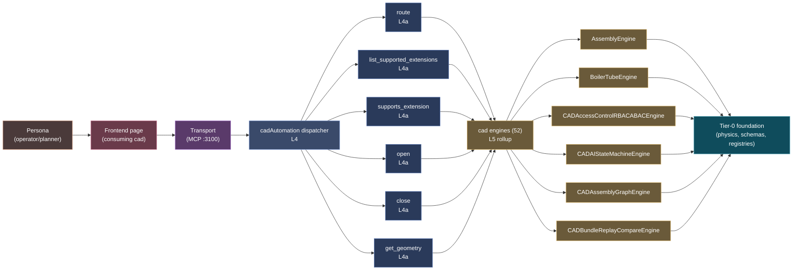

# Domain flow — `cad`

> Narrow lens on the `cad` engine domain — atomic engines + dispatcher + actions in one Mermaid diagram. Use this when working concentrates in one domain.

**Atomic engines indexed:** 52 (sample of 6 shown)
**Dispatcher:** `cadAutomation`
**Sample actions:** 6

## Flow diagram

## See also

- Full domain entry: [[domain-cad]]
- Stack overview: [[layer-stack-overview]]
- Per-engine: `knowledge/wiki/architecture/engines/cad/`
- Dispatcher entry: [[dispatcher-cadautomation]]
