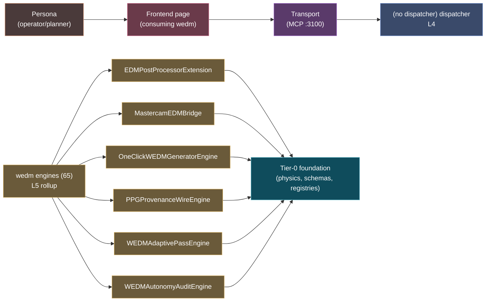

# Domain flow — `wedm`

> Narrow lens on the `wedm` engine domain — atomic engines + dispatcher + actions in one Mermaid diagram. Use this when working concentrates in one domain.

**Atomic engines indexed:** 65 (sample of 6 shown)
**Dispatcher:** _(no L4 match)_
**Sample actions:** 0

## Flow diagram

## See also

- Full domain entry: [[domain-wedm]]
- Stack overview: [[layer-stack-overview]]
- Per-engine: `knowledge/wiki/architecture/engines/wedm/`

