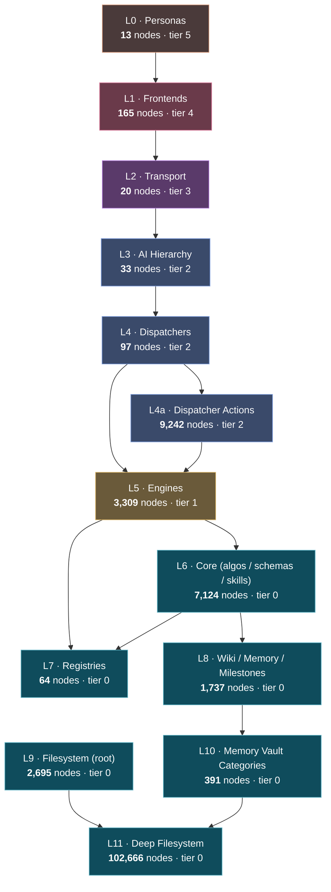

# PRISM Layer Stack — single-page overview

> Visual one-page index of the 13-layer architecture rendered from `system-graph.json`.
> This is the entry point for any chat/agent exploring PRISM structure.

**Total graph:** 127,556 nodes · 148,891 edges
**Headline:** 2302 engines wired · 875 unwired · 2 drift · 2 frontend merges pending · 776 wiki entries

## Layer diagram

## Layer counts (with wiki links)

| Wiki entry | ID | Layer | Tier | Nodes |
|------------|----|-------|------|-------|
| [[layer-l0]] | L0 | Personas | 5 | 13 |
| [[layer-l1]] | L1 | Frontends | 4 | 165 |
| [[layer-l2]] | L2 | Transport | 3 | 20 |
| [[layer-l3]] | L3 | AI Hierarchy | 2 | 33 |
| [[layer-l4]] | L4 | Dispatchers | 2 | 97 |
| [[layer-l4a]] | L4a | Dispatcher Actions | 2 | 9,242 |
| [[layer-l5]] | L5 | Engines | 1 | 3,309 |
| [[layer-l6]] | L6 | Core (algos / schemas / skills) | 0 | 7,124 |
| [[layer-l7]] | L7 | Registries | 0 | 64 |
| [[layer-l8]] | L8 | Wiki / Memory / Milestones | 0 | 1,737 |
| [[layer-l9]] | L9 | Filesystem (root) | 0 | 2,695 |
| [[layer-l10]] | L10 | Memory Vault Categories | 0 | 391 |
| [[layer-l11]] | L11 | Deep Filesystem | 0 | 102,666 |

## Atomic-first build doctrine

Tier 0 (foundation) — build/fix first. One Tier-0 primitive cascades upward:
- Unlocks 5–20 Tier-1 engines that consume it
- Which become callable through 1–4 Tier-2 dispatchers
- Which expose new actions on Tier-3 transport
- Which power N Tier-4 pages
- Which serve every Tier-5 persona

**Never start a higher-tier feature while its lower-tier blocks are missing.**

| Tier | Layers | Why first? |
|------|--------|------------|
| 0 | L6, L7, L8, L9, L10, L11 | Atomic primitives — physics constants, schemas, registries, knowledge, filesystem |
| 1 | L5 | Engines (3,243) — must wire to ≥1 dispatcher or be deleted |
| 2 | L3, L4, L4a | AI tiers (12), dispatchers (97), actions (9,228) |
| 3 | L2 | Transport — REST/WS/MCP/auth/telemetry |
| 4 | L1 | Frontends (165 pages) — dead pixels if Tier-1 unwired |
| 5 | L0 | Personas — UX validation last |

## Engine domains (per-domain wiki)

Each L5 engine domain has its own wiki entry: see `knowledge/wiki/architecture/domain-*.md`.
Top-leverage domains: `mill`, `cad`, `cam`, `fusion`, `hyper`, `wedm`, `lathe`, `ai`, `five`, `swiss`.

## Dispatcher index (per-dispatcher wiki)

Each L4 dispatcher has its own wiki entry: see `knowledge/wiki/architecture/dispatcher-*.md`.
Sorted by action count in `knowledge/wiki/index.md` → ### Dispatchers section.

## See also

- Live viewer: `/system-viz` slash command (port 8765)
- Directive: `state/shared/PRISM-SYSTEM-VIZ-DIRECTIVE.md` (authoritative rules)
- Adapter: `node scripts/system-viz-query.mjs roadmap-candidates`
- Generators that produced this brain:
  - `scripts/generate-layer-wiki.mjs` — 13 per-layer entries
  - `scripts/generate-domain-wiki.mjs` — 38 per-domain entries
  - `scripts/generate-dispatcher-wiki.mjs` — 97 per-dispatcher entries
  - `scripts/generate-layer-stack-overview.mjs` — this entry

<!-- XLINK-START — injected by inject-wiki-crosslinks.mjs -->

## All layers (13)

- [[layer-l0]]
- [[layer-l1]]
- [[layer-l2]]
- [[layer-l3]]
- [[layer-l4]]
- [[layer-l4a]]
- [[layer-l5]]
- [[layer-l6]]
- [[layer-l7]]
- [[layer-l8]]
- [[layer-l9]]
- [[layer-l10]]
- [[layer-l11]]

<!-- XLINK-END -->
