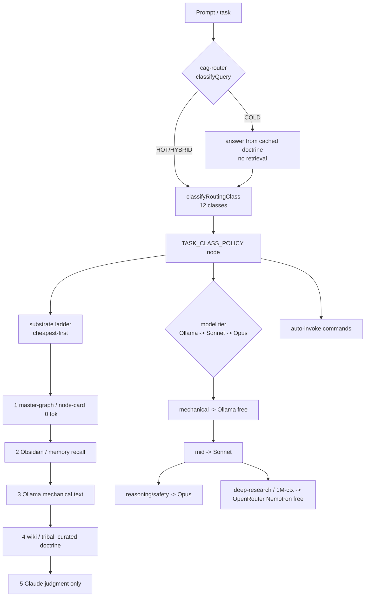

# PRISM Feature-Routing Graph — the followable "what to use, when" policy

> **FEATURE-ROUTING-GRAPH-MS0 / U-ROUTING-GRAPH** (slot:alpha, 2026-06-15).
> Operator directive: *"build a graph for you to follow on the most token-efficient way to do
> every tool call and every task we've ever done"* + *"auto-invoke [commands] in a session without
> me having to type them in."*
>
> This is the **graph Claude follows**. It is not a new router — it is the **composition layer** over
> the six routers PRISM already had (the gap the enumeration found: *"no single artifact wires these
> together in a declared execution order with a shared input schema"*). The brain is
> `scripts/lib/feature-routing-graph.mjs` (`routeTaskClass(prompt, ctx)` + `TASK_CLASS_POLICY` +
> `buildRoutingDigest`). Backing data: `state/shared/feature-routing-graph.json`.

---

## 0. The one rule

**Every task is one of 12 classes. For each class, climb the substrate ladder cheapest-first, pick the
model tier, run the commands in order, and avoid the named antipattern.** The cheapest rung that
answers the question wins — Claude (the most expensive rung) is the *last* resort, never the first.

**The substrate ladder (PSN, cheapest-first) — memorize this order:**
`master-graph (node-card/master-index, 0 tok)` → `Obsidian/memory (recall)` → `Ollama (mechanical text, free)` → `wiki/tribal (curated doctrine)` → `Claude (judgment + safety only)`.

**The model ladder:** `Ollama (free, mechanical, LOCAL)` → `Sonnet (cheap, mid)` → `Opus (reasoning, safety, synthesis)`. Never promote mechanical work to Opus on an Ollama miss (route to a Sonnet agent).

**Cloud long-context tier (CLOUD-OVERFLOW-MS0, 2026-06-15):** for genuine **deep-research / 1M-context / huge-corpus** reads, route to **OpenRouter Nemotron-3** (`nvidia/nemotron-3-super-120b-a12b:free`, 1M ctx, **$0** free tier) via `node scripts/ask-openrouter.mjs research|longread ...`. The model-routing policy (`routeCloudLongContext`) fires this tier ONLY on (a) an explicit "use nemotron/openrouter" request, or (b) an unambiguous `deep research` / `1M context` signal — and NEVER for building (Opus owns it), deep reasoning/design (Fable owns it), proven-mechanical (Ollama, free-local, wins), or safety (frontier Claude, never egresses). Cloud egress publishes content, so NC/G-code is hard-refused. Needs `OPENROUTER_API_KEY`; fails loud → Claude fallback if unset. Upgrade to the stronger 550B model with `OPENROUTER_MODEL=nemotron-ultra-free` (also $0). Quality rule: route to the cloud only when the win is unambiguous — when in doubt, Claude wins.

**BUILD-COMPLETE GATE (operator directive 2026-06-17 — `BUILD_COMPLETE_GATE` in `feature-routing-graph.mjs`):** *"all chats run loops until all gaps, bugs, errors and conflicts are filled and fixed before a build is considered complete."* A `build` / `fix` / `domain` unit is DONE only when **ALL FOUR axes are verified ZERO** — loop one-unit-per-iter, re-evaluating each pass:
- **gaps** — no unbuilt/unwired/uncovered units; every planned asset shipped + wired to ALL natural consumers (R15); tests cover happy + ≥3 failure + ≥2 adversarial.
- **bugs** — no known-incorrect behavior; each finding adversarially verified (not assumed); edge/NaN/empty/overflow handled.
- **errors** — clean build + tests green (no `.skip`/`.only`) + zero new type/lint errors in touched files.
- **conflicts** — no merge/peer-claim/doctrine conflicts; surfaced AND resolved, never averaged (R7); no duplicate of an existing asset (R8/dedup).

Each build-producing class carries a `doneWhen` field pointing at this gate; it is surfaced live on every build/fix/domain prompt (`prompt-route-inject` DONE-WHEN line) and in `/task-graph`. **R12: a build is NOT done while any axis is open — fail loud, never mark complete on "looks fine."**

---

## 1. The 12 task classes (the routing policy)

> Source of truth: `TASK_CLASS_POLICY` in `scripts/lib/feature-routing-graph.mjs`. This table mirrors it
> for reading; the code is canonical (regenerate this section if they drift).

| Class | Recognize it by | Substrate ladder (cheapest-first) | Model | Commands (in order) | Auto-invoke | AVOID |
|-------|-----------------|-----------------------------------|-------|---------------------|-------------|-------|
| **locate** | where is X / find / which file / does X exist | master-graph → obsidian → wiki → tribal → grep | Ollama/Sonnet | `/master-index` → `/node-card` → `/deep-search` | `/master-index` | Grep/Glob before the master-index |
| **build** | build / implement / create / add / wire / new engine | dedup-check → master-graph → wiki → obsidian → claude | **Sonnet 4.6 @ max** (coding default) · Opus only for deep arch/safety | `/dedup` → `/forge-triple` → `/wire-unwired` → `/scrutinize` | `/dedup` | building before `/dedup`; shipping a stub |
| **plan** | plan / design / architect / how should we / crossroad | obsidian → wiki → master-graph → **consensus** → claude | Opus | `/forge` → `/rgs` → `brainstorm-path-forward` → `/octopus` | — | guessing ONE path; same-family agreement masking the real fork |
| **recall** | what did we / prior / remember / last time / why | obsidian → cag-cold → wiki → master-graph | Ollama/Sonnet | `/wiki-query` → `/master-index` → `prism_memory:semantic_search` | `/wiki-query` | re-deriving what the wiki/memory documents |
| **learn** | learn / ingest / extract / pdf / video / corpus | ollama → pdf-video pipeline → obsidian → lora | Ollama → Sonnet | `/pdf-learn` → `/video-learn` → `/wiki-ingest` → `/learn-corpus` | `/pdf-learn` | reading whole PDFs/videos into Claude context |
| **quote** | quote / cost / estimate / price / bid / margin | obsidian → prism_business → physics → claude | Sonnet → Opus | `/quote-to-ship` → `/quote` → `/injection-mold-quote` → `/job-cost` | — | a quote with no margin-floor gate / no CI |
| **physics** | speed/feed / force / g-code / toolpath / safety | prism_calc → prism_safety → wiki → tribal → claude | Opus (safety) | `/auto-speed-feed` → `/calc` → `prism_safety:validate_physics` | `/auto-speed-feed` | inlining Kienzle/Taylor constants |
| **review** | review / scrutinize / audit / verify diff | claude-reviewers → scrutiny-3of3 → **consensus** | Opus + Sonnet arms | `/scrutinize` → `/code-review` → `/prism-review` → `/octopus` | `/scrutinize` | single-reviewer clearance; trusting same-family agreement on a contested verdict |
| **fix** | fix / debug / broken / failing / regression | master-graph blast-radius → ollama-triage → claude | **Sonnet 4.6 @ max** (coding) · Opus only for hardest root-cause | `/diagnose-fix` → `/impact` → regression-hunter | — | patching the symptom, not the root cause |
| **orchestrate** | fleet / parallel / multi-agent / all galaxies | Workflow/hermes-agents → **consensus** → atcs → claude | Opus synth + Sonnet arms | `Workflow` → `/checkin` → `/octopus` | — | back-to-back agent bursts (fanout storm) |
| **session** | checkin / handoff / startup / compact / resume | atcs → obsidian-handoff → claude | free | `/checkin-<slot>` → `/handoff` → `/precompact` | `/checkin-<slot>` | topicless handoff; lingering bg tasks (R14) |
| **domain** | mill / lathe / wedm / cam / cad task | galaxy-CLAUDE.md → tribal → wiki → prism_<domain> → claude | Opus | `/mill-studio` `/lathe-studio` `/wedm` `/cam-strategy` | — | ignoring galaxy soul; assuming inch vs mm |

### 1b. Execution machinery per class (U-EXEC-POLICY, 2026-06-16)

> The `execution: {harness, hermes, ollama, consensus}` field on every class node names the **engineered runner, the hermes-agent delegation, the ollama-offload, and (for the three high-stakes classes) the octopus cross-vendor consensus pass** to use — the operator directive "apply engineered loops/harnesses/hermes/ollama/model-switching in the graph". `loopCron` carries the loop/cron axis; `modelTier` the model-switch ladder. A `no`/`none` value — or an absent key (e.g. `consensus` on a non-escalating class) — means that dim is judgment-only/inapplicable, so the live inject self-suppresses it (`renderExecutionLine` only shows the real dims). Every named runner is a verified on-disk asset (R8). Source of truth: `TASK_CLASS_POLICY[...].execution`. The 4th dim (`consensus`) is detailed in §1c.

| Class | Harness (engineered runner) | Hermes (agent delegation) | Ollama (offload, $0) |
|-------|-----------------------------|---------------------------|----------------------|
| **locate** | none — one-shot (system-viz-query find → node-card) | no | qwen2.5-coder:1.5b — pick matching hit |
| **build** | vitest + per-file 2-arm scrutiny per unit (eval-gate; attended) | forge-team / dispatcher-wirer Agents (sonnet) | **coder ensemble**: qwen2.5-coder:32b + qwen3-coder:30b combined + Sonnet tier (deepseek-coder: pull/cloud-free); never design/reasoning (Opus) |
| **plan** | brainstorm-path-forward Workflow (5-lens → synthesis) | the 5 strategic-lens Agents | — (no local reasoner; 5-lens reasoning + synthesis is **Opus** — reasoning is always Opus) |
| **recall** | none | no | qwen2.5-coder:1.5b — summarize recalled bodies |
| **learn** | pdf-corpus-watcher-sweep / lima pypdf / post-training-harness (resumable cursor) | hermes-dream-cycle-synth — offline corpus synthesis | qwen2.5-coder:32b extract + gpt-oss:20b structure (whole pipeline) |
| **quote** | quote-to-ship pipeline | no | qwen2.5-coder:32b — parse RFQ / classify lines |
| **physics** | prism_calc → prism_safety round-trip | no — safety, no delegation | no — never offload calc/G-code (no egress) |
| **review** | scrutiny-3way.mjs (3-of-3) + per-file 2-arm | the 3 reviewer Agents (opus A/B + analyst C) | — (no local reasoner; the 3 Claude arms ARE the review reasoning) |
| **fix** | regression-hunter Agent + stop_on_failing_tests gate | regression-hunter (sonnet) — blast-radius triage | qwen2.5-coder:32b diff-summary (mechanical); root-cause reasoning stays **Opus** |
| **orchestrate** | Workflow / prism_atcs; fleet-reaper/doctrine sweeps (recurring) | PRIMARY — ask-hermes + hermes Agent fan-out; zulu fleet | mining/read arms → ollama or sonnet, NEVER opus |
| **session** | prism_atcs + per-agent-handoff + precompact-handoff | no | qwen2.5-coder:1.5b — summarize diff into handoff |
| **domain** | galaxy studio (mill/lathe/wire-edm) + jmdie-roundtrip-harness | physics-reviewer Agent per part | qwen2.5-coder:32b — G-code/setup-sheet text |

### 1c. Consensus dim — octopus multi-LLM (U-OCTOPUS-CONSENSUS-ROUTE, 2026-06-17)

> The 4th execution dimension `execution.consensus` is present ONLY on the three high-stakes classes where a single model-**family** blind spot is a real risk. The octopus fans a prompt to up to 5 **cross-vendor** voices (Claude · Codex · Ollama · Grok · Gemini), scores their agreement, and recommends accept/review/escalate — *"when models agree, confidence is high; when they disagree, the disagreement IS the signal."* This is categorically different from `hermes-agents` (N same-family Claude agents), the 3-of-3 review gate (3 Claude arms), and the 5-lens brainstorm (5 Claude agents) — all of which share whatever blind spot the Claude family has. Safety classes (`physics`) carry **no** consensus dim: Grok/Gemini are cross-vendor egress, forbidden for G-code/safety calc.

| Class | Consensus (octopus cross-vendor) |
|-------|----------------------------------|
| **review** | `prism_ai:consensus_decide` / `/octopus` — escalation ABOVE the 3 same-family arms when they could share a blind spot or the verdict is contested; agreement < threshold → escalate |
| **plan** | `prism_ai:consensus_decide` on the crossroad — cross-vendor agreement complements the same-family 5-lens brainstorm; where vendors DISAGREE marks the real fork (don't average) |
| **orchestrate** | octopus fan-out — `auto-consensus-userprompt` enqueues every prompt to `consensus-queue.jsonl`; `stop-consensus-drain` drains out-of-band (30-60s); `prism_ai:consensus_decide` for sync vote/compare; recall via `prism_dev:consensus_cache_recall` |
| _all other classes_ | — (no cross-vendor pass; `physics` is no-egress) |

---

### 1d. Model-routing layer + $0 cloud fallback ladder (U-MODEL-PLAN-RESOLVER, operator 2026-06-18 + CLOUD-OVERFLOW-MS0 fleet 2026-06-17)

> The prose `Model` column (§1a) now has a **machine-checkable structured twin** — `resolveModelPlan(taskClass)` returns the concrete model assignment as DATA, single-sourced from `MODEL_IDS`, emitted into `feature-routing-graph.json` as `modelPlans` + `modelIds` + `fallbackLadder`. `assertModelRoleCoherence()` (run by the generator, fail-loud) keeps the structured map and the prose from drifting. The operator's directive is encoded as invariants, not text:

- **REASONING is ALWAYS Claude Opus** (`claude-opus-4-8`) — never a local reasoner (no `deepseek-r1`), never a cloud reasoner for a load-bearing judgment. Classes: plan, review, physics, orchestrate, domain.
- **CODING is newest Sonnet @ MAX effort** (`claude-sonnet-4-6`) **paired with a local CODER ENSEMBLE** — `qwen2.5-coder:32b` + `qwen3-coder:30b` run together, outputs combined ("cover more ground in one pass"); `deepseek-coder` joins once pulled. Classes: build, fix. Opus is the *escalation only* (deep architecture / safety-coupled root-cause). **`localEnsembleWired:true`** (U-OCTOPUS-CODER-ENSEMBLE, 2026-06-18): `MultiModelConsensusEngine`'s `coderEnsemble:true` now seats the two dedicated coders (`CODER_ENSEMBLE_MODELS`) via the diverse-panel path instead of the size-ranked `gpt-oss:120b` + one coder — opt-in per coding consensus. And the LIVE router (`claude-tier-router`/`model-routing-policy`) now routes coding/build → Sonnet (U-LIVE-ROUTER-CODING-SONNET), so the declared policy and the live behavior agree.
- **MECHANICAL → Ollama-first, Sonnet fallback, NEVER Opus** (locate/recall/session/learn). **MIXED (quote)** → Sonnet bulk + an Opus judgment sub-step (margin).

**The canonical fallback ladder** (`FALLBACK_LADDER` — the spec twin of the live `model-routing-policy.mjs` / `ollama-task-offloader.mjs` / `/smart resolveExecutor`, mirroring not re-implementing their logic):

| Rung | Tier | Model | Cost | When |
|------|------|-------|------|------|
| 1 | ollama-local-free | 16-model live roster (qwen-coders, gpt-oss, deepseek-r1, …) | $0 | proven-mechanical text — the default cheap rung |
| 2 | openrouter-cloud-free | `nvidia/nemotron-3-super-120b-a12b:free` (1M ctx) | $0 | LARGE (≥1000 chars) long-context **READING** / deep-research / free-overflow when the local window is too small |
| 3 | cheap-claude | `claude-sonnet-4-6` / `claude-haiku-4-5` | paid-cheap | coding/authoring (Sonnet @ max — cloud is vetoed here) + small mechanical not worth a cloud round-trip |
| 4 | opus | `claude-opus-4-8` | paid-frontier | reasoning / synthesis / safety-critical — the ONLY reasoning tier |

**Load-bearing rules** (NOT preferences): the cloud rung is **READ-only** — `CLOUD_VETO` keeps codegen + authoring on Claude (so "deepseek-coder cloud-if-free" needs a *codegen-capable* cloud rung, not the current Nemotron one); **safety/G-code/NC NEVER egresses to cloud** (`looksLikeNcProgram` refuses); a new cloud candidate (e.g. `z-ai/glm-5.2`) is promoted to a rung ONLY on `assess-cloud-candidate.mjs` battery evidence. `modelPolicyDrift(decision)` flags where the declared Sonnet coding policy diverges from a live router routing build/fix → Opus — the R7 conflict it was built to surface is now **RESOLVED** (U-LIVE-ROUTER-CODING-SONNET aligned the live router to Sonnet), so `modelPolicyDrift` reads clean and now stands as a regression-guard against a future revert.

---

## 2. Substrate reference (when each substrate is the right choice)

> 20 substrates, each a node in the graph. Full machine record in `feature-routing-graph.json`.
> `governingRouter` = the existing router/hook/engine that owns it (compose, do not duplicate — R8).

| Substrate | When | How | Cost | Governing router |
|-----------|------|-----|------|------------------|
| master-graph | "where is X / is it built / blast radius" — BEFORE any grep | `prism_session:master_index_query` · `system-viz-query.mjs find/node-card/blast-radius` | free | master-index-precheck-inject |
| obsidian-vault / second-brain | prior-art recall before build; persist outcome after | READ `prism_memory:semantic_search`; WRITE `reference_*.md` | free | task-substrate-router (obsidian row) + handoff-memory-seed-stop |
| ollama-offload | mechanical text/code (explain/summarize/classify/lint) NOT safety G-code | `node scripts/ask-ollama.mjs <mode> <input>` | free | model-tier-advisor + OllamaHookBridgeEngine |
| cag | every prompt: skip redundant doctrine on cold hits | `classifyQuery()` in cag-router.mjs (auto, sub-ms) | free | cag-router (self) |
| rag | semantic similarity over engines/skills/formulas | `prism_memory:semantic_search` / hybrid-retrieval.mjs | low | cag-router HOT path |
| wikis | curated domain reference before building | `/wiki-query <topic>` | free | cag COLD_SOURCES (wiki-index) |
| tribal-knowledge | shop-floor wisdom before CAM/machining | auto-injected; `tribal-rerank-spawn.mjs <q>` | free | cag COLD_SOURCES (tribal-tips) |
| memories | auto-write session outcomes at Stop | auto (handoff-memory-seed-stop); `prism_memory` | free | handoff-memory-seed-stop |
| psn | cross-substrate synthesis each iteration (11 legs) | feed-down (read) auto-injected; feed-up writes `reference_*.md` | free | composition of all substrates |
| model-switching | escalate local→cloud by complexity/budget | `/model <tier>`; auto via model-tier-advisor | free | model-routing-policy.routePrompt |
| prism-ai | programmatic route/classify within MCP chains | `prism_ai:route_task\|classify_complexity` | low | AISystemRouterEngine (MCP facade) |
| hermes | stronger managed-OAuth model, single shot, outside ctx | `node scripts/ask-hermes.mjs <mode> <input>` (:8645) | low | hermes-workflow-planner |
| hermes-agents | parallel/adversarial/tournament fan-out | Agent fan-out / `prism_hermes`; Zulu fleet | mid | shouldUseWorkflow() |
| consensus | high-stakes review/plan/orchestrate where a single model-family blind spot is a risk — octopus cross-vendor (Claude·Codex·Ollama·Grok·Gemini) agreement; disagreement IS the signal | `/octopus` · `prism_ai:consensus_decide {prompt,voices,options?}` · auto-drain `stop-consensus-drain.mjs`; recall `prism_dev:consensus_cache_recall` | mid | auto-consensus-userprompt + stop-consensus-drain (out-of-band) · MultiModelConsensusEngine.ask() |
| crons | recurring/one-shot wall-clock action | `CronCreate` tool (durable:true to persist) | free | NONE (native tool) |
| loops | poll/repeat on an interval, session-bound | `/loop <interval> <command>` | low | prism_atcs |
| harnessed-loops | autonomous, context-boundary-crossing build loop | `Workflow` tool + `/checkin` Step 12 | mid | prism_atcs |
| prism-learning-systems | after a verified outcome → ledger → GNN/LoRA | `prism_outcome` append; lora-training-pipeline.mjs | mid | outcomeDispatcher |
| lora | fine-tune a domain adapter from the ledger | `lora-training-pipeline.mjs <config>` | high | NONE (pipeline-driven) |

---

## 2b. Context-engineering lens — Write / Select / Compress / Isolate (U-CONTEXT-STRATEGY-LENS, 2026-06-18)

> Applies the canonical LangChain **Write · Select · Compress · Isolate** context-management framework (sairahul1 *"Context Engineering for AI Agents: The Complete Playbook"*; reinforced by 0xCodez *"harness engineering"* 3-floors + zeuuss_01 *"compounding OS"*) onto the substrate catalog — so the graph teaches HOW to keep the context window healthy, not just WHICH substrate to reach for. Machine-readable as `feature-routing-graph.json` `contextStrategies`; canonical in `CONTEXT_STRATEGIES` (`scripts/lib/feature-routing-graph.mjs`); the generator **fail-loud-asserts** the lens buckets EXACTLY the 20 catalog substrates (no drift).
>
> **WHY this is a first-class routing concern (not an afterthought):** the Chroma 18-frontier-model *"context rot"* study found output quality degrades CONTINUOUSLY with input length — well before the hard limit (Claude Code degrades at **~40-60% of capacity**), and *"lost in the middle"* drops mid-context recall ~30pt. Managing context is therefore a routing decision.

| Strategy | What | PRISM substrates | Implementation |
|----------|------|------------------|----------------|
| **Write** | persist info OUTSIDE the window so a /compact never loses it | obsidian-vault, memories, second-brain, psn, harnessed-loops | Obsidian auto-feed + per-slot MEMORY + handoffs + PSN feed-up + ATCS durable state |
| **Select** | load only the RIGHT context in, at the right time | master-graph, cag, rag, wikis, tribal-knowledge, prism-ai | CAG cold/hot routing + master-index + RAG + wiki/tribal injection |
| **Compress** | reduce tokens BEFORE they hit the window | ollama-offload, model-switching | ask-ollama summarize/triage + node-card + digests + Haiku-tier routing |
| **Isolate** | push work into a SEPARATE context/run, return only the result | hermes-agents, hermes, consensus, loops, crons, prism-learning-systems, lora | Workflow/Agent fan-out + octopus consensus + worktrees + offline LoRA |

> PRISM implements all 4 strategies — the article corpus validated the design; this lens makes the coverage explicit + machine-readable. The 3-floor harness model (0xCodez: harness=static config -> loop=timer/spawns -> self-improving=loop+compounding-memory) maps onto the graph's `execution.harness` + `loopCron` + the close-the-loop (output->lesson->skill) dimensions already present.

## 2c. The SPINE — Hermes agents (OS driver) + Obsidian vault (brain) (U-GRAPH-SPINE, operator 2026-06-18)

> Operator framing, confirmed: **Hermes agents + the Obsidian vault are the driving force behind the OS and brain.** This makes that load-bearing spine EXPLICIT (machine-readable as `feature-routing-graph.json` `spine`; canonical in `SPINE`, `scripts/lib/feature-routing-graph.mjs`). Per the 0xCodez 3-floor harness model, the `.claude/` harness is the OS *substrate*; the agent fleet is the active force that *drives work through it*; the vault is the persistent, compounding *brain*.

| Spine | Role | Substrates | What it is |
|-------|------|-----------|------------|
| **OS driver** | the active force that DRIVES work across the harness/OS | hermes-agents, hermes | 26-slot NATO fleet + zulu orchestrator + Workflow/Agent fan-out (Isolate strategy). The `.claude/` harness is the OS; the fleet runs ON it and does the work. |
| **Brain** | persistent, COMPOUNDING knowledge — survives every /compact | obsidian-vault, memories, second-brain, psn | Obsidian vault + per-slot MEMORY + Stop-hook auto-feed + PSN (Write strategy). The memory an agent reasons FROM; sierra graded it best-in-class. |

> Every other substrate hangs off this spine: work is **driven by agents**, knowledge **persists in the vault**. The harness (model + tools + permissions + context + hooks) is the chassis they run on.

## 2d. Coherence guards -- the graph cannot silently drift (ROUTING-GRAPH-COMPLETENESS, slot:zulu 2026-06-18)

> The graph is a COMPOSED artifact: a policy table (class->substrate), a substrate catalog
> (substrate->class), a context-strategy lens, a model-role map, a spine, and a ladder vocabulary.
> FIVE fail-loud coherence guards (pure, DI, in `scripts/lib/feature-routing-graph.mjs`, all CALLED by
> `generate-feature-routing-graph.mjs` main() BEFORE the JSON is emitted) bind these halves so they can
> NEVER silently desync -- a drift THROWS a named error and BLOCKS regeneration until fixed. This is
> what lets a chat TRUST the graph as an enforcement guide rather than a stale doc.

| Guard | Binds | Throws on |
|-------|-------|-----------|
| `assertCatalogCoherence` | context-strategy lens <-> SUBSTRATES catalog | a substrate in one but not the other (missing / extra / dup) |
| `assertModelRoleCoherence` | MODEL_ROLE_BY_CLASS <-> each class's prose modelTier | a reasoning class not naming Opus; a coding class missing the coder ensemble |
| `assertSubstrateClassCoherence` | SUBSTRATES[].taskClasses <-> the 12 task classes | a dangling class ref, an orphaned substrate, or a substrate-STARVED class (caught the real `physics` gap, 2026-06-18) |
| `assertOperatorSubstrateCoverage` | the operator's 13 enumerated substrates <-> the live graph axes | any of skills / scripts / hooks / harnesses / loops / crons / hermes / ollama / obsidian / prism-ai / memories / wiki / tribal enforced by ZERO axis |
| `assertLadderTokenCoverage` | substrateLadder tokens <-> the SUBSTRATES catalog | a ladder rung mapping to no catalog node that is not a declared non-catalog primitive |

> **Navigation bridge:** `resolveLadderToken(token)` maps a short ladder rung (`wiki`, `prism_calc`) to
> its canonical catalog node (`wikis`, `prism-ai`) so the ladder + catalog are ONE navigable graph
> (emitted as `ladderTokenToSubstrate` + `nonCatalogLadderPrimitives` in the JSON).
> `OPERATOR_SUBSTRATE_CATEGORIES` records the live axis enforcing each of the 13 substrates -- the
> operator's "enforces usage of everything", now machine-verified (the live graph SATISFIES it).

## 3. The six routers this composes (R8 — build ON, not over)

The enumeration confirmed PRISM already had the pieces; they were never wired into one ordered flow.
`routeTaskClass()` is the handshake.

| Router | Decides | Exported API | Role in the graph |
|--------|---------|--------------|-------------------|
| `cag-router.mjs` | what context to load (COLD/HOT/HYBRID) | `classifyQuery(query)` | **Step 1** — runs first, decides doctrine injection |
| `model-routing-policy.mjs` (`model-tier-advisor.mjs`) | which engine/tier | `routePrompt({prompt})` | **Spine** — engine+tier verdict per prompt |
| `task-substrate-router.mjs` | which substrate plan | `routeTask(taskType, phase, ctx)` | **Step 4** — execution plan when engine=claude |
| `loop-goal-stack-advisor.mjs` | per-iter presentation | `buildStackAdvisory({prompt,iter})` | **Presentation** — /loop + /goal delivery layer |
| `skill-auto-trigger.mjs` | which skill to fire | `_skill-triggers.jsonl` + INVOKE_NOW set | **Parallel branch** — orthogonal (skill, not model) |
| `AISystemRouterEngine.ts` | task-class → backend (MCP) | `aiSystemRouterEngine.route(task)` | **MCP facade** of the same decision |

**Execution order** (what `routeTaskClass` encodes): `classifyQuery` (context) → `routePrompt` (engine+tier) ∥ `classifyTaskClass` (policy) → `routeTask` (substrate plan) → `buildStackAdvisory` (if /loop). `skill-auto-trigger` runs in parallel on the same UserPromptSubmit slot (orthogonal axis).

---

## 4. Auto-invoke — firing commands without typing them

Three layers already fire commands/skills on context; the graph feeds all three:

1. **`skill-auto-trigger.mjs`** (UserPromptSubmit) — BM25-scores the prompt against
   `knowledge/wiki/architecture/_skill-triggers.jsonl`; emits a **mandatory INVOKE-NOW** directive for
   the `INVOKE_NOW_SKILLS` allowlist at score ≥ 0.75, advisory suggestions at ≥ 0.65. **To make a
   command auto-fire for a task class:** append an entry to `_skill-triggers.jsonl` with
   `action:"invoke"`, the per-class `autoInvoke` phrases in `matcher.value`, and (for mandatory) add
   the skill to `INVOKE_NOW_SKILLS` (mirror in `scripts/extract-skill-triggers.mjs`).
2. **`loop-goal-stack-advisor.mjs`** (per `/loop`/`/goal` iteration) — now appends the task-class
   `autoInvoke` line from `buildRoutingDigest`, so an autonomous loop sees "this iteration is class X →
   auto-fire these commands" without the operator typing them.
3. **`model-tier-advisor.mjs`** (UserPromptSubmit) — already fires the model-tier directive every turn.

The per-class `autoInvoke` column in §1 is the source list: `locate→/master-index`, `build→/dedup`,
`recall→/wiki-query`, `learn→/pdf-learn`, `physics→/auto-speed-feed`, `review→/scrutinize`,
`session→/checkin-<slot>`. These are the high-confidence "fire on sight" commands.

---

## 5. How to use this graph (every task, every chat)

1. **Classify** the task (one of 12). When in doubt, `node scripts/feature-route.mjs "<task>"` prints the digest
   (or call `routeTaskClass` / `buildRoutingDigest`).
2. **Climb the ladder** cheapest-first — do not reach for Claude/Grep until the cheaper rungs miss.
3. **Pick the model tier** — mechanical → Ollama/Sonnet; reasoning/safety → Opus.
4. **Run the commands** in order; let the auto-invoke layer fire the `autoInvoke` ones.
5. **Avoid the antipattern** named for that class.
6. **Respect the gates** — `duplication-hard-block`, `scrutinize-before-stop`, `git-add-lane-guard`,
   `claude-md-golf-only-guard` are HARD BLOCKS (block-gates); the graph routes *with* them.
   (`comprehensive-build-enforce` is an ADVISORY inject, not a block — its code is `BLOCKING: never`;
   corrected per the advisory-feature-catalog behavioral classification, 2026-06-17.)

> Coverage: 12 task classes × 20 substrates × 112 command families × 6 composed routers × 832 hooks.
> The machine-readable catalog (every command family + substrate + router + hook summary) is
> `state/shared/feature-routing-graph.json`; the per-hook behavioral catalog (gates/advisors per
> class) is `state/shared/advisory-feature-catalog.json`.

## 6. Applied external principles — the 3 operator X posts (ROUTING-GRAPH-COMPLETENESS, 2026-06-17)

The operator directed: *"apply this to the graph"* referencing three X posts. The posts are auth-walled
(WebFetch → HTTP 402); their principles were recovered via web search + PRISM's prior vault analyses of
the same genre (`reference_cyrilxbt_obsidian_hermes_apply_assessment`, `reference_feature_routing_graph_ms0`,
the 25 second-brain memories). Per PRISM's established external-method apply-pattern (map → adversarial
HAVE/PARTIAL/GAP), each principle is mapped to the **concrete graph element that embodies it** — application
demonstrated by citation, not asserted. The prior milestone already found PRISM *exceeds* these posts; this
section makes that explicit and applies the one net-new seam.

### 6.1 onchainmilady — graph-memory-augmented agentic ROUTING
| Principle | Graph element (HAVE) |
|---|---|
| Per-query routing as an MDP (pick LLM backbone + agent role per query) | `routeTaskClass(prompt)` classifies → `TASK_CLASS_POLICY[class].modelTier` (Ollama→Sonnet→Opus) + `.execution.{harness,hermes,ollama}` (the role/machinery) |
| Intent classification → graph-edge traversal | `classifyRoutingClass` (12-class keyword intent) → master-index/system-graph traversal (the `master-graph` ladder rung) |
| Zero-token coordination code (the code prompts the agent) | `prompt-route-inject` (deterministic, $0) + Workflow/ATCS (coordination is code, agents do work) |

### 6.2 zeuuss_01 — loop engineering (write the program that prompts the agent)
| Principle | Graph element (HAVE) |
|---|---|
| "An automation can call a skill (fire $skill) not a giant prompt" | `autoInvoke` per class + `skill-auto-trigger` |
| Keep looping until done | `loopCron` per class + `/loop` + ATCS + `force-loop-continue` (loops to `iter>=target`) |
| **The 4 loop types (heartbeat/cron/hook/goal)** — APPLIED net-new seam, mapped per class: |
| - **goal-loop** (iterate to a target/eval-gate) | build, fix, learn, domain (`loopCron.loop = yes`) |
| - **cron** (recurring scheduled) | session, learn, orchestrate (`loopCron.cron = yes`; fleet sweeps) |
| - **hook** (lifecycle-fired) | every class — the 832-hook catalog (`advisory-feature-catalog.json`) |
| - **heartbeat** (idle/wakeup tick) | orchestrate (ScheduleWakeup/dynamic /loop), session (compaction heartbeat) |

### 6.3 charliejhills — AI second-brain (mine your history → searchable → slash workflow)
| Principle | Graph element (HAVE) |
|---|---|
| **Mine your AI/chat history into a searchable brain** | `operator-prompt-route-map.json` — 4870 prompts mined from all 613 transcripts → per-class route + frequency |
| Karpathy living markdown wiki | `knowledge/wiki/` + Obsidian vault (auto-fed every Stop) — the `obsidian`/`wiki`/`tribal` ladder rungs |
| Slash-command workflow scaffolding (/today /ideas /create) | 440+ skills + `slash-command-plans.json` (every command → class) + `/task-graph` (fill the workflow) |

### 6.4 Conclusion (R12, honest)
PRISM embodies all three posts' load-bearing principles in the graph already (routing=onchainmilady,
loops=zeuuss, history-mining/second-brain=charliejhills) — each row above cites the concrete element.
The one **net-new application** is §6.2's 4-loop-type taxonomy now named per task class (was implicit in
`loopCron`). No genuine gap remains; the routing-utilization audit (`routing-utilization-audit.mjs`)
scores the graph 0.821 with an empty punch list.
